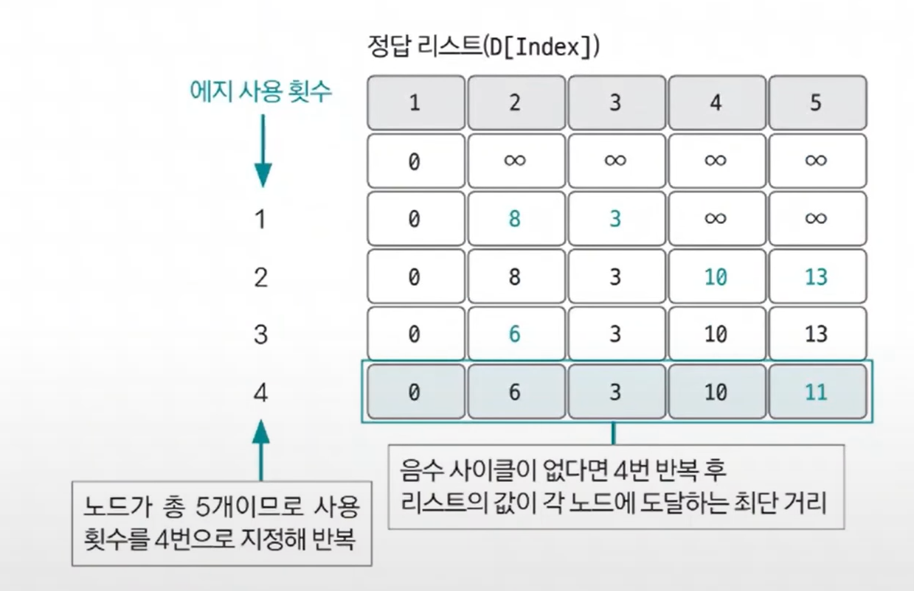
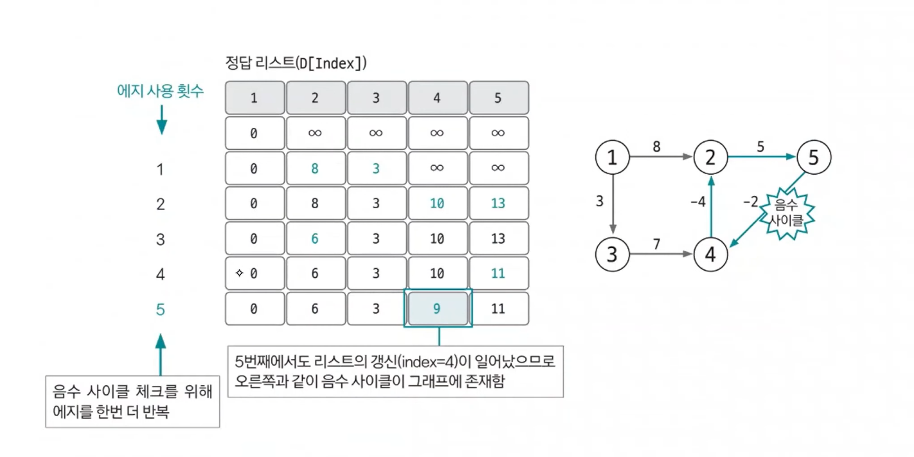

# 벨만-포드

- 벨만-포드(`bellman-ford-moore`) 알고리즘은 그래프에서 최단 거리를 구하는 알고리즘이다.
- **기능** : 특정 출발 노드에서 다른 모든 노드까지의 최단 경로 탐색
- **특징** 
  - 음수 가중치 에지가 있어도 수행할 수 있다.
  - **전체 그래프에서 음수 사이클의 존재 여부를 판단할 수 있다.**
- **시간 복잡도** : `O(VE)`, V: 노드 수, E: 에지 수

## 벨만-포드 핵심 이론

1. **에지 리스트로 그래프를 구현하고 최단 경로 리스트 초기화**

- 벨만-포드 알고리즘은 **에지를 중심으로 동작**하므로 그래프를 에지 리스트로 구현한다.
- 최단 경로 리스트를 출발 노드는 0, 나머지 노드는 무한으로 초기화한다.

2. **모든 에지를 확인해 정답 리스트 업데이트**

- 최단 거리 리스트에서 업데이트 반복 횟수는 `노드 개수 - 1`이다.
- 노드 개수가 `N`이고 음수 사이클이 없을 때 특정 두 노드의 최단 거리를 구성할 수 있는 에지의 최대 개수는 `N - 1`이기 때문이다.
- 모든 에지(`E = (s, e, v)`)에서 다음 조건을 만족하면 업데이트를 실행한다. 업데이트 반복 횟수가 K번이라면 해당 시점에 정답 리스트의 값은 시작점에서 K개의
  에지를 사용했을 때 각 노드에 대한 최단 거리이다.

> **업데이트 조건과 방법**
> - `D[s] != ∞(무한)` 이며 `D[e] > D[s] + v` 일 때, `D[e] = D[s] + v`로 리스트의 값을 업데이트한다.
> 
> 
> 
> - 음수 사이클이 없을 때 `N - 1`번 에지 사용 횟수를 반복하면 출발 노드와 모든 노드 간의 최단 거리를 알려주는 정답 리스트가 완성된다. 이렇게 완성 후 마지막으로
> - 이 그래프에 음수 사이클이 존재하는지 확인해야 한다.

3. **음수 사이클 유무 확인하기**

- 음수 사이클 유무를 확인하기 위해 모든 에지를 한 번씩 다시 사용해 업데이트되는 노드가 발생하는지 확인한다.
- 만약 업데이트되는 노드가 있다면 음수 사이클이 있다는 뜻이고, 2단계에서 도출한 정답 리스트가 무의미하고 최단 거리를 찾을 수 없는 그래프라는 뜻이 된다.
- 음수 사이클이 존재하면 이 사이클을 무한하게 돌수록 가중치가 계속 감소하므로 최단 거리를 구할 수 없다.

- 실제 알고리즘 코딩 테스트에서는 벨만-포드 알고리즘을 사용해 최단 거리를 구하는 문제보다 음수 사이클을 판별하는 문제가 더 빈번하게 출제된다.
- **따라서 마지막에 한번 더 모든 에지를 사용해 업데이트되는 노드가 존재하는지 확인해야 한다.**

### [예제 문제(백준 - 타임머신)](https://github.com/genesis12345678/TIL/blob/main/algorithm/graph/bellmanFord/Example_1.md#%EB%B2%A8%EB%A7%8C-%ED%8F%AC%EB%93%9C-%EC%98%88%EC%A0%9C---1)

### [예제 문제(백준 - 오민식의 고민)](https://github.com/genesis12345678/TIL/blob/main/algorithm/graph/bellmanFord/Example_2.md#%EB%B2%A8%EB%A7%8C-%ED%8F%AC%EB%93%9C-%EC%98%88%EC%A0%9C---2)