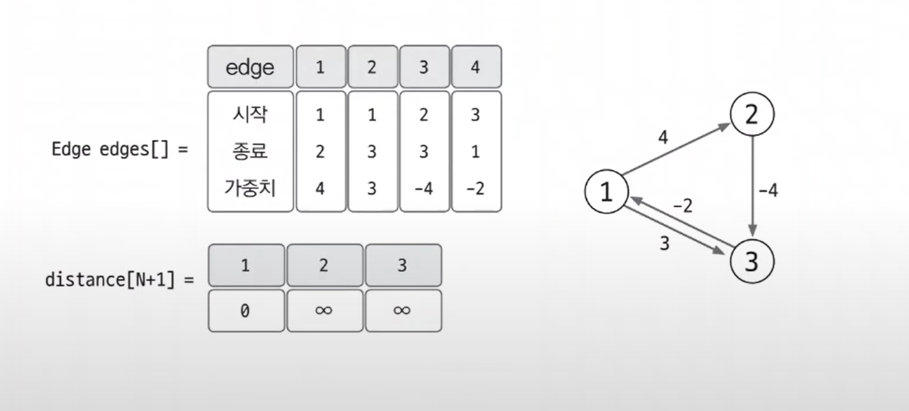
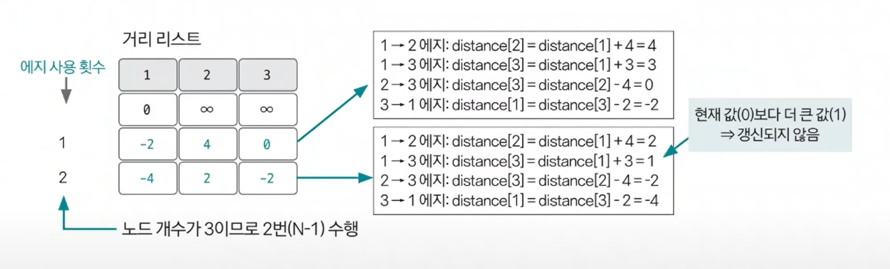
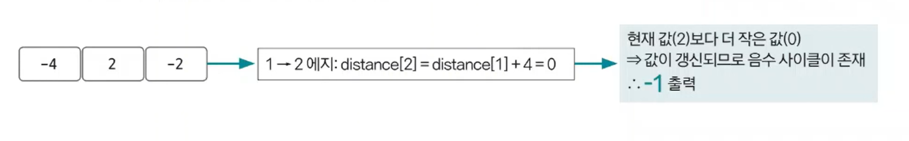

# 벨만-포드 예제 - 1

### [문제(백준(11657번 - 타임머신))](https://www.acmicpc.net/problem/11657)

### 문제 분석
- 시작점 및 다른 노드와 관련된 최단 거리를 구하는 문제지만, 특이한 점은 에지에 해당하는 이동하는 시간이 양수가 아닌 경우가 가능하다는 것이다.
- 이렇게 시작점에서 다른 노드와 관련된 최단 거리를 구하는데 에지가 음수가 가능할 때는 벨만-포드 알고리즘을 사용할 수 있다.

### 손으로 풀어보기
1. **에지 리스트에 에지 데이터를 저장한 후 거리 리스트를 초기화한다. 최초 시작점에 해당하는 거리 리스트값은 0으로 초기화한다.**



2. **다음 순서에 따라 벨만-포드 알고리즘을 수행한다.**

- **벨만-포드 알고리즘 수행 과정**
  1. 모든 에지와 관련된 정보를 가져온 후 다음 조건에 따라 거리 리스트의 값을 업데이트한다.
     - 출발 노드가 방문한 적이 없는 노드일 때 값을 업데이트하지 않는다.
     - `출발 노드의 거리 리스트값 + 에지 가중치 < 종료 노드의 거리 리스트값` 일 때 종료 노드의 거리 리스트값을 업데이트한다.
  2. `노드 개수 - 1`만큼 과정 1을 반복한다.
  3. **음수 사이클 유무를 알기 위해 모든 에지에 관해 다시 한번 과정1을 수행한다. 이때 한번이라도 값이 업데이트되면 음수 사이클이 존재한다고 판단한다.**



3. **음수 사이클이 존재하면 -1, 존재하지 않으면 거리 리스트의 값을 출력한다. 단, 거리 리스트의 값이 무한일 경우에는 -1을 출력한다.**



### 슈도코드
```text
n(노드 개수) m(에지 개수)
edges(에지 정보 저장 리스트)
distance(거리 저장 리스트)

for m 반복:
    에지 리스트에 에지 정보 저장

거리 리스트에 출발 노드 0으로 초기화

for n-1 반복:
    for 에지 개수만큼:
        현재 에지 데이터 가져오기
        if 출발 노드가 무한대가 아니고, 종료 노드값 > 출발 노드값 + 에지 가중치:
            업데이트 수행(종료 노드값 = 출발 노드값 + 에지 가중치)

# 음수 사이클 여부 확인을 위해 한번 더 수행
for 에지 개수만큼:
    if 출발 노드가 무한대가 아니고, 종료 노드값 > 출발 노드값 + 에지 가중치:
        업데이트 가능 = 음수 사이클 존재

if 음수 사이클 미존재:
    거리 리스트 출력
else:
    -1 출력
```

### 코드 구현 - 파이썬
```python
import sys

input = sys.stdin.readline
n, m = map(int, input().split())
edges = []
distance = [sys.maxsize] * (n + 1)

for i in range(m):
    start, end, time = map(int, input().split())
    edges.append((start, end, time))

distance[1] = 0

# n-1번 수행
for _ in range(n - 1):
    for start, end, time in edges:
        if distance[start] != sys.maxsize and distance[end] > distance[start] + time:
            distance[end] = distance[start] + time


isCycle = False

# 음수 사이클 여부 확인을 위해 한번 더 수행
for start, end, time in edges:
    if distance[start] != sys.maxsize and distance[end] > distance[start] + time:
        isCycle = True
        break

result = []

if not isCycle:
    for i in range(2, n + 1):
        if distance[i] != sys.maxsize:
            result.append(str(distance[i]))
        else:
            result.append(str(-1))

    print("\n".join(result))
else:
    print(-1)
```

### 코드 구현 - 자바
```java
import java.io.BufferedReader;
import java.io.IOException;
import java.io.InputStreamReader;
import java.util.Arrays;
import java.util.StringTokenizer;

public class Main {

    static class Edge {
        int start, end, time;

        public Edge(int start, int end, int time) {
            this.start = start;
            this.end = end;
            this.time = time;
        }
    }

    public static void main(String[] args) throws IOException {
        BufferedReader br = new BufferedReader(new InputStreamReader(System.in));
        StringTokenizer st = new StringTokenizer(br.readLine());

        int n = Integer.parseInt(st.nextToken());
        int m = Integer.parseInt(st.nextToken());

        long[] distance = new long[n + 1];  //주의! int로 할 경우 오버플로우 발생
        Arrays.fill(distance, Integer.MAX_VALUE);
        distance[1] = 0;

        Edge[] edges = new Edge[m];

        for (int i = 0; i < m; i++) {
            st = new StringTokenizer(br.readLine());

            int start = Integer.parseInt(st.nextToken());
            int end = Integer.parseInt(st.nextToken());
            int time = Integer.parseInt(st.nextToken());

            edges[i] = new Edge(start, end, time);
        }

        for (int i = 0; i < n - 1; i++) {
            for (Edge edge : edges) {
                int start = edge.start;
                int end = edge.end;
                int time = edge.time;

                if (distance[start] != Integer.MAX_VALUE && distance[end] > distance[start] + time) {
                    distance[end] = distance[start] + time;
                }
            }
        }

        boolean isCycle = false;

        for (Edge edge : edges) {
            int start = edge.start;
            int end = edge.end;
            int time = edge.time;

            if (distance[start] != Integer.MAX_VALUE && distance[end] > distance[start] + time) {
                isCycle = true;
                break;
            }
        }
        
        if (!isCycle) {
            for (int i = 2; i <= n; i++) {
                if (distance[i] != Integer.MAX_VALUE) {
                    System.out.println(distance[i]);
                } else {
                    System.out.println(-1);
                }
            }
        } else {
            System.out.println(-1);
        }
    }
}
```