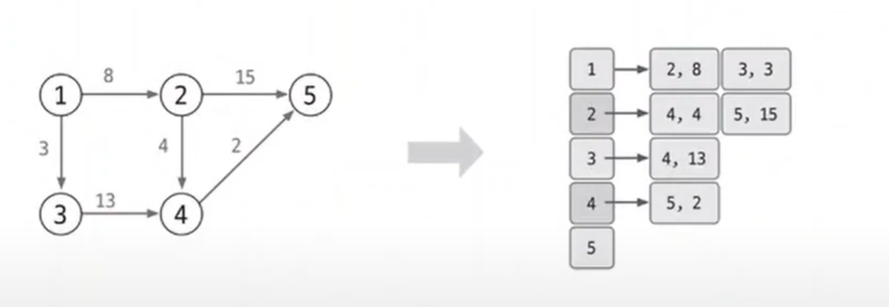
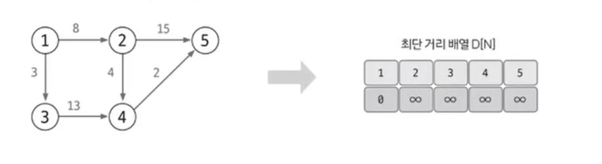
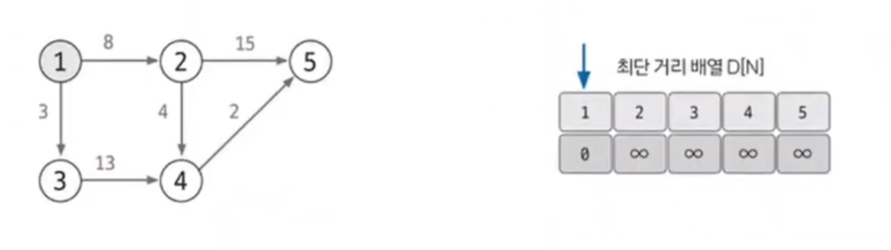
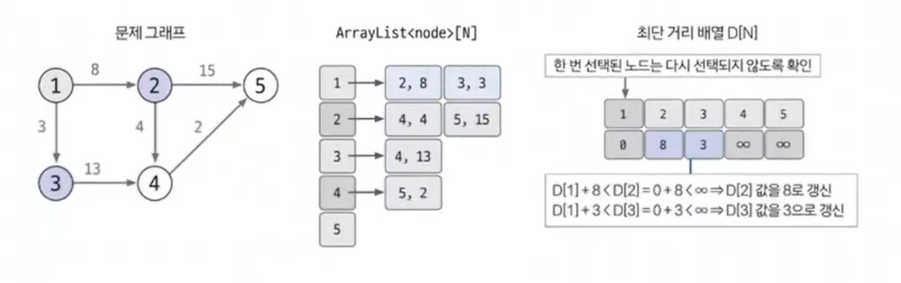
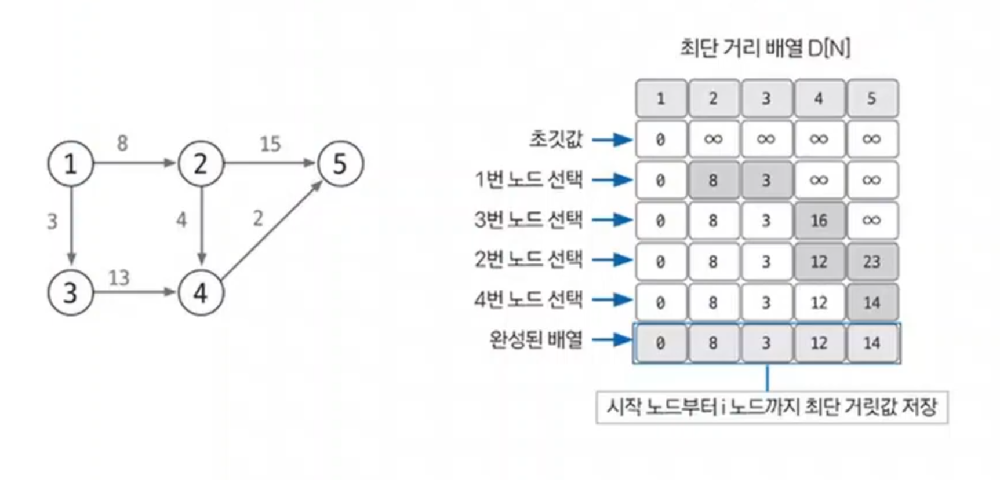

# 다익스트라

- 다익스트라(`dijkstra`) 알고리즘은 그래프에서 최단 거리를 구하는 알고리즘이다.
- **기능** : 출발 노드와 모든 노드 간의 최단 거리 탐색
- **특징** : 에지는 모두 양수
- **시간 복잡도** : `O(ElogV)`, V: 노드 수, E: 에지 수
- 특정 노드에서 다른 노드들의 최단 거리를 구하는 문제가 주어졌을 때 다익스트라 알고리즘을 사용하여 문제를 해결할 수 있다.

## 다익스트라 알고리즘 핵심 이론

1. **인접 리스트로 그래프 구현**

- 인접 행렬로 구현해도 되지만 시간 복잡도 측면, `N`의 크기가 클 것을 대비해 인접 리스트로 구현하는 것이 좋다.

2. **최단 거리 리스트 초기화**

최단 거리 리스트를 만들고 출발 노드는 0, 이외의 노드는 무한으로 초기화한다. 무한은 적당히 큰 값을 사용하면 된다.

3. **값이 가장 작은 노드 고르기**

최단 거리 리스트에서 현재 값이 가장 작은 노드를 고른다. 처음에는 출발 노드에서 시작하면 된다.

4. **최단 거리 리스트 업데이트**

선택된 노드에 연결된 에지의 값을 바탕으로 다른 노드의 값을 업데이트한다. 1단계에서 저장해 놓은 연결 리스트를 이용해 현재 선택된 노드의 에지들을 탐색하고
업데이트하면 된다. 연결 노드의 최단 거리는 다음과 같이 두 값 중 더 작은 값으로 업데이트 하면 된다.

- **최단 거리 업데이트 방법**
  - `min(선택 노드의 최단 거리 배열의 값 + 에지 가중치, 연결 노드의 최단 거리 배열의 값)`

5. **과정 3~4를 반복해 최단 거리 리스트 완성**

모든 노드가 처리될 때까지 과정 3~4를 반복한다. 과정 4에서 **선택 노드가 될 때마다 다시 선택되지 않도록 방문 리스트를 만들어 처리하고**, 모든 노드가 선택될 때까지
반복하면 최단 리스트가 완성된다.

### [예제 문제(백준 - 최단경로)](https://github.com/genesis12345678/TIL/blob/main/algorithm/graph/dijkstra/Example_1.md#%EB%8B%A4%EC%9D%B5%EC%8A%A4%ED%8A%B8%EB%9D%BC-%EC%98%88%EC%A0%9C---1)

### [예제 문제(백준 - 최소비용 구하기)](https://github.com/genesis12345678/TIL/blob/main/algorithm/graph/dijkstra/Example_2.md#%EB%8B%A4%EC%9D%B5%EC%8A%A4%ED%8A%B8%EB%9D%BC-%EC%98%88%EC%A0%9C---2)

### [예제 문제(백준 - K번째 최단경로 찾기)](https://github.com/genesis12345678/TIL/blob/main/algorithm/graph/dijkstra/Example_3.md#%EB%8B%A4%EC%9D%B5%EC%8A%A4%ED%8A%B8%EB%9D%BC-%EC%98%88%EC%A0%9C---3)