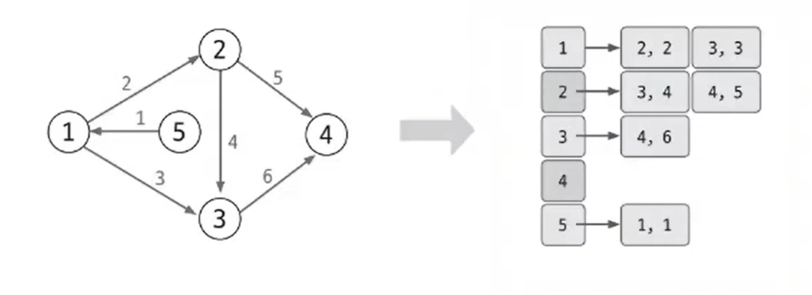
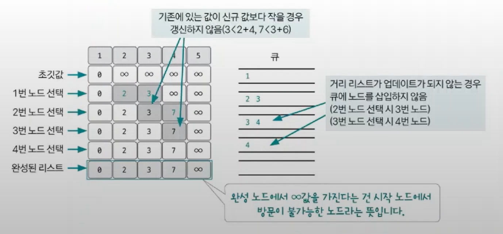

# 다익스트라 예제 - 1

### [문제(백준(1753번 - 최단경로))](https://www.acmicpc.net/problem/1753)

### 문제 분석
- 에지의 가중치가 10 이하의 자연수, 시작점과 다른 노드와 관련된 최단 거리를 문제로, 다익스트라 알고리즘의 가장 기본적인 형태를 구현할 수 있는지 묻는 문제다.


### 손으로 풀어보기
1. **인접 리스트에 노드를 저장하고 거리 리스트를 초기화한다. 거리 리스트는 출발 노드는 0, 나머지는 무한으로 초기화한다.**



2. **최초 시작점을 우선순위 큐에 삽입하고, 다음 과정에 따라 다익스트라 알고리즘을 수행한다.**

- **다익스트라 알고리즘 수행 과정**
  1. 거리 리스트에서 아직 방문하지 않은 노드 중 현재 값이 가장 작은 노드를 선택한다. 즉, 우선순위 큐에서 데이터를 뽑는다.
  2. 해당 노드와 연결된 노드들의 최단 거릿값을 다음 공식으로 업데이트한다.
     - `연결 노드 거리 리스트 값`보다 `선택 노드의 거리 리스트 값 + 에지 가중치`가 더 작은 경우 업데이트 수행
     - 업데이트가 수행되는 동안 연결 노드를 우선순위 큐에 삽입
  3. 큐가 빌 때까지 과정 1~2를 반복한다.
    


3. **완성된 거리 리스트의 값을 출력한다.**
### 슈도코드
```text
v(노드 개수) e(에지 개수)
k(시작 노드)
distance(거리 저장 리스트)
visit(방문 처리 리스트)
A(인접 리스트)
pq(우선순위 큐)

for e 반복:
    인접 리스트 데이터 저장
    
시작 노드 우선순위 큐 삽입
거리 리스트에 시작 노드 0 설정

while 큐가 빌 때까지:
    우선순위 큐에서 현재 노드 가져오기
    현재 선택된 노드를 방문한 적이 있는지 확인
    현재 노드를 방문 처리
    for 현재 선택된 노드의 인접 노드:
        if 미방문 노드 and 현재 선택 노드 최단 거리 + 비용 < 연결 노드의 최단 거리:
            연결 노드 최단 거리 업데이트
            우선순위 큐에 연결 노드 추가

완성된 거리 리스트 출력
```

### 코드 구현 - 파이썬
```python
import sys
from queue import PriorityQueue

input = sys.stdin.readline


class Node:
    def __init__(self, node, dist):
        self.node = node
        self.dist = dist


V, E = map(int, input().split())
k = int(input())

distance = [sys.maxsize] * (V + 1)
visit = [False] * (V + 1)
A = [[] for _ in range(V + 1)]

pq = PriorityQueue()

for _ in range(E):
    u, v, w = map(int, input().split())
    A[u].append(Node(v, w))

pq.put((0, k))
distance[k] = 0

while pq.qsize() > 0:
    now = pq.get()

    if visit[now[1]]:
        continue
    visit[now[1]] = True

    for next in A[now[1]]:
        next_node = next.node
        dist = next.dist

        if distance[next_node] > distance[now[1]] + dist:

            distance[next_node] = distance[now[1]] + dist
            pq.put((distance[next_node], next_node))

result = []

for i in range(1, V + 1):
    result.append(str(distance[i]) if visit[i] else "INF")

print("\n".join(result))
```

### 코드 구현 - 자바
```java
import org.w3c.dom.Node;

import java.io.BufferedReader;
import java.io.IOException;
import java.io.InputStreamReader;
import java.util.*;

public class Main {

    // 인접 리스트에 저장할 노드
    static class Node {
        int node, dist;

        public Node(int node, int dist) {
            this.node = node;
            this.dist = dist;
        }
    }

    // 우선순위 큐에 value값 기준 오름차순 정렬할 정보
    static class Info implements Comparable<Info> {
        int value, node;

        public Info(int value, int node) {
            this.value = value;
            this.node = node;
        }

        @Override
        public int compareTo(Info o) {
            return this.value - o.value;
        }
    }

    public static void main(String[] args) throws IOException {
        BufferedReader br = new BufferedReader(new InputStreamReader(System.in));
        StringTokenizer st = new StringTokenizer(br.readLine());

        int V = Integer.parseInt(st.nextToken());
        int E = Integer.parseInt(st.nextToken());
        int K = Integer.parseInt(br.readLine());

        boolean[] visit = new boolean[V + 1];

        int[] distance = new int[V + 1];
        Arrays.fill(distance, Integer.MAX_VALUE);

        ArrayList<Node>[] A = new ArrayList[V + 1];
        for (int i = 1; i < V + 1; i++) {
            A[i] = new ArrayList<>();
        }

        for (int i = 0; i < E; i++) {
            st = new StringTokenizer(br.readLine());
            int u = Integer.parseInt(st.nextToken());
            int v = Integer.parseInt(st.nextToken());
            int w = Integer.parseInt(st.nextToken());

            A[u].add(new Node(v, w));
        }

        Queue<Info> pq = new PriorityQueue<>();

        pq.add(new Info(0, K));
        distance[K] = 0;

        while (!pq.isEmpty()) {
            Info now = pq.poll();
            int cur = now.node;

            if (visit[cur]) {
                continue;
            }
            visit[cur] = true;

            for (Node next : A[cur]) {
                int next_node = next.node;
                int dist = next.dist;

                if (distance[next_node] > distance[cur] + dist) {
                    distance[next_node] = distance[cur] + dist;
                    pq.add(new Info(distance[next_node], next_node));
                }
            }
        }

        StringBuilder sb = new StringBuilder();

        for (int i = 1; i < V + 1; i++) {
            sb.append(visit[i] ? distance[i] : "INF").append("\n");
        }

        System.out.println(sb);
    }
}
```