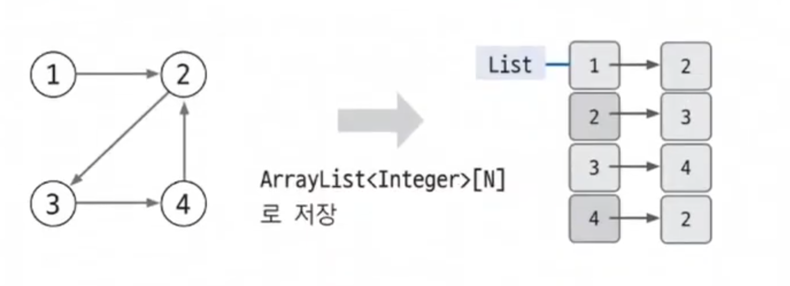
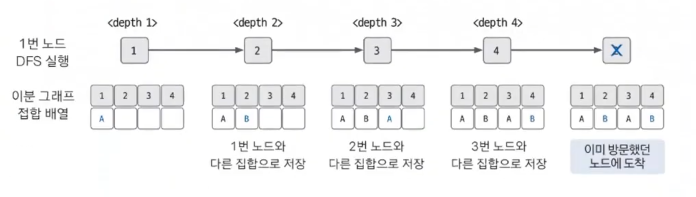

# 그래프의 표현 예제 - 3

### [문제(백준(1707번 - 이분 그래프))](https://www.acmicpc.net/problem/1707)

### 문제 분석
- 트리의 경우에는 항상 이분 그래프가 된다.
- 사이클이 발생하지 않으면 탐색을 하면서 다음 노드를 이번 노드와 다른 집합으로 지정하면 되기 때문이다.
- 사이클이 발생했을 때는 이분 그래프가 불가능할 때가 있다.
- 기존의 탐색 메커니즘에서 탐색한 노드에 다시 접근하게 됐을 때 현재 노드의 집합과 같으면 이분 그래프가 불가능하다는 것으로 판별할 수 있다.

### 손으로 풀어보기
1. **입력된 그래프 데이터를 인접 리스트로 구현한다.**



2. **모든 노드로 각각 DFS 탐색 알고리즘을 적용해 탐색을 수행한다. DFS를 실행할 때 현재 노드에서 연결된 노드 중 이미 방문한 노드가 나와 같은 집합이면 이분 그래프가
    아닌 것으로 판별한다. 실행 결과가 이분 그래프가 아니면 이후 노드는 탐색하지 않는다.**



3. **이분 그래프 여부를 정답으로 출력한다.**
4. **테스트 케이스의 개수만큼 과정 1~3을 반복한다.**

> **모든 노드로 DFS를 실행하는 이유는 여러 개의 부분 그래프로 이뤄진 케이스가 존재할 수 있기 때문이다.**

### 슈도코드
```text
n(테스트 케이스 개수)
isEven(이분 그래프 판별 변수)

DFS:
    visit 방문 기록
    if 현재 노드의 연결 노드 중 미 방문 노드:
        현재 노드와 다른 집합으로 연결 노드 집합 저장
        DFS(다음 노드)
    elif 이미 방문한 노드인데, 현재 나의 노드와 같은 집합:
        이분 그래프가 아님 표시

for n 반복:
    v(노드 개수)
    e(에지 개수)
    A(인접 리스트)
    visit(방문 기록 리스트)
    check(노드별 집합 리스트)
    isEven = True
    
    for e 반복:
        A 인접 리스트 데이터 저장
    
    for v 반복:
        각 노드에서 DFS 실행 -> 결과가 이분 그래프가 아니면 반복 종료
        
    이분 그래프 여부 출력
```

### 코드 구현 - 파이썬
```python
import sys

input = sys.stdin.readline
sys.setrecursionlimit(1_000_000)

n = int(input())
isEven = True


def DFS(node):
    global isEven
    visit[node] = True

    for next in A[node]:
        if not visit[next]:
            check[next] = (check[node] + 1) % 2
            DFS(next)

        elif check[node] == check[next]:
            isEven = False


for _ in range(n):
    v, e = map(int, input().split())
    A = [[] for _ in range(v + 1)]
    visit = [False] * (v + 1)
    check = [0] * (v + 1)
    isEven = True

    for i in range(e):
        u, v = map(int, input().split())
        A[u].append(v)
        A[v].append(u)

    for i in range(1,  v + 1):
        if isEven:
            DFS(i)
        else:
            break

    if isEven:
        print("YES")
    else:
        print("NO")
```

### 코드 구현 - 자바
```java
import java.io.BufferedReader;
import java.io.IOException;
import java.io.InputStreamReader;
import java.util.*;

public class Main {
    static ArrayList<Integer>[] A;
    static boolean[] visit;
    static int[] check;
    static boolean isEven;

    public static void main(String[] args) throws IOException {
        BufferedReader br = new BufferedReader(new InputStreamReader(System.in));

        int testcase = Integer.parseInt(br.readLine());

        for (int i = 0; i < testcase; i++) {
            String[] s = br.readLine().split(" ");
            int V = Integer.parseInt(s[0]);
            int e = Integer.parseInt(s[1]);

            A = new ArrayList[V + 1];
            visit = new boolean[V + 1];
            check = new int[V + 1];
            isEven = true;

            for (int j = 1; j <= V; j++) {
                A[j] = new ArrayList<>();
            }

            for (int j = 0; j < e; j++) {
                s = br.readLine().split(" ");
                int u = Integer.parseInt(s[0]);
                int v = Integer.parseInt(s[1]);

                A[u].add(v);
                A[v].add(u);
            }

            for (int j = 1; j <= V; j++) {
                if (isEven) {
                    DFS(j);
                } else {
                    break;
                }
            }

            if (isEven) {
                System.out.println("YES");
            } else {
                System.out.println("NO");
            }
        }
    }

    private static void DFS(int node) {
        visit[node] = true;

        for (int next : A[node]) {
            if (!visit[next]) {
                check[next] = (check[node] + 1) % 2; //집합이 0또는 1로 나뉨
                DFS(next);
            } else if (check[node] == check[next]) {
                isEven = false;
            }
        }
    }
}
```