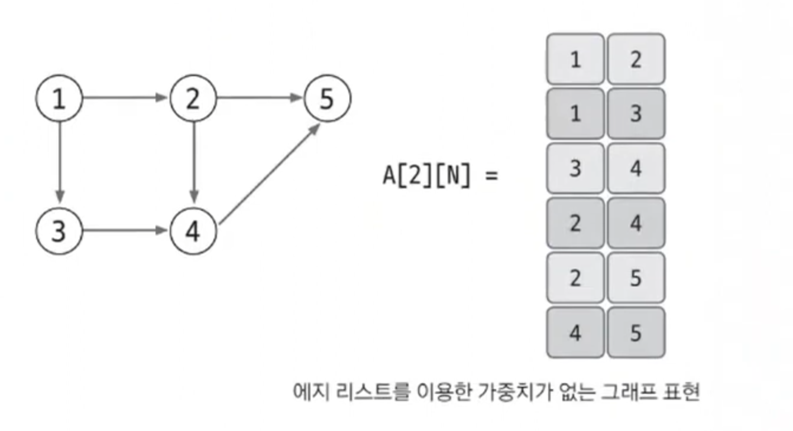
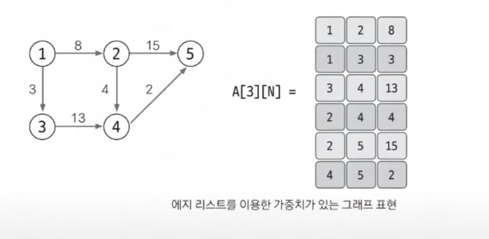
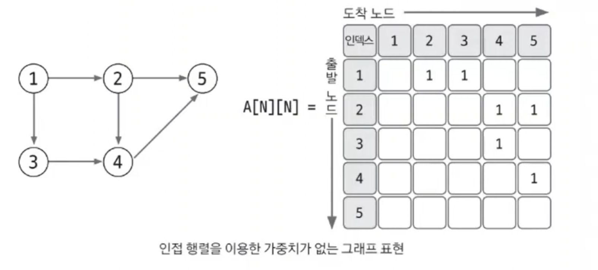
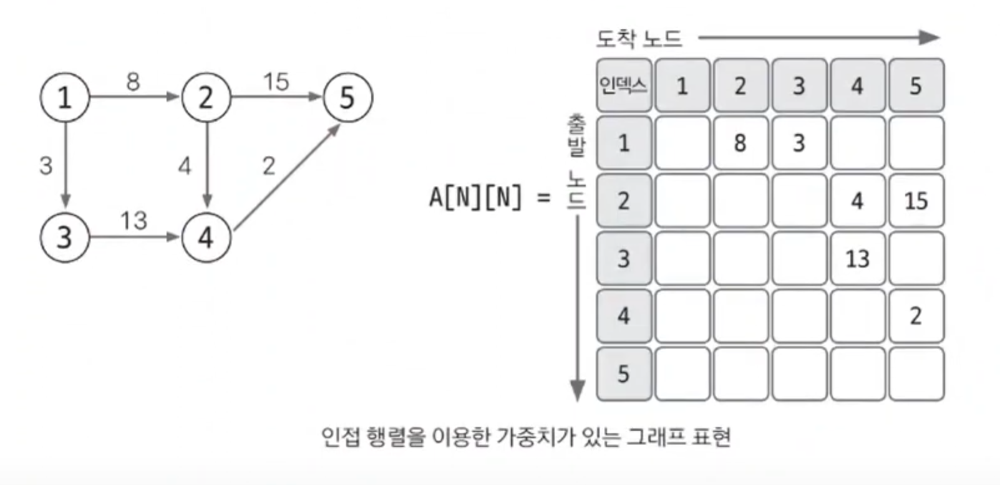
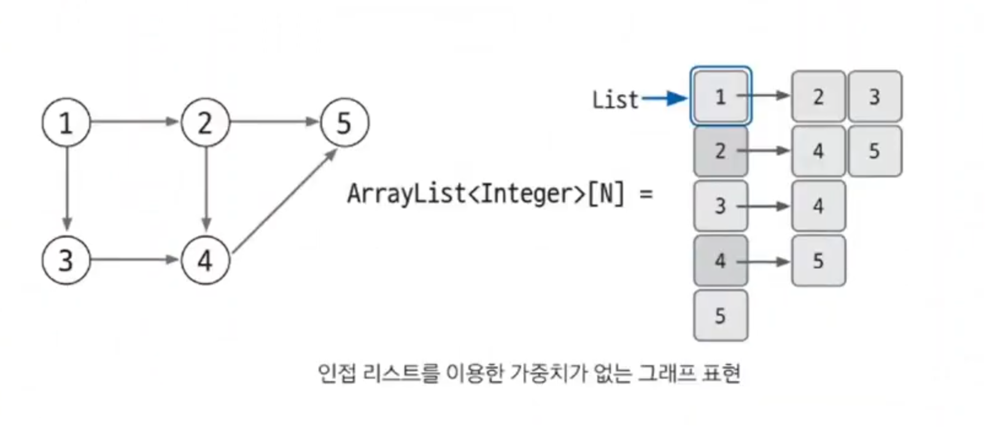
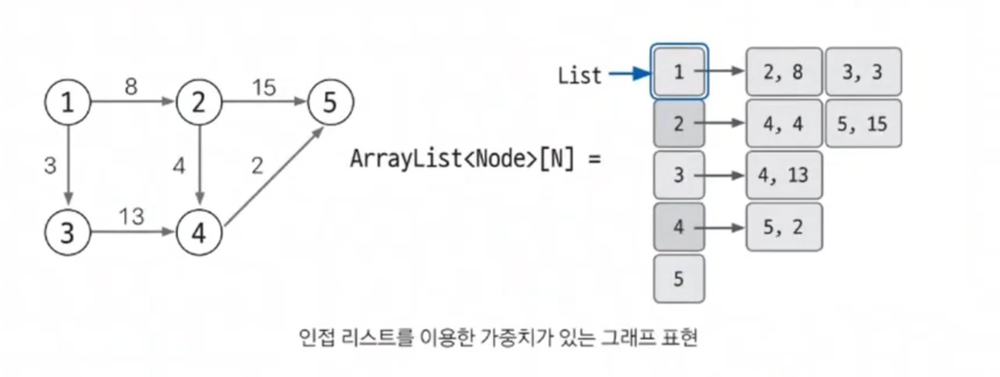

# 그래프의 표현

## 에지 리스트

- 에지 리스트는 에지를 중심으로 그래프를 표현한다.
- 리스트에 출발 노드, 도착 노드를 저장하여 에지를 표현한다.
- 또는 출발 노드, 도착 노드, 가중치를 저장하여 가중치가 있는 에지를 표현한다.

### 에지 리스트로 가중치 없는 그래프 표현

- 가중치가 없는 그래프는 출발 노드와 도착 노드만 표현하므로 배열의 열은 2개면 충분하다.

### 에지 리스트로 가중치 있는 그래프 표현

- 가중치가 있는 그래프는 열을 3개로 늘려 3번째 열에 가중치를 저장하면 된다.

> **에지 리스트는 구현하기 쉽지만, 특정 노드와 관련되어 있는 에지를 탐색하기는 쉽지 않다. 에지 리스트는 노드 사이의 최단 거리를 구하는 
> `벨만-포드`나 `최소 신장 트리`를 찾는 크루스칼 알고리즘에 사용하며, 노드 중심 알고리즘에는 잘 사용하지 않는다.**

 

## 인접 행렬

- 인접 행렬은 2차원 리스트(배열)를 자료구조로 이용하여 그래프를 표현한다.
- 인접 행렬은 에지 리스트와 다르게 노드 중심으로 그래프를 표현한다.

### 인접 행렬로 가중치 없는 그래프 표현

- 1을 저장하는 이유는 가중치가 없기 때문이다.

### 인접 행렬로 가중치 있는 그래프 표현

> **인접 행렬을 이용한 그래프 구현은 쉽고, 두 노드를 연결하는 에지의 여부와 가중치값은 리스트에 직접 접근하면 바로 확인할 수 있는 것도 장점이다.  
> 하지만 노드와 관련되어 있는 에지를 탐색하면 `N`번 접근해야 하므로 시간 복잡도가 인접 리스트에 비해 느리고 노드 개수에 비해 에지가 적을 때는 공간 효율성도 떨어진다.**
> 또한 노드 개수가 많은 경우 아예 2차원 배열 선언 자체를 할 수 없는 결함도 있을 수 있다. 예를 들어 노드가 3만 개가 넘으면 자바에서는 힙 스페이스 에러가 발생한다.
> 따라서 인접 행렬은 노드 개수에 따라 사용 여부를 적절하게 판단하는 능력도 필요하다.

 

## 인접 리스트

- 인접 리스트는 파이썬의 리스트, 자바에서는 ArrayList로 그래프를 표현한다.
- 노드 개수만큼 리스트를 선언한다.
- 자료형은 문제의 조건에 맞게 설정한다.

### 인접 리스트로 가중치 없는 그래프 표현

- 파이썬에서는 리스트를 `A = [[] for _ in range(N + 1)]`로 선언하면 된다.

### 인접 리스트로 가중치 있는 그래프 표현

- 가중치가 있는 경우 자료형을 클래스로 사용한다.
- (도착 노드, 가중치)를 갖는 Node 클래스를 선언하여 데이터를 저장할 수 있다.

> 인접 리스트를 이용한 그래프 구현은 복잡한 편이지만, **노드와 연결된 에지를 탐색하는 시간은 매우 뛰어나며, 노드 개수가 커도 공간 효율이 좋아 메모리 초과 에러도
> 발생하지 않는다.** 이런 장점으로 실제 코딩 테스트에서도 인접 리스트를 이용한 그래프 구현을 선호한다.

 

 

### [예제 문제(백준 - 특정 거리의 도시 찾기)](https://github.com/genesis12345678/TIL/blob/main/algorithm/graph/expression/Example_1.md#%EA%B7%B8%EB%9E%98%ED%94%84%EC%9D%98-%ED%91%9C%ED%98%84-%EC%98%88%EC%A0%9C---1)

### [예제 문제(백준 - 효율적인 해킹)](https://github.com/genesis12345678/TIL/blob/main/algorithm/graph/expression/Example_2.md#%EA%B7%B8%EB%9E%98%ED%94%84%EC%9D%98-%ED%91%9C%ED%98%84-%EC%98%88%EC%A0%9C---2)

### [예제 문제(백준 - 이분 그래프)](https://github.com/genesis12345678/TIL/blob/main/algorithm/graph/expression/Example_3.md#%EA%B7%B8%EB%9E%98%ED%94%84%EC%9D%98-%ED%91%9C%ED%98%84-%EC%98%88%EC%A0%9C---3)

### [예제 문제(백준 - 물통)](https://github.com/genesis12345678/TIL/blob/main/algorithm/graph/expression/Example_4.md#%EA%B7%B8%EB%9E%98%ED%94%84%EC%9D%98-%ED%91%9C%ED%98%84-%EC%98%88%EC%A0%9C---4)