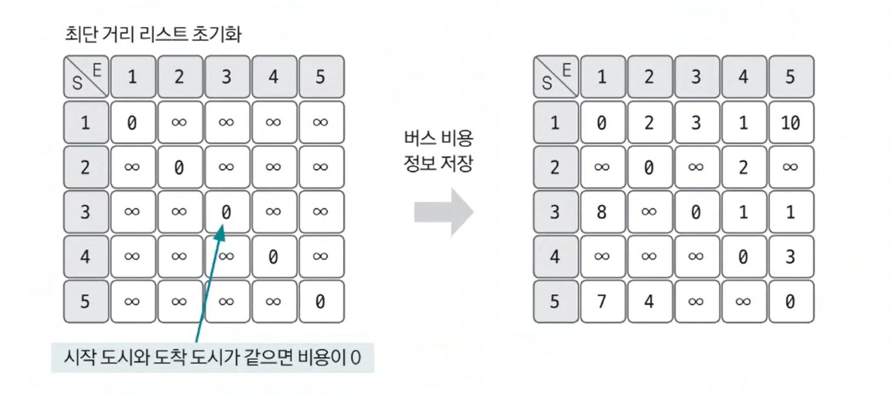
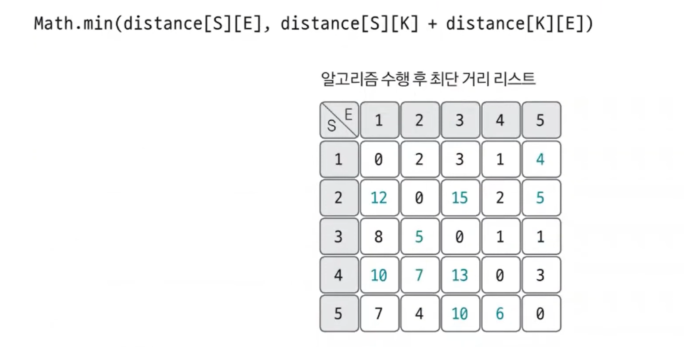

# 플로이드-워셜 예제 - 1

### [문제(백준(11404번 - 플로이드))](https://www.acmicpc.net/problem/11404)

### 문제 분석
- 모든 도시에 쌍과 관련된 최솟값을 찾아야하는 문제이다.
- 그래프에서 시작점을 지정하지 않고, 모든 노드와 관련된 최소 경로를 구하는 알고리즘이 바로 플로이드-워셜 알고리즘이다.
- 도시의 최대 개수가 100개로 매우 작은 편이므로 `O(N^3)` 시간 복잡도의 플로이드-워셜 알고리즘으로 해결할 수 있다.

### 손으로 풀어보기
1. **버스 비용 정보를 인접 행렬에 저장한다. 먼저 인접 행렬을 초기화하는데, 연결 도시가 같으면(`i==j`)0, 아니면 충분히 큰 수로 값을 초기화하면 된다.
    그리고 주어진 버스 비용 데이터값을 인접 행렬에 저장한다.**



2. **플로이드-워셜 알고리즘을 수행한다. 점화식을 활용한 3중 for 문으로 모든 중간 경로를 탐색한다.**



3. **알고리즘으로 변경된 인접 행렬을 출력한다. 인접 행렬 자체가 모든 쌍의 최단 경로를 나타내는 정답 리스트이다.**

### 슈도코드
```text
n(도시 개수)
m(노선 개수)
distance(인접 행렬)  # 큰 값으로 초기화

for 1~n 반복:
    인접 행렬에 시작 도시와 종료 도시가 같은 자리에 0 저장

for m 반복:
    노선 데이터 인접 행렬에 저장

for k n반복:
    for s n반복:
        for e n 반복:
            distance[s][e]보다 distance[s][k] + distance[k][e]가 작으면 업데이트

정답 리스트 출력
```

### 코드 구현 - 파이썬
```python
import sys

input = sys.stdin.readline

n = int(input())
m = int(input())
distance = [[sys.maxsize for _ in range(n + 1)] for _ in range(n + 1)]

for i in range(1, n + 1):
    distance[i][i] = 0

for i in range(m):
    start, end, v = map(int, input().split())
    if distance[start][end] > v:  # 노선이 여러개 일 때 비용이 더 적은 정보 저장
        distance[start][end] = v

for k in range(1, n + 1):
    for s in range(1, n + 1):
        for e in range(1, n + 1):
            if distance[s][e] > distance[s][k] + distance[k][e]:
                distance[s][e] = distance[s][k] + distance[k][e]

for i in range(1, n + 1):
    for j in range(1, n + 1):
        if distance[i][j] == sys.maxsize:
            print(0, end=' ')
        else:
            print(distance[i][j], end=' ')

    print()

```

### 코드 구현 - 자바
```java
import java.io.BufferedReader;
import java.io.IOException;
import java.io.InputStreamReader;
import java.util.StringTokenizer;

public class Main {

    public static void main(String[] args) throws IOException {
        BufferedReader br = new BufferedReader(new InputStreamReader(System.in));
        int n = Integer.parseInt(br.readLine());
        int m = Integer.parseInt(br.readLine());

        long[][] distance = new long[n + 1][n + 1]; //주의! long 사용

        for (int i = 1; i < n + 1; i++) {
            for (int j = 1; j < n + 1; j++) {
                if (i != j) {
                    distance[i][j] = Integer.MAX_VALUE;
                }
            }
        }

        for (int i = 0; i < m; i++) {
            StringTokenizer st = new StringTokenizer(br.readLine());
            int start = Integer.parseInt(st.nextToken());
            int end = Integer.parseInt(st.nextToken());
            int cost = Integer.parseInt(st.nextToken());

            if (distance[start][end] > cost) {
                distance[start][end] = cost;
            }
        }

        for (int k = 1; k < n + 1; k++) {
            for (int s = 1; s < n + 1; s++) {
                for (int e = 1; e < n + 1; e++) {
                    if (distance[s][e] > distance[s][k] + distance[k][e]) {
                        distance[s][e] = distance[s][k] + distance[k][e];
                    }
                }
            }
        }


        for (int i = 1; i < n + 1; i++) {
            for (int j = 1; j < n + 1; j++) {
                if (distance[i][j] == Integer.MAX_VALUE) {
                    System.out.print(0 + " ");
                } else {
                    System.out.print(distance[i][j] + " ");
                }
            }
            System.out.println();
        }
    }
}
```