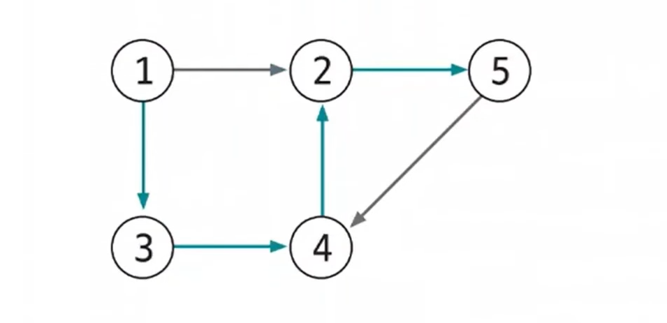
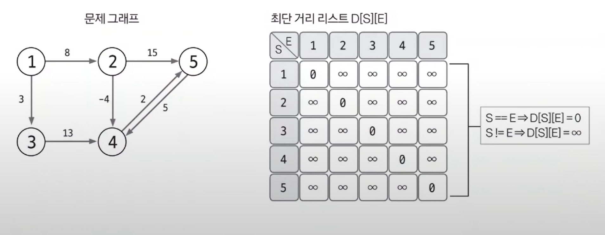
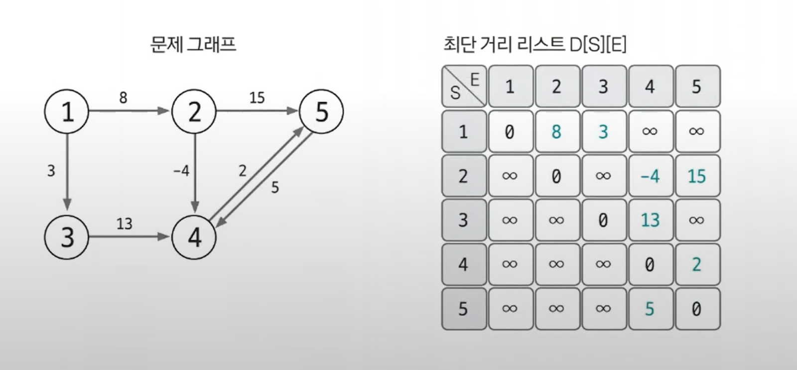
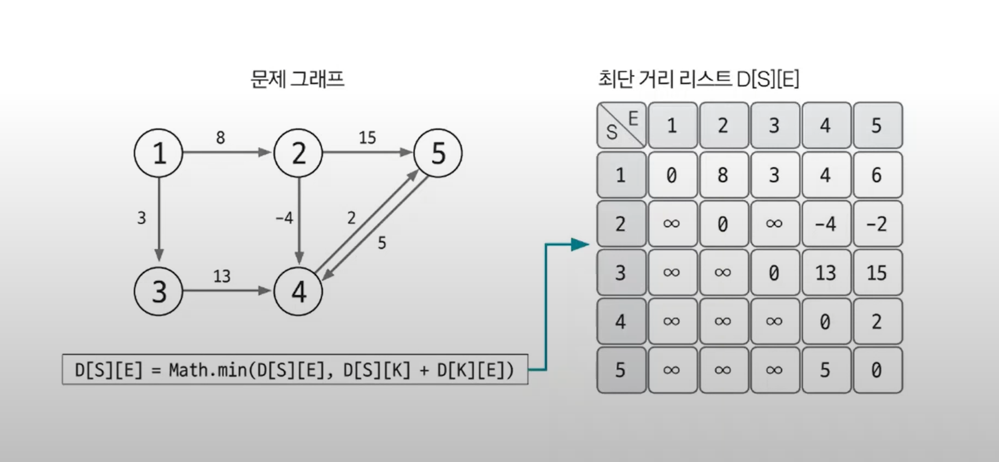

# 플로이드-워셜

- 플로이드-워셜(`floyd-warshall`) 알고리즘은 그래프에서 최단 거리를 구하는 알고리즘이다.
- **기능** : 모든 노드 간에 최단 경로 탐색
- **특징**
  - 음수 가중치 에지가 있어도 수행할 수 있다(음수 사이클이 없을 때)
  - 동적 계획법의 원리를 이용해 알고리즘에 접근한다.
- **시간 복잡도** : `O(V^3)` , V: 노드 수

## 플로이드-워셜 핵심이론

- 플로이드-워셜 알고리즘을 도출하는 가장 핵심적인 원리는 A 노드에서 B 노드까지 최단 경로룰 구했다고 가정했을 때 최단 경로 위에 K노드가 존재한다면
    그것을 이루는 부분 경로 역시 최단 경로라는 것이다.

- 색칠된 에지 경로 `1 -> 5`가 최단 경로라면 `1 -> 4` 최단 경로와 `4 -> 5` 최단 경로 역시 색칠된 에지로 이뤄질 수밖에 없다.
- 즉, 전체 경로의 최단 경로는 부분 경로의 최단 경로의 조합으로 이뤄진다는 의미가 된다.
- 이 원리로 다음과 같은 점화식이 도출된다.
  - `D[S][E] = Math.min(D[S][E], D[S][K] + D[K][E])`

1. **리스트를 선언하고 초기화하기**
- `D[S][E]`는 노드 S에서 노드 E까지의 최단 거리를 저장하는 리스트라 정의한다.
- S와 E의 값이 같은 칸은 0, 다른 칸은 무한으로 초기화한다. 여기에서 `S == E`는 자기 자신에게 가는 데 걸리는 최단 경로값을 의미하기 때문이다.

2. **최단 거리 리스트에 그래프 데이터 저장하기**
- 출발 노드는 S, 도착 노드는 E, 이 에지의 가중치를 W라고 했을 때 `D[S][E] = W`로 에지의 정보를 리스트에 입력한다.
- 이렇게 플로이드-워셜 알고리즘은 그래프를 인접 행렬로 표현한다는 것을 알 수 있다.

3. **점화식으로 리스트 업데이트하기**

- 위에서 구했던 점화식으로 3중 for문의 형태로 반복하면서 리스트의 값을 업데이트한다.**

- **플로이드-워셜 알고리즘 로직**
- `for 경유지 K에 관해 (1 ~ N)` (N: 노드 개수)
  - `for 출발 노드 S에 관해 (1 ~ N)`
    - `for 도착 노드 E에 관해 (1 ~ N)`
      - `D[S][E] = Math.min(D[S][E], D[S][K] + D[K][E])`

- 완성된 리스트는 모든 노드 간의 최단 거리를 알려준다. 예를 들어 1번 노드에서 5번 노드까지 가는 최단 거리는 `D[1][5] = 6`이라는 것을 알 수 있다.
- 플로이드-워셜 알고리즘은 모든 노드 간의 최단 거리를 확인해 주기 때문이 시간 복잡도가 `O(V^3)`으로 빠르지 않은 편이다. 따라서 플로이드-워셜 알고리즘을
    사용해야 하는 문제는 일반적으로 노드 개수의 범위가 다른 그래프에 비해 현저히 적은 것을 알 수 있다.

### [예제 문제(백준 - 플로이드)](https://github.com/genesis12345678/TIL/blob/main/algorithm/graph/floydWarshall/Example_1.md#%ED%94%8C%EB%A1%9C%EC%9D%B4%EB%93%9C-%EC%9B%8C%EC%85%9C-%EC%98%88%EC%A0%9C---1)

### [예제 문제(백준 - 경로 찾기)](https://github.com/genesis12345678/TIL/blob/main/algorithm/graph/floydWarshall/Example_2.md#%ED%94%8C%EB%A1%9C%EC%9D%B4%EB%93%9C-%EC%9B%8C%EC%85%9C-%EC%98%88%EC%A0%9C---2)

### [예제 문제(백준 - 케빈 베이컨의 6단계 법칙)](https://github.com/genesis12345678/TIL/blob/main/algorithm/graph/floydWarshall/Example_3.md#%ED%94%8C%EB%A1%9C%EC%9D%B4%EB%93%9C-%EC%9B%8C%EC%85%9C-%EC%98%88%EC%A0%9C---3)