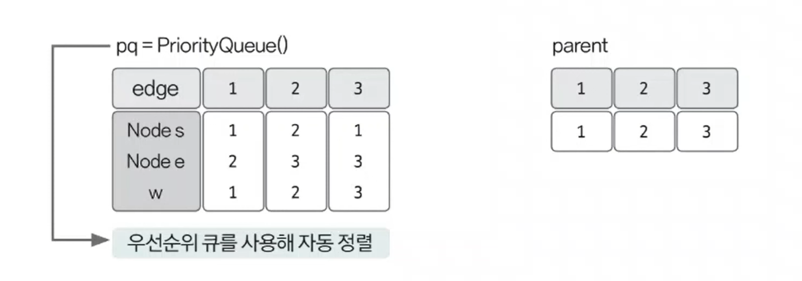
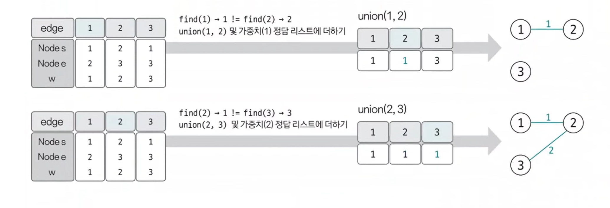
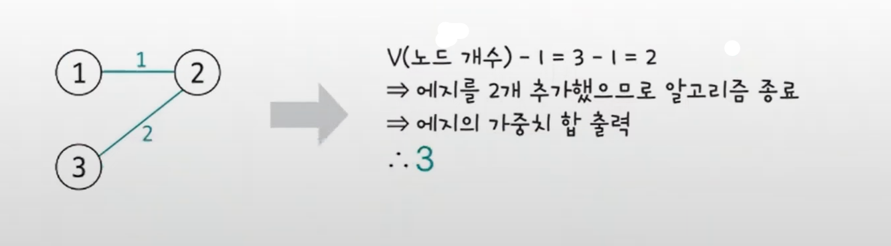

# 최소 신장 트리 예제 - 1

### [문제(백준(1197번 - 최소 스패닝 트리))](https://www.acmicpc.net/problem/1197)

### 문제 분석
- 최소 신장 트리를 구하는 가장 기본적인 문제이다.

### 손으로 풀어보기
1. **에지 리스트에 에지 정보를 저장한 후 부모 노드 데이터를 초기화한다. 최소 신장 트리는 에지 중심의 알고리즘이므로 데이터를 에지 리스트를 활용해
    저장해야 한다. 사이클 생성 유무를 판단하기 위한 유니온 파인드용 부모 노드도 초기화한다.**



2. **크루스칼 알고리즘을 수행한다. 현재 미사용 에지 중 가중치가 가장 작은 에지를 선택하고, 이 에지를 연결했을 때 사이클의 발생 유무를 판단한다.
    사이클이 발생하면 생략하고, 발생하지 않으면 에지값을 더한다.**



3. **과정 2에서 에지를 더한 횟수가 `노드 개수 - 1`이 될 때까지 반복하고, 반복이 끝나면 에지의 가중치를 모두 더한 값을 출력한다.**



### 슈도코드
```text
n(노드 수) m(에지 수)
pq(에지 정보 저장 우선순위 큐)
parent(대표 노드 저장 리스트)

for m 반복:
    에지 정보 우선순위 큐에 저장

find(a):
    a가 대표 노드면 리턴
    아니면 a의 대표 노드값을 find(parent[a])값으로 저장

union(a, b):
    a와 b의 대표 노드 찾기
    두 원소의 대표 노드끼리 연결

useEdge(엣지 사용 횟수 변수)
result(정답 변수)

while 사용한 엣지의 횟수가 노드 개수 - 1이 될 때까지:
    큐에서 에지 정보 가져오기
    if 에시 시작점과 끝점의 부모 노드가 다르면:
        union 연산 수행
        에지의 가중치를 정답에 더하기
        엣지 사용 횟수 1 증가
```

### 코드 구현 - 파이썬
```python
import sys
from queue import PriorityQueue

input = sys.stdin.readline
n, m = map(int, input().split())
pq = PriorityQueue()
parent = [0] * (n + 1)

for i in range(1, n + 1):
    parent[i] = i

for i in range(m):
    s, e, v = map(int, input().split())
    pq.put((v, s, e))  # 순서에 의해 정렬 순서가 결정되므로 가중치를 먼저 넣어야 한다.


def find(a):
    if parent[a] == a:
        return a
    parent[a] = find(parent[a])
    return parent[a]


def union(a, b):
    a = find(a)
    b = find(b)
    if a != b:
        parent[b] = a
    
        
useEdge = 0
result = 0

while useEdge < n - 1:
    v, s, e = pq.get()
    if find(s) != find(e):
        union(s, e)
        result += v
        useEdge += 1
    
print(result)
```

### 코드 구현 - 자바
```java
import java.io.BufferedReader;
import java.io.IOException;
import java.io.InputStreamReader;
import java.util.PriorityQueue;
import java.util.Queue;
import java.util.StringTokenizer;

public class Main {

    static class Edge implements Comparable<Edge>{
        int start, end, dist;

        public Edge(int start, int end, int dist) {
            this.start = start;
            this.end = end;
            this.dist = dist;
        }

        @Override
        public int compareTo(Edge o) {
            return this.dist - o.dist;
        }
    }
    static int[] parent;

    public static void main(String[] args) throws IOException {
        BufferedReader br = new BufferedReader(new InputStreamReader(System.in));
        StringTokenizer st = new StringTokenizer(br.readLine());

        int n = Integer.parseInt(st.nextToken());
        int m = Integer.parseInt(st.nextToken());

        parent = new int[n + 1];
        for (int i = 1; i < n + 1; i++) {
            parent[i] = i;
        }

        Queue<Edge> pq = new PriorityQueue<>();
        for (int i = 0; i < m; i++) {
            st = new StringTokenizer(br.readLine());
            int s = Integer.parseInt(st.nextToken());
            int e = Integer.parseInt(st.nextToken());
            int v = Integer.parseInt(st.nextToken());

            pq.add(new Edge(s, e, v));
        }

        int useEdge = 0;
        int result = 0;

        while (useEdge < n - 1) {
            Edge edge = pq.poll();
            int start = edge.start;
            int end = edge.end;
            int dist = edge.dist;

            if (find(start) != find(end)) {
                union(start, end);
                result += dist;
                useEdge++;
            }
        }
        System.out.println(result);

    }

    private static int find(int a) {
        if (parent[a] == a) {
            return a;
        }
        return parent[a] = find(parent[a]);
    }

    private static void union(int a, int b) {
        a = find(a);
        b = find(b);
        if (a != b) {
            parent[b] = a;
        }
    }
}
```