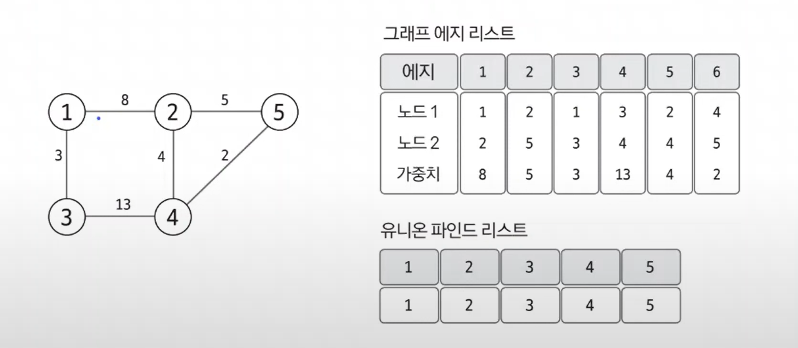
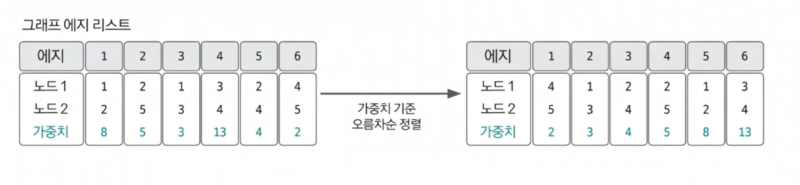
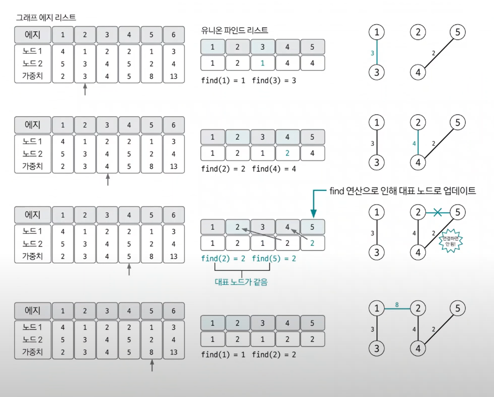
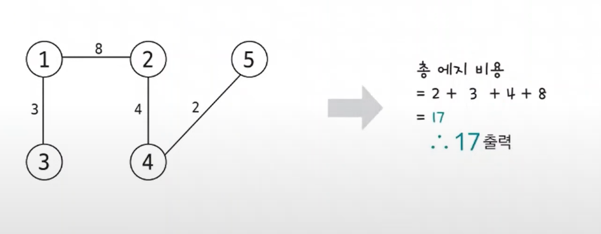

# 최소 신장 트리

- 최소 신장 트리(`minimum spanning tree`)란 그래프에서 모든 노드를 연결할 때 사용된 에지들의 가중치의 합을 최소로 하는 트리이다.
- **특징**
  - 사이클이 포함되면 가중치의 합이 최소가 될 수 없으므로 사이클을 포함하지 않는다.
  - `N`개의 노드가 있으면 최소 신장 트리를 구성하는 에지의 개수는 `N-1`개다.

## 최소 신장 트리 핵심이론

1. **에지 리스트로 그래프를 표현하고 유니온 파인드 리스트 초기화**
- 최소 신장 트리는 데이터를 노드가 아닌 에지 중심으로 저장하므로 인접 리스트가 아닌 에지 리스트의 형태로 저장한다.
- 이 리스트는 일반적으로 노드 변수 2개와 가중치 변수로 구성된다.
- 사이클 처리를 위한 유니온 파인드 리스트도 함께 초기화한다.

2. **그래프 데이터를 가중치 기준으로 정렬**

3. **가중치가 낮은 에지부터 연결 시도**

- 가중치가 낮은 에지부터 순서대로 선택해 연결을 시도한다.
- 이때 바로 연결하지 않고 이 에지를 연결했을 때 그래프에 사이클 형성 유무를 `find` 연산을 이용해 확인한 후 사이클이 형셩되지 않을 때만 `union` 연산으로 두 노드를 연결한다.

4. **과정 3 반복**
- 전체 노드의 개수가 `N`개일 때, 연결한 에지의 개수가 `N-1`이 될 때까지 과정 3을 반복한다.

5. **총 에지 비용 출력**
- 에지의 개수가 `N-1`이 되면 알고리즘을 종료하고, 완성된 최소 신장 트리의 총 에지 비용을 출력한다.

- 최소 신장 트리는 에지를 기준으로 하는 알고리즘이기 때문에 다른 그래프 알고리즘과는 달리, 에지 리스트의 형태를 이용해 데이터를 담는다는 특징이 있다.
- 또한 사이클이 존재하면 안 되는 특징일 지니고 있기 때문에 사이클 판별 알고리즘인 유니온 파인드 알고리즘을 내부에 구현해야 한다.

### [예제 문제(백준 - 최소 스패닝 트리)](https://github.com/genesis12345678/TIL/blob/main/algorithm/graph/mst/Example_1.md#%EC%B5%9C%EC%86%8C-%EC%8B%A0%EC%9E%A5-%ED%8A%B8%EB%A6%AC-%EC%98%88%EC%A0%9C---1)

### [예제 문제(백준 - 다리 만들기 2)](https://github.com/genesis12345678/TIL/blob/main/algorithm/graph/mst/Example_2.md#%EC%B5%9C%EC%86%8C-%EC%8B%A0%EC%9E%A5-%ED%8A%B8%EB%A6%AC-%EC%98%88%EC%A0%9C---2)

### [예제 문제(백준 - 불우이웃돕기)](https://github.com/genesis12345678/TIL/blob/main/algorithm/graph/mst/Example_3.md#%EC%B5%9C%EC%86%8C-%EC%8B%A0%EC%9E%A5-%ED%8A%B8%EB%A6%AC-%EC%98%88%EC%A0%9C---3)