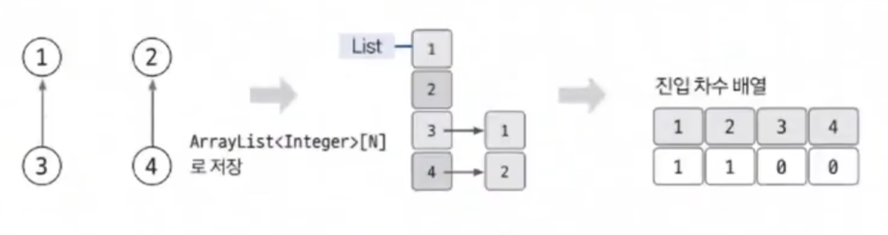

# 위상 정렬 예제 - 1

### [문제(백준(2252번 - 줄 세우기))](https://www.acmicpc.net/problem/2252)

### 문제 분석
- 학생들을 노드로 생각하고, 키 순서 비교 데이터로 에지를 만든다고 생각했을 때 노드의 순서를 도출하는 가장 기본적인 문제이다.
- 답이 여러 개일 때 아무거나 출력해도 된다는 전제는 위상 정렬의 결과가 항상 유일하지 않다는 알고리즘의 전제와 동일하다는 것을 알 수 있다.

### 손으로 풀어보기
1. **인접 리스트에 노드 데이터를 저장하고, 진입 차수 배열값을 업데이트 한다.** 



2. **다음 순서에 따라 위상 정렬을 수행한다.**
   1. 진입 차수가 0인 노드를 큐에 저장
   2. 큐에서 데이터를 뽑아 와서 해당 노드를 탐색 결과에 추가하고, 해당 노드가 가리키는 노드의 진입 차수를 1씩 감소한다.
   3. 감소했을 때 진입 차수가 0이 되는 노드를 큐에 삽입한다.
   4. 큐가 빌 때까지 위 과정을 반복한다.
    
    
### 슈도코드
```text
n(학생 수) m(비교 횟수)
A(인접 리스트)
inDegree(진입 차수 리스트)

for m 반복:
    인접 리스트 데이터 저장
    진입 차수 리스트 초기 데이터 저장
    
큐 생성

for n 반복:
    진입 차수 리스트의 값이 0인 학생(노드)을 큐에 삽입
    
while 큐가 빌 때까지:
    큐에서 현재 노드를 빼면서 출력
    for 현재 노드에서 갈 수 있는 노드의 개수:
        다음 노드 진입 차수 리스트값 1 감소
        if 다음 노드의 진입 차수가 0이면:
            큐에 다음 노드 삽입
```

### 코드 구현 - 파이썬
```python
import sys
from collections import deque

input = sys.stdin.readline

n, m = map(int, input().split())
A = [[] for _ in range(n + 1)]
inDegree = [0] * (n + 1)

for i in range(m):
    a, b = map(int, input().split())
    A[a].append(b)
    inDegree[b] += 1

qu = deque()

for i in range(1, n + 1):
    if inDegree[i] == 0:
        qu.append(i)


result = []

while qu:
    now = qu.popleft()
    result.append(str(now))

    for next in A[now]:
        inDegree[next] -= 1
        if inDegree[next] == 0:
            qu.append(next)

print(" ".join(result))
```

### 코드 구현 - 자바
```java
import java.io.BufferedReader;
import java.io.IOException;
import java.io.InputStreamReader;
import java.util.*;

public class Main {

    public static void main(String[] args) throws IOException {
        BufferedReader br = new BufferedReader(new InputStreamReader(System.in));
        StringTokenizer st = new StringTokenizer(br.readLine());

        int n = Integer.parseInt(st.nextToken());
        int m = Integer.parseInt(st.nextToken());

        ArrayList<Integer>[] A = new ArrayList[n + 1];
        int[] inDegree = new int[n + 1];

        for (int i = 1; i <= n; i++) {
            A[i] = new ArrayList<>();
        }

        for (int i = 0; i < m; i++) {
            st = new StringTokenizer(br.readLine());
            int a = Integer.parseInt(st.nextToken());
            int b = Integer.parseInt(st.nextToken());

            A[a].add(b);
            inDegree[b]++;
        }

        Queue<Integer> qu = new LinkedList<>();

        for (int i = 1; i < inDegree.length; i++) {
            if (inDegree[i] == 0) {
                qu.offer(i);
            }
        }

        StringBuilder sb = new StringBuilder();

        while (!qu.isEmpty()) {
            int now = qu.poll();
            sb.append(now).append(" ");

            for (int next : A[now]) {
                inDegree[next]--;
                if (inDegree[next] == 0) {
                    qu.offer(next);
                }
            }
        }

        System.out.println(sb);

    }
}
```