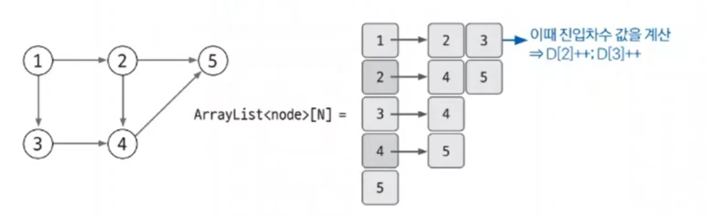
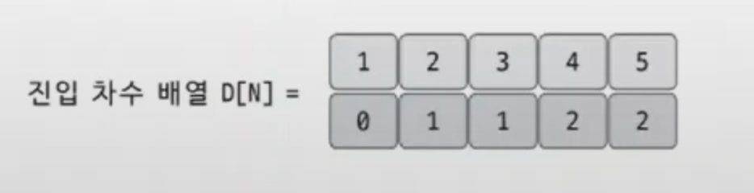
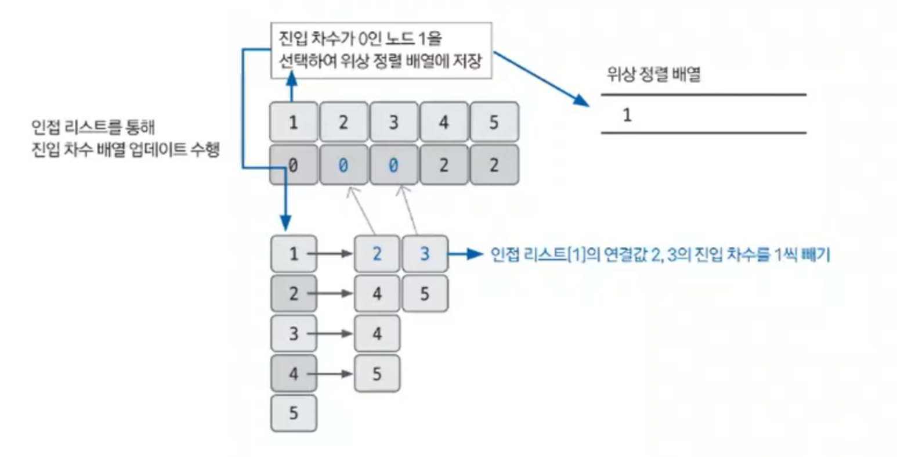
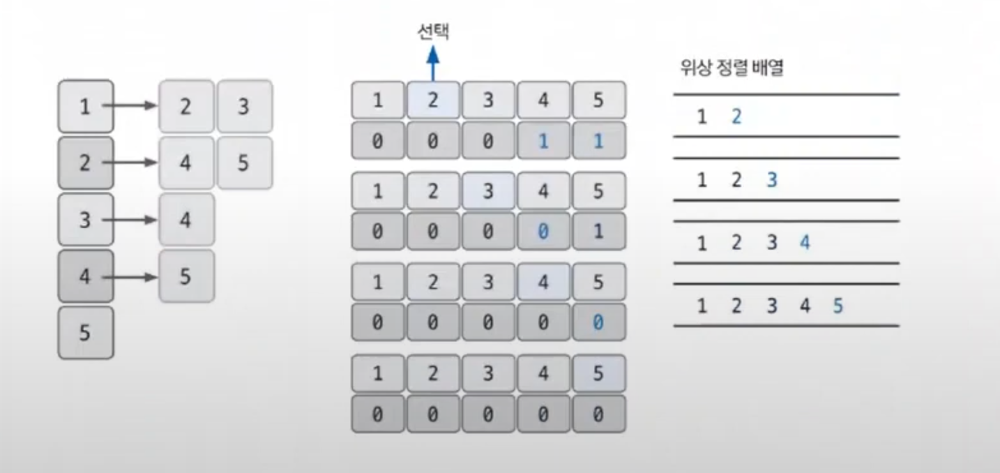
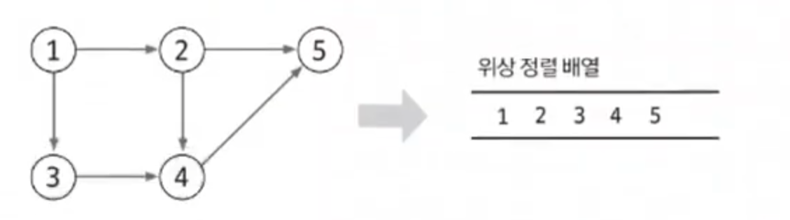

# 위상 정렬

- 위상 정렬(`topology sort`)은 사이클이 없는 방향 그래프에서 노드 순서를 찾는 알고리즘이다.
- 위상 정렬에서는 항상 유일한 값으로 정렬되지 않는다.
- 사이클이 존재하면 노드 간의 순서를 명확하게 정의할 수 없으므로 위상 정렬을 적용할 수 없다.
- **기능** : 노드 간의 순서를 결정
- **특징** : 사이클이 없어야 한다.
- **시간 복잡도** : `O(V + E)`, V: 노드 수, E: 에지 수

## 위상 정렬 핵심 이론

1. **진입 차수란 자기 자신을 가리키는 에지의 개수이다.**

- 인접 리스트에 기반을 둔 차수 리스트는 다음과 같이 만들어진다.

2. **진입 차수 리스트에서 진입 차수가 0인 노드를 선택하고 선택된 노드를 정렬 리스트에 저장한다. 그 후 인접 리스트에서 선택된 노드가 가리키는 노드들의 진입 차수를 1씩 뺀다.**

- 계속해서 모든 노드가 정렬될 때까지 진입 차수가 0인 노드를 선택하고 선택된 노드가 가리키는 진입 차수를 1 빼주는 과정을 반복한다.

- 진입 차수가 0인 노드가 2개 이상일 때, 아무거나 선택해도 위상 정렬에 위배 되지 않는다.
- 이것이 항상 유일한 값으로 정렬되지 않는 이유다.

3. **위상 정렬 배열 결과는 다음과 같다.**

### [예제 문제(백준 - 줄 세우기)](https://github.com/genesis12345678/TIL/blob/main/algorithm/graph/topologySort/Example_1.md#%EC%9C%84%EC%83%81-%EC%A0%95%EB%A0%AC-%EC%98%88%EC%A0%9C---1)

### [예제 문제(백준 - 게임 개발)](https://github.com/genesis12345678/TIL/blob/main/algorithm/graph/topologySort/Example_2.md#%EC%9C%84%EC%83%81-%EC%A0%95%EB%A0%AC-%EC%98%88%EC%A0%9C---2)

### [예제 문제(백준 - 임계경로)](https://github.com/genesis12345678/TIL/blob/main/algorithm/graph/topologySort/Example_3.md#%EC%9C%84%EC%83%81-%EC%A0%95%EB%A0%AC-%EC%98%88%EC%A0%9C---3)