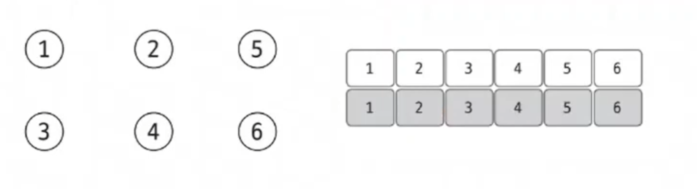
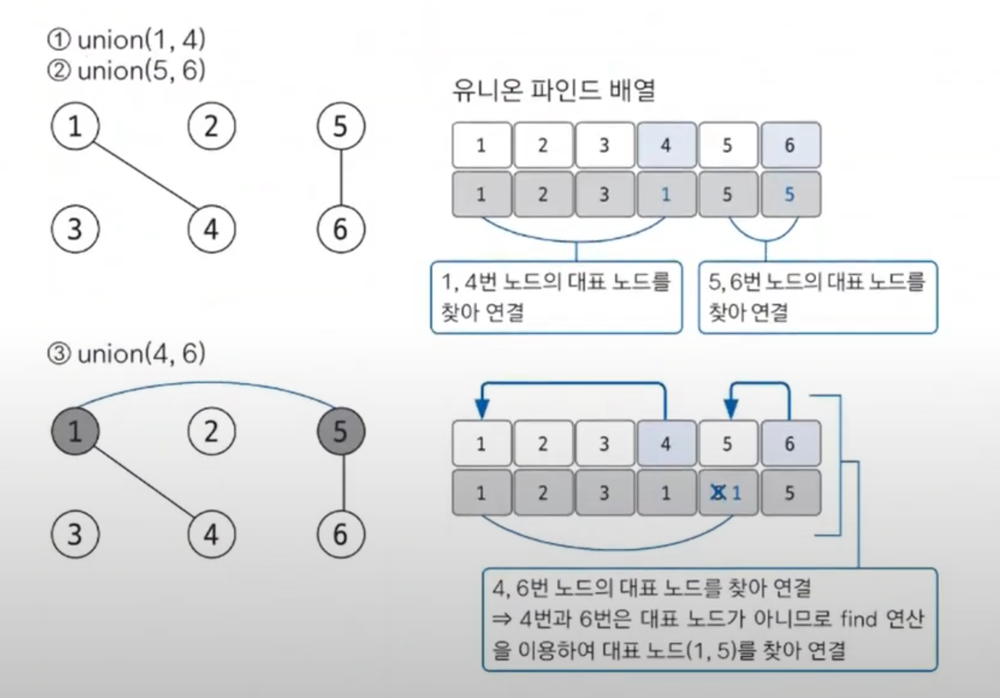
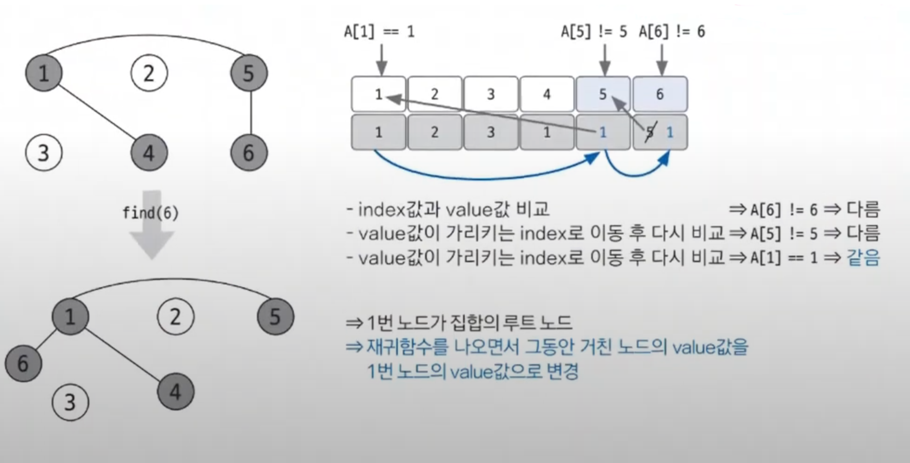
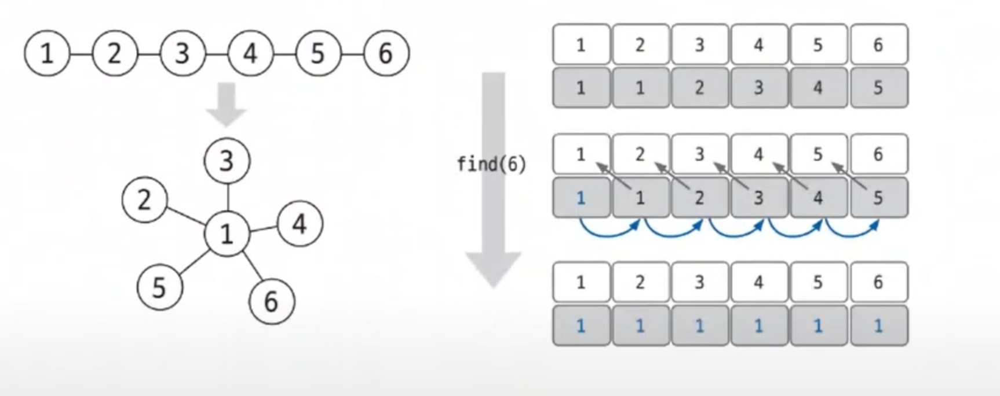

# 유니온 파인드

- 유니온 파인드(union-find)는 일반적으로 여러 노드가 있을 때 특정 2개의 노드를 연결해 1개의 집합으로 묶는 `union` 연산과 두 노드가
    같은 집합에 속해 있는지를 확인하는 `find` 연산으로 구성되어 있는 알고리즘이다.

## 유니온 파인드 핵심 이론

- 유니온 파인드는 `union`, `find` 연산을 완벽히 이해하는 것이 중요하다.
- **union 연산**
  - 각 노드가 속한 집합을 1개로 합치는 연산이다. 노드 a, b가 `a ∈ A`, `b ∈ B`일 때 `union(a, b)`는 `A ∪ B`를 말한다.
- **find 연산**
  - 특정 노드 a에 관해 a가 속한 집합의 대표 노드를 반환하는 연산이다. 노드 a가 `a ∈ A`일 때 `find(a)`는 A 집합의 대표 노드를 반환한다.

**유니온 파인드 알고리즘 구현 방법**

1. 유니온 파인드를 표현하는 일반적인 방법은 1차원 배열을 이용하는 것이다. 처음에는 노드가 연결되어 있지 않으므로 각 노드가 대표 노드가 된다. 각 노드가 모두
    대표 노드이므로 배열은 자신의 인덱스값으로 초기화한다.

2. 2개의 노드를 선택해 각각의 대표 노드를 찾아 연결하는 `union`연산을 수행한다.

- `union(1, 4)`의 경우 1은 대표 노드, 4는 자식 노드로 `union`을 하므로 리스트[4]의 대표 노드를 1로 설정한다.
- 자식 노드로 들어가는 노드값 4를 대표 노드값 1로 변경한 것이다.
- 그 결과 각각의 집합이었던 1, 4는 하나로 합쳐진다.
- `union(4, 6)`의 경우 4와 6은 모두 대표 노드가 아니다.
- `find`연산을 통해 대표 노드를 찾아야 한다.

3. **find 연산은 자신이 속한 집합의 대표 노드를 찾는 연산이다. find 연산은 단순히 대표 노드를 찾는 역할만 하는 것이 아니라 그래프를 정돈하고 시간 복잡도를 줄인다.**

> **find 연산의 작동 원리**
> 1. 대상 노드 리스트에 index값과 value값이 동일한지 확인한다.
> 2. 동일하지 않으면 value값이 가리키는 index 위치로 이동한다.
> 3. 이동 위치의 index값과 value값이 같을 때까지 과정 1~2를 반복한다. 반복이므로 이 부분은 재귀 함수로 구현한다.
> 4. **대표 노드에 도달하면 재귀 함수를 빠져나오면서 거치는 모든 노드값을 대표 노드값으로 변경한다.**
>
> 

- `find`연산은 시간 복잡도가 줄어드는 효과를 얻게 된다.
- 연산은 할 때 거치는 노드들이 대표 노드와 바로 연결되는 형태로 변경되는 것을 알 수 있는데. 이렇게 되면 추후 노드와 관련된 `find`연산 속도가 `O(1)`로 변경된다.

- 한 번의 find 연산을 이용해 모든 노드가 루트 노드에 직접 연결되는 형태로 변경되는 것을 볼 수 있다.
- 이러한 형태로 변경되면 이후 `find` 연산이 진행될 때 **경로 압축의 효과가 나타난다.**
  - 경로 압축은 실제 그래프에서 여러 노드를 거쳐야 하는 경로에서 그래프를 변형해 더 짧은 경로로 갈 수 있도록 함으로써 시간 복잡도를 효과적으로 줄이는 방법을 말한다.
- 예를 들어 이후 `find(4)` 연산을 수행하면 한 번의 이동으로 바로 대표 노드를 찾을 수 있게 된다.

 

### [예제 문제(백준 - 집합의 표현)](https://github.com/genesis12345678/TIL/blob/main/algorithm/graph/unionFind/Example_1.md#%EC%9C%A0%EB%8B%88%EC%98%A8-%ED%8C%8C%EC%9D%B8%EB%93%9C-%EC%98%88%EC%A0%9C---1)

### [예제 문제(백준 - 여행 가자)](https://github.com/genesis12345678/TIL/blob/main/algorithm/graph/unionFind/Example_2.md#%EC%9C%A0%EB%8B%88%EC%98%A8-%ED%8C%8C%EC%9D%B8%EB%93%9C-%EC%98%88%EC%A0%9C---2)

### [예제 문제(백준 - 거짓말)](https://github.com/genesis12345678/TIL/blob/main/algorithm/graph/unionFind/Example_3.md#%EC%9C%A0%EB%8B%88%EC%98%A8-%ED%8C%8C%EC%9D%B8%EB%93%9C-%EC%98%88%EC%A0%9C---3)