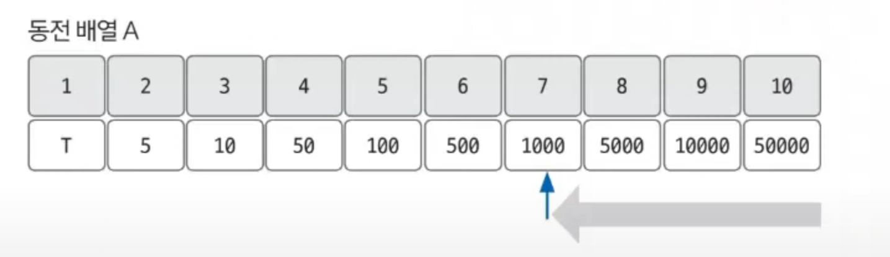

# 그리디 알고리즘 예제 - 1

### [문제(백준(11047번 - 동전 0))](https://www.acmicpc.net/problem/11047)

### 문제 분석
- 전형적인 그리디 알고리즘 문제이다.
- 그리디 알고리즘으로 풀 수 있도록 뒤의 동전 가격이 앞에 나오는 동전 가격의 배수가 된다는 조건을 부여했다.
- 즉, 동전을 최소로 사용하여 K를 만들기 위해서는 가장 가격이 큰 동전부터 차례대로 사용하면 된다.

### 손으로 풀어보기
1. **가격이 큰 동전부터 내림차순으로 K보다 가격이 작거나 같은 동전이 나올 때까지 탐색한다.**



2. **탐색을 멈춘 동전의 가격으로 K를 나눠 몫은 동전 개수에 더하고, 나머지로 K값을 갱신한다.**
3. **과정 1 ~ 2를 나머지가 0이 될 때까지 반복한다.**

### 슈도코드
```text
n(동전 개수) k(목표 금액)
list(동전 데이터 리스트)

for n 반복:
    list 데이터 저장

for n (n-1 ~ 0):  # 역순
    if 현재 k보다 동전 가치가 작거나 같으면:
        동전 수 += 목표 금액 / 현재 동전 가치
        목표 금액 = 목표 금액 % 현재 동전 가치
        
누적된 동전 개수 출력
```

### 코드 구현 - 파이썬
```python
n, k = map(int, input().split())
list = [0] * n

for i in range(n):
    list[i] = int(input())

count = 0

for i in range(n - 1, -1, -1):
    if k >= list[i]:
        count += int(k / list[i])
        k = k % list[i]

print(count)
```

> **그리디 알고리즘에서 자주 사용하는 자료구조 우선순위 큐**
> 
> 그리디 알고리즘은 현재 상황에서 최선의 선택을 반복하느 알고리즘이기 때문에 우선순위 큐를 사용하여 문제를 해결하는 경우가 흔하다.<br>
> 파이썬에서는 우선순위 큐 자료구조를 두 가지 방법으로 제공한다.
> ```python
> from queue import PriorityQueue
> 
> myque = PriorityQueue()  # 우선순위 큐 생성
> 
> # 기본 함수
> put(data)     # 원소 추가
> get()         # 큐에서 데이터 꺼내기
> qsize()       # 큐 사이즈 가져오기
> empty()       # 큐가 비어 있는지 확인
> ```
> ```python
> import heapq
> 
> mylist = []               # 리스트 생성
> heapq.heappush(mylist, 1) # 리스트에 데이터를 넣을 때 heapq를 이용하여 저장
> 
> # 기본 함수
> heappush(mylist, data)    # data를 list(heap 자료구조) 형태로 저장
> heappop(mylist)           # list(heap 자료구조)에서 데이터 꺼내기
> heapify(mylist)           # 일반적인 list를 heap 자료구조로 변환 
> ```
> 
> - `PriorityQueue`는 객체 자체를 우선순위 큐 형태로 만들어 사용하는 반면, `heapq`는 기본적인 list 객체를 대상으로 원소 삽입, 삭제 등의 제공 함수를 통해
>   우선순위 큐를 구현한다.

### 코드 구현 - 자바
```java
import java.io.BufferedReader;
import java.io.IOException;
import java.io.InputStreamReader;
import java.util.StringTokenizer;

public class Main {
    public static void main(String[] args) throws IOException {
        BufferedReader br = new BufferedReader(new InputStreamReader(System.in));
        StringTokenizer st = new StringTokenizer(br.readLine());

        int n = Integer.parseInt(st.nextToken());
        int k = Integer.parseInt(st.nextToken());

        int[] arr = new int[n];
        for (int i = 0; i < n; i++) {
            arr[i] = Integer.parseInt(br.readLine());
        }

        int count = 0;

        for (int i = n - 1; i >= 0 ; i--) {
            if (k >= arr[i]) {
                count += k / arr[i];
                k %= arr[i];
            }
        }
        System.out.println(count);
    }
}

```