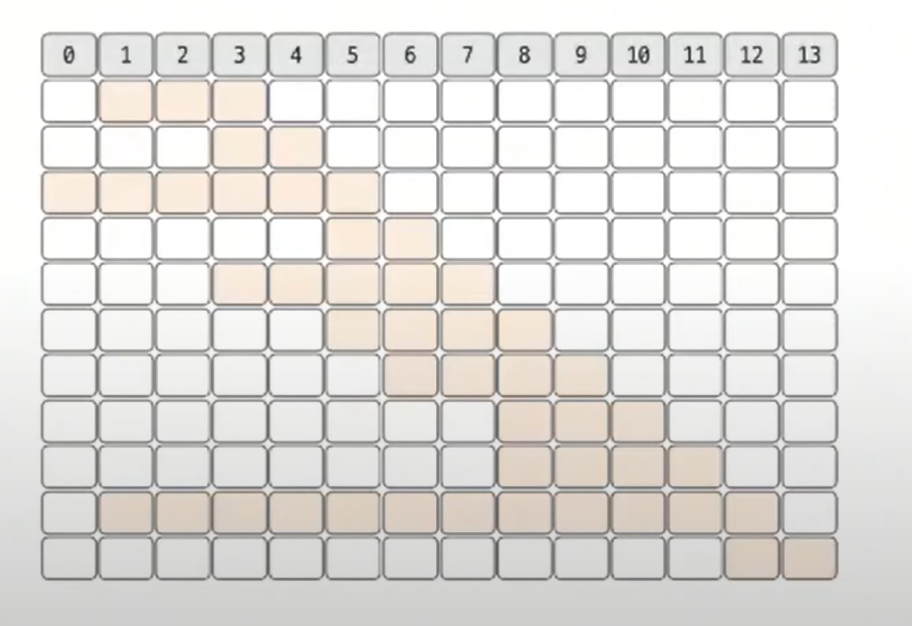
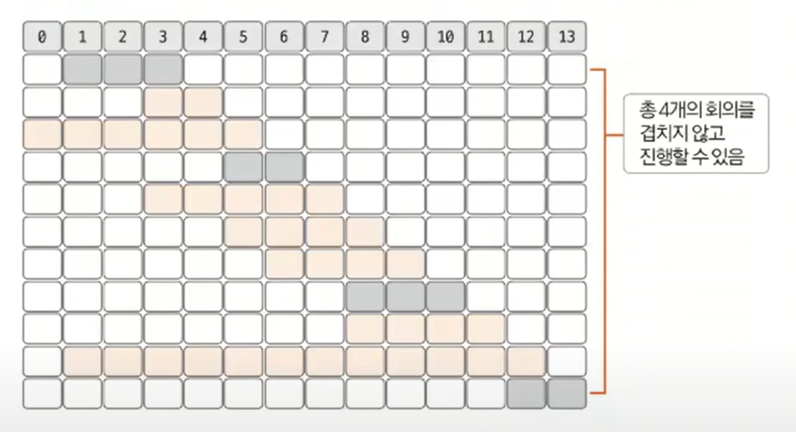

# 그리디 알고리즘 예제 - 4

### [문제(백준(1931번 - 회의실 배정))](https://www.acmicpc.net/problem/1931)

### 문제 분석
- 1개의 회의실에 회의가 겹치지 않게 최대한 많은 회의를 배정해야 한다.
- 이때 그리디 알고리즘을 적용해야 하는데, 현재 회의의 종료 시간이 빠를수록 다음 회의와 겹치지 않게 시작하는 데 유리하다.
- 종료 시간이 빠른 순서대로 정렬해 겹치지 않는 회의실을 적절하게 선택하면 문제를 해결할 수 있다.

### 손으로 풀어보기
1. **회의 정보와 관련된 데이터를 저장한 후 종료 시간순으로 정렬한다. 단, 종료 시간이 같을 때는 시작 시간을 기준으로 다시 한번 정렬한다.**



2. **차례대로 탐색하다가 시간이 겹치지 않는 회의가 나오면 선택한다.(이미 종료 시간이 빠른 순서대로 정렬을 해 놓았기 때문)**



> **종료 시간이 같은 경우**
> 
> 종료 시간이 같을 때는 시작 시간이 빠른 순으로 정렬하는 기준이 포함되어야 한다. 문제에서 회의의 시작 시간과 종료 시간이 같을 수도 있다고 했다.<br>
> 예를 들어 `(2, 2)`, `(1, 2)` 2개의 회의가 있을 때, 실제로는 2개의 회의가 겹치지 않게 할 수 있지만 로직상 `(2, 2)`가 먼저 나오면 나중에 나온 `(1, 2)`가 불가능할 수 있다.
> 따라서 종료 시간이 같으면 시작 시간이 빠른 순서로 정렬하는 로직도 추가해야 한다.

### 슈도코드
```text
n(회의 개수)
A(회의 정보 저장)
A 정렬  # 종료 시각 기준으로 정렬, 종료 시각이 같으면 시작 시각 기준 정렬

for n 반복:
    if 앞 회의의 종료 시각보다 시작 시각이 늦은 회의가 나온 경우:
        현재 회의의 종료 시각으로 종료 시각 업데이트
        진행할 수 있는 회의 수 1 증가
        
회의 수 출력
```


### 코드 구현 - 파이썬
```python
n = int(input())
A = [[0] * 2 for _ in range(n)]

for i in range(n):
    start, end = map(int, input().split())
    A[i][0] = end  # 종료 시각 우선 정렬이 먼저이므로 0번째에 종료 시각을 먼저 저장
    A[i][1] = start

A.sort()
count = 0
end = -1

for i in range(n):
    if A[i][1] >= end:
        end = A[i][0]
        count += 1

print(count)
```
- **이차원 리스트의 정렬 방식은 데이터 입력 순서를 통하여 조정할 수 있다.**

### 코드 구현 - 자바
```java
import java.io.BufferedReader;
import java.io.IOException;
import java.io.InputStreamReader;
import java.util.Arrays;
import java.util.StringTokenizer;

public class Main {
    public static void main(String[] args) throws IOException {
        BufferedReader br = new BufferedReader(new InputStreamReader(System.in));
        int n = Integer.parseInt(br.readLine());

        int[][] A = new int[n][2];

        for (int i = 0; i < n; i++) {
            StringTokenizer st = new StringTokenizer(br.readLine());
            int start = Integer.parseInt(st.nextToken());
            int end = Integer.parseInt(st.nextToken());

            A[i][0] = start;
            A[i][1] = end;
        }

        //종료 시각 기준 오름차순, 종료 시각이 같으면 시작 시각이 빠른 순서로 정렬
        Arrays.sort(A, (o1, o2) -> {
            if (o1[1] == o2[1]) {
                return o1[0] - o2[0];
            }
            return o1[1] - o2[1];
        });

        int count = 0;
        int end = Integer.MIN_VALUE;

        for (int i = 0; i < n; i++) {
            if (A[i][0] >= end) { //현재 회의 시작 시간과 이전 회의 종료 시간이 겹치지 않으면
                end = A[i][1]; //현재 회의의 종료 시간으로 업데이트
                count++;
            }
        }
        System.out.println(count);
    }
}
```