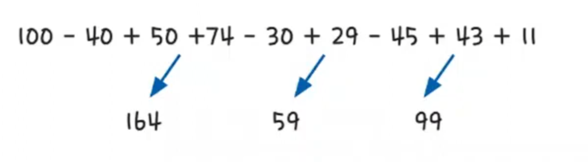

# 그리디 알고리즘 예제 - 5

### [문제(백준(1541번 - 잃어버린 괄호))](https://www.acmicpc.net/problem/1541)

### 문제 분석
- 그리디의 관점에서 생각하면 쉽게 풀 수 있는 문제다.
- 가장 작은 최솟값을 만들기 위해서는 가능한 한 큰 수를 빼야한다.
- 수식이 더하기와 빼기 연산만으로 이루어져 있기 때문에 더하기에 해당하는 부분에 괄호를 쳐서 모두 계산한 후 빼기를 실행하면 된다.

### 손으로 풀어보기

1. **가장 먼저 더하기 연산을 실행한다.** 


2. **가장 앞에 있는 값에서 더하기 연산으로 나온 결괏값들을 모두 뺀다.**
: `100 - 164 - 59 - 99 = -222`

### 슈도코드
```text
result(정답 변수)
A 리스트(들어온 데이터를 "-" 기호를 기준으로 split)

mySum():
    현재 들어온 String 값을 "+" 기호 기준으로 split
    for 나뉜 데이터 개수만큼:
        String값을 int형으로 변환해 리턴값에 더하기
    전체 합 리턴
    
for i A만큼:
    결괏값 = mySum(A[i]) 수행
    if 가장 앞 데이터:
        result에 결괏값 더하기
    else:
        result에 결괏값 빼기
        
result 출력
```

### 코드 구현 - 파이썬
```python
result = 0
A = list(map(str, input().split("-")))


def mySum(s):
    sum = 0
    temp = str(s).split("+")
    for i in temp:
        sum += int(i)
    return sum


for i in range(len(A)):
    temp = mySum(A[i])
    if i == 0:
        result += temp
    else:
        result -= temp

print(result)
```

### 코드 구현 - 자바
```java
import java.io.BufferedReader;
import java.io.IOException;
import java.io.InputStreamReader;

public class Main {
    public static void main(String[] args) throws IOException {
        BufferedReader br = new BufferedReader(new InputStreamReader(System.in));

        String input = br.readLine();
        String[] str = input.split("-");

        int count = 0;
        for (int i = 0; i < str.length; i++) {
            int temp = mySum(str[i]);

            if (i == 0) {
                count += temp;
            } else {
                count -= temp;
            }
        }
        System.out.println(count);
    }

    private static int mySum(String s) {
        String[] temp = s.split("\\+");
        int sum = 0;

        for (String string : temp) {
            sum += Integer.parseInt(string);
        }
        return sum;
    }
}
```
- `String[] temp = s.split("\\+");`
  - 그냥 `split("+")`을 하면 이상하게 `java.util.regex.PatternSyntaxException: Dangling meta character ...` 에러가 발생한다.
  - `?, *, + ,( ,) ,[, ], {, }` 와 같은 문자를 `replace, replaceAll, split` 등을 사용하여 치환 및 나누어주는 기준으로 사용할 때 발생하는 에러이다.
  - 위 특수문자들은 역슬래시`(\)`두개를 붙여줘야 인식해서 에러가 발생하지 않는다.
