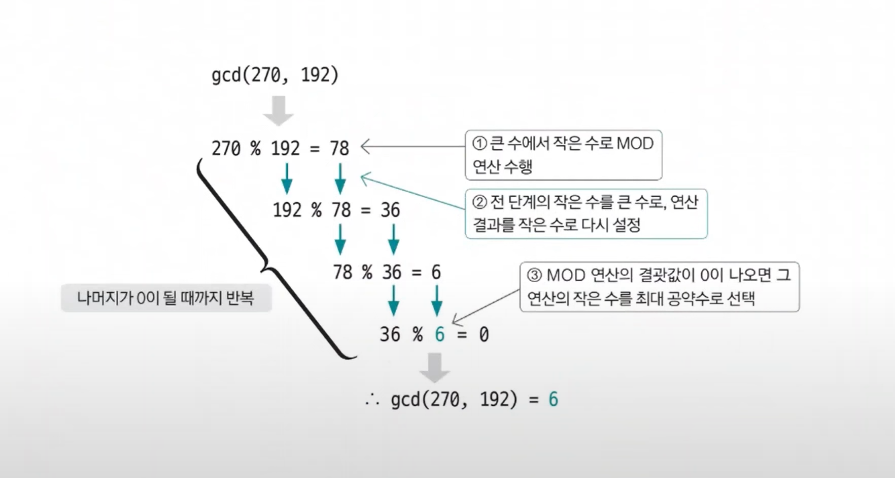

# 유클리드 호제법

- 유클리드 호제법은 두 수의 최대 공약수를 구하는 알고리즘이다.
- 일반적으로 최대 공약수를 구하는 방법은 소인수 분해를 이용한 공통된 소수들의 곱으로 표현할 수 있지만, 유클리드 호제법은 좀 더 간단한 방법을 제시한다.

## 유클리드 호제법 핵심 이론

- **유클리드 호제법은 `MOD` 연산이 최대 공약수를 구하는 데 사용하는 핵심 연산이다.**

**MOD 연산으로 구현하는 유클리드 호제법**
1. 큰 수를 작은 수로 나누는 MOD 연산 수행
2. 앞 단계에서의 작은 수와 MOD 연산 결괏값(나머지)으로 MOD 연산 수행
3. 2단계를 반복하다가 나머지가 0이 되는 순간의 작은 수를 최대 공약수로 선택

- 270과 192의 최대 공약수를 구하는 과정
- `gcd` : Greatest Common Divisor, 최대 공약수

### [예제 문제(백준 - 최소공배수)](https://github.com/genesis12345678/TIL/blob/main/algorithm/numberTheory/euclidean/Example_1.md#%EC%9C%A0%ED%81%B4%EB%A6%AC%EB%93%9C-%ED%98%B8%EC%A0%9C%EB%B2%95-%EC%98%88%EC%A0%9C---1)

### [예제 문제(백준 - 최대공약수)](https://github.com/genesis12345678/TIL/blob/main/algorithm/numberTheory/euclidean/Example_2.md#%EC%9C%A0%ED%81%B4%EB%A6%AC%EB%93%9C-%ED%98%B8%EC%A0%9C%EB%B2%95-%EC%98%88%EC%A0%9C---2)

### [예제 문제(백준 - 칵테일)](https://github.com/genesis12345678/TIL/blob/main/algorithm/numberTheory/euclidean/Example_3.md#%EC%9C%A0%ED%81%B4%EB%A6%AC%EB%93%9C-%ED%98%B8%EC%A0%9C%EB%B2%95-%EC%98%88%EC%A0%9C---3)

# 확장 유클리드 호제법

- 유클리드 호제법의 목적이 두 수의 최대 공약수를 구하는 것이라면 확장 유클리드 호제법의 목적은 방정식의 해를 구하는 것이다.

## 확장 유클리드 호제법 핵심 이론

**해를 구하고자 하는 방정식**
- `ax + by = c(a, b, c, x, y는 정수)`
  - 위 방정식은 `c % gcd(a, b) = 0`인 경우에만 정수해를 가진다.
  - c가 a와 b의 최대 공약수의 배수인 경우에만 정수해를 가진다.
  - 이는 `ax + by = c`가 정수해를 갖게 하는 c의 최솟값이 gcd(a, b)라는 것을 의미한다.

예) **`5x + 9y = 2`일 때 이 식을 만족하는 정수 x와 y**
1. 우선 `5x + 9y`가 정수해를 갖게 하는 c의 최솟값이 gcd(5, 9)라는 것을 적용하여 식을 다시 놓는다. gcd(5, 9) = 1이므로 `5x + 9y = 1`로 식을 다시 놓고 다음 단계를 진행한다.
2. a, b로 유클리드 호제법을 반복 실행하며 몫, 나머지를 저장한다. 반복은 나머지가 0이 되면 중단한다.

| 유클리드 호제법 실행 | 나머지 | 몫 |
|-------------|-----|---|
| `5 % 9 = 5` | 5   | 0 |
| `9 % 5 = 4` | 4   | 1 |
| `5 % 4 = 1` | 1   | 1 |
| `4 % 1 = 0` | 0   | 4 |

3. 반복으로 구한 나머지와 몫을 이용하여 거꾸로 올라가며 `x = y'`, `y = x' - y' * q`를 계산한다. 
: `x'`는 이전 x, `y'`는 이전 y를 의미하고, `q`는 현재 보고 있는 몫을 의미한다. 
    이때, 처음 시작하는 x, y는 이전 x와 y가 없으므로 각각 1, 0을 지정하여 역계산을 진행한다.

| 나머지 | 몫 | `x = y'`, `y = x' - y' * q` 역순 계산           |
|-----|---|---------------------------------------------|
| 5   | 0 | `X = 2`, `Y = -1 - (2 * 0) = -1` , 계산 순서: 4 |
| 4   | 1 | `X = -1`, `Y = 1 - (-1 * 1) = 2` , 계산 순서: 3 |
| 1   | 1 | `X = 1`, `Y = 0 - (1 * 1) = -1` , 계산 순서: 2  |
| 0   | 4 | `X = 0`, `Y = 1 - (0 * 4) = 1` , 계산 순서: 1   |

4. 이렇게 재귀 방식으로 알아낸 최종 x, y는 `ax + by = gcd(a, b)`를 만족한다. 그리고 `c / gcd(a, b) = K`를 가정하면 최초 방정식의 해는
    Kx, Ky로 간단히 구할 수 있다. 3번 과정에서 찾은 x는 2, y는 -1이고 K값을 곱하면 `2(c값) / 1(최대 공약수) = 2`가 되므로 2의 값을 기존에 `x(2)`, `y(-1)` 값에
    각각 곱해주면 최초 방정식의 해는 `x = 4`, `y = -2`가 된다는 것을 알 수 있다.

> **오른쪽 변의 값(c)이 gcd(a, b)의 배수가 아니라면?**
> 
> 이 경우를 만족하는 x, y값은 정수 범위에서 존재하지 않는다. 따라서 확장 유클리드 호제법을 구현할 때 먼저 오른쪽 변의 값이 `gcd(a, b)`의 배수라는 조건을
> 만족하는지 먼저 판단해야 한다. 만약 조건에 만족하지 않는다면 이후 프로그램을 수행하지 않고 불가능을 표현하는 값을 출력하면 된다. 
> 또한 유클리드 호제법의 구조 자체가 특정한 값을 업데이트시키면서 같은 로직을 반복적으로 수행하므로 재귀 함수의 형태로 구현한다.

### [예제 문제(백준 - Ax+By=C)](https://github.com/genesis12345678/TIL/blob/main/algorithm/numberTheory/euclidean/Example_4.md#%ED%99%95%EC%9E%A5-%EC%9C%A0%ED%81%B4%EB%A6%AC%EB%93%9C-%ED%98%B8%EC%A0%9C%EB%B2%95-%EC%98%88%EC%A0%9C---1)