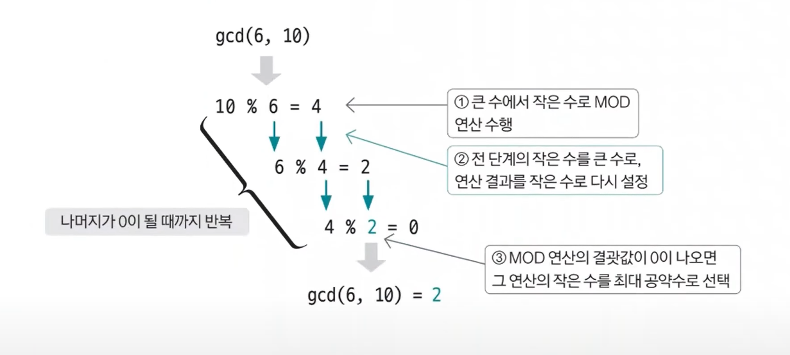

# 유클리드 호제법 예제 - 1

### [문제(백준(1934번 - 최소공배수))](https://www.acmicpc.net/problem/1934)

### 문제 분석
- 최소 공배수는 A와 B가 주어졌을 때 `A * B / 최대공약수`를 계산해 구할 수 있다.
- 유클리드 호제법을 이용해 최대 공약수를 구한 후 두 수의 곱에서 최대 공약수를 나눠 주는 것으로 해결할 수 있다.

### 손으로 풀어보기
1. **유클리드 호제법을 이용해 A, B의 최대 공약수를 구한다.**



2. **두 수의 곱을 최대 공약수로 나눈 값을 정답으로 출력한다.**


### 슈도코드
```text
gcd(a, b):
    if b가 0:
        a가 최대 공약수
    else:
        gcd(작은 수, 큰 수 % 작은 수)
        
t(테스트 케이스)

for t 반복:
    a(1번째 수) b(2번째 수)
    출력(a * b / gcd(a, b))
```

### 코드 구현 - 파이썬
```python
t = int(input())

def gcd(a, b):
    if b == 0:
        return a
    else:
        return gcd(b, a % b)

ans = []

for _ in range(t):
    a, b = map(int, input().split())
    result = a * b // gcd(a, b)
    ans.append(str(result))

print("\n".join(ans))
```
- 입력 a와 b를 대소 비교를 하지 않아도 재귀호출 과정에서 자연스럽게 a가 큰 수가 되고 b가 작은 수로 바뀐다.
### 코드 구현 - 자바
```java
import java.io.BufferedReader;
import java.io.IOException;
import java.io.InputStreamReader;
import java.util.StringTokenizer;

public class Main {
    public static void main(String[] args) throws IOException {
        BufferedReader br = new BufferedReader(new InputStreamReader(System.in));

        int t = Integer.parseInt(br.readLine());

        StringBuilder sb = new StringBuilder();
        for (int i = 0; i < t; i++) {
            StringTokenizer st = new StringTokenizer(br.readLine());
            int a = Integer.parseInt(st.nextToken());
            int b = Integer.parseInt(st.nextToken());

            int result = a * b / gcd(a, b);
            sb.append(result).append("\n");
        }
        System.out.println(sb);
    }

    private static int gcd(int a, int b) {
        if (b == 0) {
            return a;
        } else {
            return gcd(b, a % b);
        }
    }
}
```