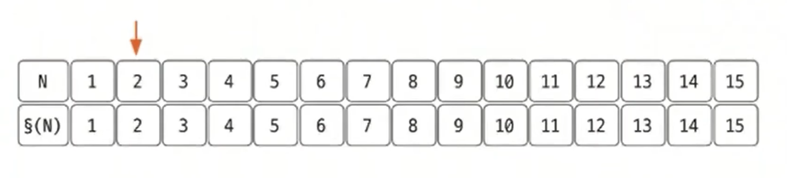
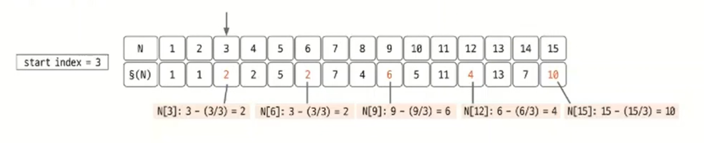
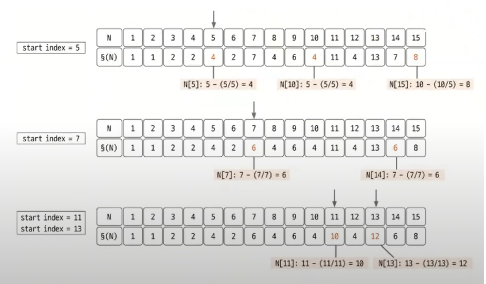

# 오일러 피 함수

- 오일러 피 함수 `P[N]`의 정의는 1부터 `N`까지 범위에서 `N`과 서로소인 자연수의 개수를 뜻한다.
- 서로소란 공약수가 1 이외에는 없다는 것이다.
- 예) `P[6] = 1, 5 = 2`, 2, 3, 4, 6은 같은 약수를 가지므로 포함되지 않는다.

## 오일러 피 핵심 이론

- 오일러 피 함수의 원리는 에라토스테네스의 체와 비슷하다.

**오일러 피 함수의 원리**
1. 구하고자 하는 오일러 피의 범위만큼 리스트를 자기 자신의 인덱스값으로 초기화한다.
2. 2부터 시작해 현재 리스트의 값과 인덱스가 같으면(=소수일 떄) 현재 선택된 숫자(`K`)의 배수에 해당하는 수를 리스트에 끝까지 탐색하며 `P[i] = P[i] - P[i] / K` 연산을 수행한다.(`i`는 `K`의 배수)
3. 리스트의 끝까지 과정 2를 반복하며 오일러 피 함수를 완성한다.

 

1. **구하고자 하는 범위까지 배열을 생성한 후 2를 선택한다.**

2. **2의 모든 배수마다 `P[i] = P[i] - P[i] / 2` 연산을 수행해 값을 갱신한다.**

3. **소수 구하기에서 배수를 지우는 부분만 `P[i] = P[i] - P[i] / K`로 변경하면 오일러 피 함수를 간단히 구현할 수 있다. 탐색을 계속 진행하면서 `N = Φ(N)`인 곳(소수)을 찾아 값을 갱신한다.**

4. **배열이 끝날 때까지 반복한다.**

> **수학적으로 오일러 피 함수 이해**
> 
> - 초기 상태: `Φ(6) = 6` -> 서로소가 될 수 있는 후보의 개수로 초기화(1, 2, 3, 4, 5, 6)
> - 2의 배수로 인한 탈락 -> `Φ(6) = 6 - (6 / 2) = 3(1, 3, 5)`
> - 3의 배수로 인한 탈락 -> `Φ(6) = 3 - (3 / 3) = 2(1, 5)`
> 
> 이때 후보에서 삭제하는 기준을 6이 아닌 업데이트된 3으로 진행하는 이유는 3의 배수 중 2의 배수인 수들, 즉 3과 2의 공배수는 2의 배수에서 이미 삭제됐기 때문에 중복
> 삭제를 막기 위함이다.  
> 최종적으로 `Φ(6) = 2`가 되는데, 이때 2의 의미는 숫자 6과 6 이하의 숫자들 중 서로소가 되는 개수가 2개(1, 5)라는 뜻이 된다.

### [예제 문제(백준 - GCD(n, k) = 1)](https://github.com/genesis12345678/TIL/blob/main/algorithm/numberTheory/eulerPhi/Example_1.md#%EC%98%A4%EC%9D%BC%EB%9F%AC-%ED%94%BC-%ED%95%A8%EC%88%98-%EC%98%88%EC%A0%9C---1)