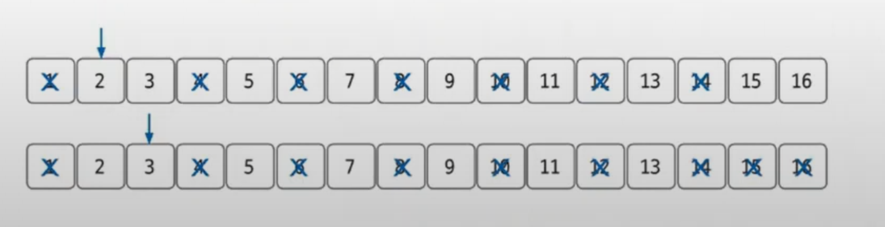

# 소수 구하기 예제 - 1

### [문제(백준(1929번 - 소수 구하기))](https://www.acmicpc.net/problem/1929)

### 문제 분석
- 숫자 사이에 소수를 출력하는 문제다.
- `N`의 최대 범위가 1,000,000이므로 일반적인 소수 구하기 방식으로 문제를 풀면 시간 초과가 발생한다.
    - 일반적으로 소수를 찾을 때는 2 이상부터 자기 자신보다 작은 수로 나눴을 때 나머지가 0이 아닌 수를 찾는다.
- 에라토스테네스 방법으로 문제를 풀어야 한다.

### 손으로 풀어보기
1. **크기가 `N+1`인 리스트를 선언한 후 값은 각각의 인덱스값으로 채운다. 소수 구하기에서 0번째 배열은 사용하지 않는다.**
2. **1은 소수가 아니므로 삭제한다.**


3. **2부터 `N`의 제곱근까지 값을 탐색한다. 값이 인덱스값이면 그대로 두고(소수로 인정), 그 값의 배수를 탐색해 0으로 변경한다.**


- `9`도 변경


4. **배열에 남아 있는 수 중 `M` 이상 `N`이하의 수를 모두 출력한다.**


> **`N`의 제곱급까지만 탐색하는 이유**
> 
> `N`의 제곱근이 `n`일 때 `N = a * b`를 만족하는 a와 b모두 `n`보다 클 수는 없다. a가 `n`보다 크다면 b는 `n`보다 작아야 한다. <br>
> 즉, `N`보다 작은 수 가운데 소수가 아닌 수는 항상 `n`보다 작은 약수를 가진다. 따라서 에라토스테네스의 체로 `n`이하의 수의 배수를 모두 제거하면
> 1부터 `N` 사이의 소수를 구할 수 있다.

### 슈도코드
```text
m(시작 수) n(종료 수)
A(소수 리스트)

for n 반복:
    A 리스트 초기화  # 각각의 인덱스값으로
    
for n의 제곱근까지:
    소수가 아니면 넘어감
    for 소수의 배수 값을 n까지:
        현재 수가 소수가 아니라는 것을 표시
        
for m ~ n:
    A에서 소수인 값 출력
```

### 코드 구현 - 파이썬
```python
import math

m, n = map(int, input().split())
A = [0] * (n + 1)

for i in range(2, n+1):
    A[i] = i

for i in range(2, int(math.sqrt(n)) + 1):
    if A[i] != 0:
        for j in range(i + i, n + 1, i):
            A[j] = 0

result = []
for i in range(m, n + 1):
    if A[i] != 0:
        result.append(str(A[i]))

print("\n".join(result))
```

### 코드 구현 - 자바
```java
import java.io.BufferedReader;
import java.io.IOException;
import java.io.InputStreamReader;
import java.util.StringTokenizer;

public class Main {
    public static void main(String[] args) throws IOException {
        BufferedReader br = new BufferedReader(new InputStreamReader(System.in));
        StringTokenizer st = new StringTokenizer(br.readLine());
        int m = Integer.parseInt(st.nextToken());
        int n = Integer.parseInt(st.nextToken());

        int[] A = new int[n + 1];
        for (int i = 2; i <= n; i++) {
            A[i] = i;
        }

        for (int i = 2; i <= Math.sqrt(n); i++) {
            if (A[i] != 0) {
                for (int j = i * 2; j <= n; j += i) {
                    A[j] = 0;
                }
            }
        }

        StringBuilder sb = new StringBuilder();
        for (int i = m; i <= n; i++) {
            if (A[i] != 0) {
                sb.append(A[i]).append("\n");
            }
        }
        System.out.println(sb);

    }
}
```