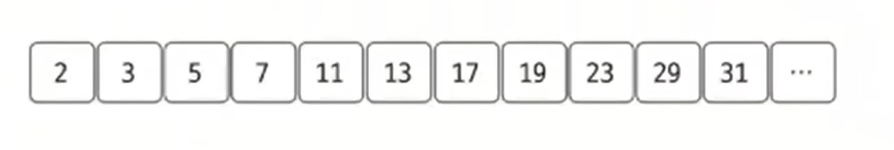
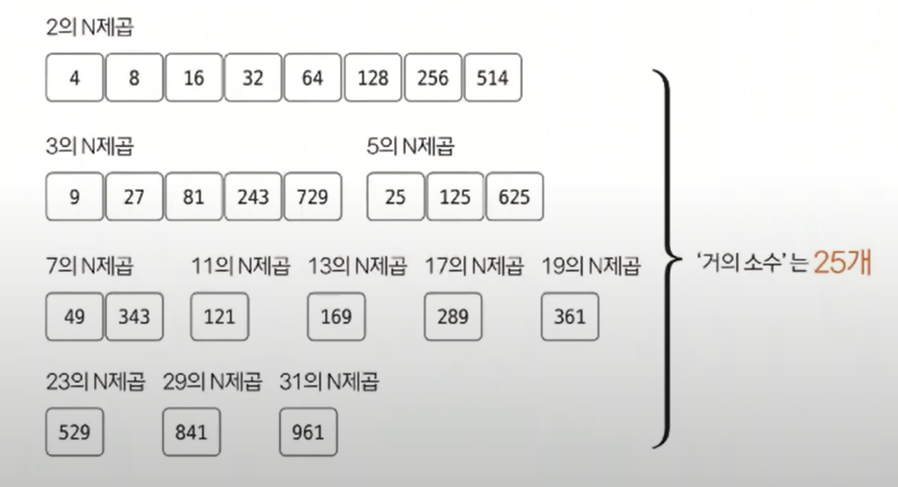

# 소수 구하기 예제 - 2

### [문제(백준(1456 - 거의 소수))](https://www.acmicpc.net/problem/1456)

### 문제 분석
- 최대 범위에 해당하는 모든 소수를 구해놓고, 이 소수들의 N제곱값이 입력된 A와 B 사이에 존재하는지 판단해 문제를 해결할 수 있다.
- 입력에서 주어진 범위의 최댓값 `10^14`의 제곱근인 `10^7`까지 소수를 탐색해야 한다.
- 에라토스테네스의 체를 이용해 빠르게 소수를 먼저 구하고, 이후에는 주어진 소수들의 N제곱값이 A ~ B 범위 안에 존재하는지 판별해 유효한 소수의 개수를 세면 된다.

### 손으로 풀어보기
1. **`2 ~ 10,000,000` 사이에 존재하는 모든 소수를 구한다.**



2. **각가의 소수에 관해 소수를 N제곱(`N >= 2`)한 값이 B보다 커질 때까지 반복문을 실행한다. 이때 소수를 N제곱한 값이 A보다 크거나 같으면 거의 소수로 판단해 카운트한다. 
   모든 소수에 관해서는 반복문을 실행한 후 카운트한 값을 출력한다.**



> **실제 구현해보면 N제곱한 값을 구하는 도중 값이 변수 표현 범위를 초과하는 경우가 발생한다. 계산 오류를 방지하려면 k^N과 B값이 아니라
> N과 `B / k^(N-1)`을 비교하는 형식으로 식을 적절하게 정리해야 한다.**
> 
> **이항 정리**
> - 예) `3^6 < 1,000` 판별
> - `3^6 / 3^5 < 1000 / 3^5` = `3 < 1000 / 3^5` : 참
> - `k^N < B` = `N < B / k^(N-1)`

### 슈도코드
```text
min(시작 수) max(종료 수)
A(소수 리스트)

for 2 ~ 10,000,000:  # 10^14의 제곱근까지만
    A 리스트 초기화

for 10,000,000의 제곱근까지:
    소수가 아니면 넘어감
    for 소수의 배숫값을 10,000,000까지:
        현재 수가 소수가 아니라는 것을 표시

for 2 ~ 10,000,000:
    A 리스트에서 소수인 값일 때:
        temp(현재 소수)
        while 현재 소수 <= max/temp
```

### 코드 구현 - 파이썬
```python
import math

min, max = map(int, input().split())
A = [0] * 10_000_001

for i in range(2, len(A)):
    A[i] = i

for i in range(2, int(math.sqrt(len(A)) + 1)):
    if A[i] != 0:
        for j in range(i * 2, len(A), i):
            A[j] = 0

count = 0

for i in range(2, 10_000_001):
    if A[i] != 0:
        temp = A[i]
        while A[i] <= max / temp:
            if A[i] >= min / temp:
                count += 1
            temp *= A[i]

print(count)
```

### 코드 구현 - 자바
```java
import java.io.BufferedReader;
import java.io.IOException;
import java.io.InputStreamReader;
import java.util.StringTokenizer;

public class Main {
    public static void main(String[] args) throws IOException {
        BufferedReader br = new BufferedReader(new InputStreamReader(System.in));
        StringTokenizer st = new StringTokenizer(br.readLine());

        long min = Long.parseLong(st.nextToken());
        long max = Long.parseLong(st.nextToken());

        int[] A = new int[10_000_001];
        for (int i = 2; i < A.length; i++) {
            A[i] = i;
        }

        for (int i = 2; i <= Math.sqrt(A.length); i++) {
            if (A[i] != 0) {
                for (int j = i * 2; j < A.length; j += i) {
                    A[j] = 0;
                }
            }
        }

        int count = 0;
        for (int i = 2; i < A.length; i++) {
            if (A[i] != 0) {
                long temp = A[i];
                while (A[i] <= (double)max / (double)temp) {
                    if (A[i] >= (double)min / (double)temp) {
                        count++;
                    }
                    temp *= A[i];
                }
            }
        }
        System.out.println(count);

    }
}
```