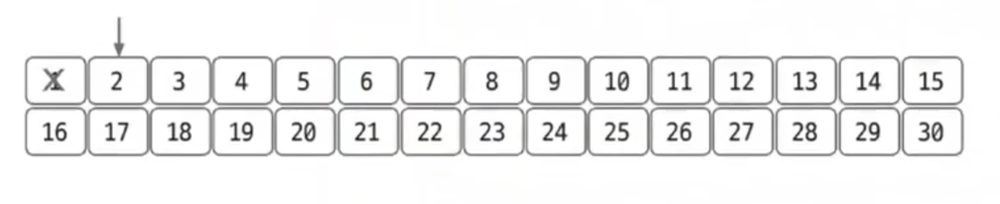
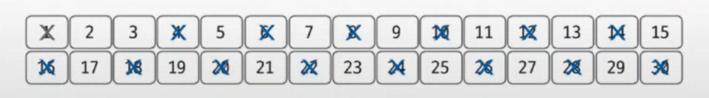
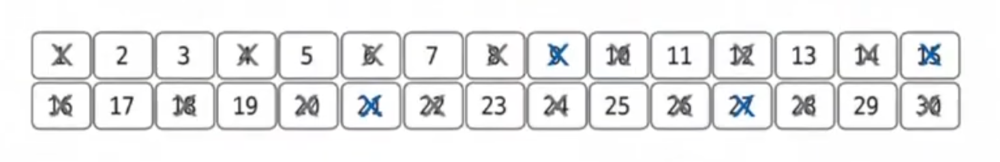
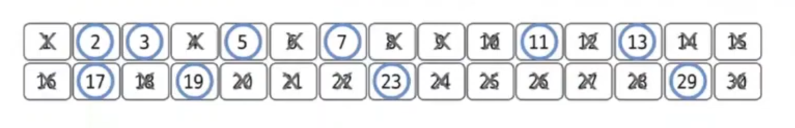

# 소수 구하기

- 소수(`prime number`)는 1과 자기 자신 외에 약수가 존재하지 않는 수를 말한다.

## 소수 구하기 핵심 이론

- 소수를 구하는 대표적인 판별법으로는 **에라토스테네스의 체**가 있다.

> **에라토스테네스의 체 원리**
> 1. 구하고자 하는 소수의 범위만큼 1차원 배열을 생성한다.
> 2. 2부터 시작하고 현재 숫자가 지워진 상태가 아닌 경우 현재 선택된 숫자의 배수에 해당하는 수를 리스트에서 끝까지 탐색하면서 지운다. 이때 처음으로 선택된 숫자는 지우지 않는다.
> 3. 배열의 끝까지 과정 2를 반복한 후에 배열에서 남아 있는 모든 수가 소수가 된다.

- **1부터 30까지 중 소수를 구하는 예시**

1. **주어진 범위까지 배열을 생성한다. 1은 소수가 아니므로 삭제하고 배열은 2부터 시작한다.**

2. **2부터 선택한 수의 배수를 모두 삭제한다.**

3. **다음 지워지지 않은 수를 선택한다. 3을 선택하고 선택한 수의 모든 배수를 삭제한다. 이미 지운 수는 다시 지우지 않는다.**

4. **위 과정을 배열의 끝까지 반복한다.**

5. **삭제되지 않은 수가 모두 소수이다.**

> **에라토스테네스의 체 시간 복잡도**
> 
> 일반적으로 에라토스테네스의 체를 구현하려면 이중 for문을 사용하므로 시간 복잡도가 `O(N^2)` 정도라고 볼 수 있다. 하지만 실제 시간 복잡도는 최적화의 정도에 따라
> 다르겠지만, 일반적으로 `O(Nlog(logN))`이다. 
> 이유는 배수를 삭제하는 연산으로 실제 구현에서 바깥쪽 for문을 생략하는 경우가 빈번하게 발생하기 때문이다. 

### [예제 문제(백준 - 소수 구하기)](https://github.com/genesis12345678/TIL/blob/main/algorithm/numberTheory/getPrime/Example_1.md#%EC%86%8C%EC%88%98-%EA%B5%AC%ED%95%98%EA%B8%B0-%EC%98%88%EC%A0%9C---1)

### [예제 문제(백준 - 거의 소수)](https://github.com/genesis12345678/TIL/blob/main/algorithm/numberTheory/getPrime/Example_2.md#%EC%86%8C%EC%88%98-%EA%B5%AC%ED%95%98%EA%B8%B0-%EC%98%88%EC%A0%9C---2)

### [예제 문제(백준 - 소수&팰린드롬)](https://github.com/genesis12345678/TIL/blob/main/algorithm/numberTheory/getPrime/Example_3.md#%EC%86%8C%EC%88%98-%EA%B5%AC%ED%95%98%EA%B8%B0-%EC%98%88%EC%A0%9C---3)

### [예제 문제(백준 - 제곱 ㄴㄴ 수)](https://github.com/genesis12345678/TIL/blob/main/algorithm/numberTheory/getPrime/Example_4.md#%EC%86%8C%EC%88%98-%EA%B5%AC%ED%95%98%EA%B8%B0-%EC%98%88%EC%A0%9C---4)