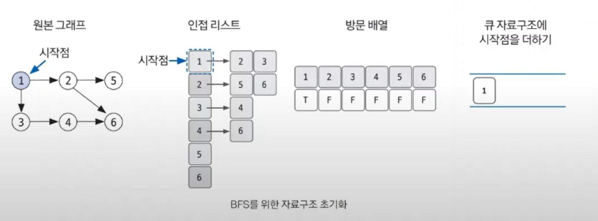
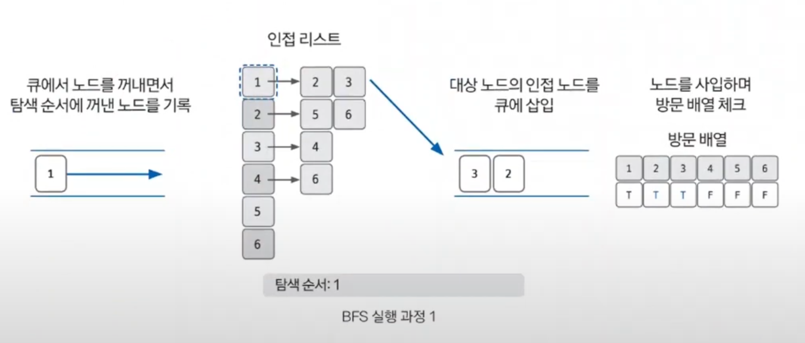

# 너비 우선 탐색

- **BFS** : Breadth-First Search, 그래프 완전 탐색 기법 중 하나
- 시작 노드에서 출발해 시작 노드를 기준으로 가까운 노드를 먼저 방문하면서 탐색하는 알고리즘
- 큐(`Queue`) 자료구조를 이용해 선입선출(`FIFO`) 탐색을 한다.
- 시간 복잡도는 `O(V + E)`이다. `V`: 노드 수, `E`: 에지 수
- **너비 우선 탐색은 탐색 시작 노드와 가까운 노드를 우선하여 탐색하므로 목표 노드에 도착하는 경로가 여러 개일 때 최단 경로를 보장한다.**

## 너비 우선 탐색 핵심 이론
1. **BFS를 시작할 노드를 정한 후 사용할 자료구조 초기화**

2. **큐에서 노드를 꺼낸 후 꺼낸 노드의 인접 노드를 다시 큐에 삽입**
: 큐에서 노드를 꺼내면서 인접 노드를 큐에 삽입하는데, 이때 방문 리스트를 체크하여 이미 방분한 노드는 큐에 삽입하지 않는다. 그리고 큐에서 꺼낸 노드는 탐색 순서에 기록한다.

3. **큐 자료구조에 값이 없을 때까지 반복**

### [예제 문제(백준 - DFS와 BFS)](https://github.com/genesis12345678/TIL/blob/main/algorithm/search/bfs/Example_1.md#%EB%84%88%EB%B9%84-%EC%9A%B0%EC%84%A0-%ED%83%90%EC%83%89-%EC%98%88%EC%A0%9C---1)

### [예제 문제(백준 - 미로 탐색)](https://github.com/genesis12345678/TIL/blob/main/algorithm/search/bfs/Exmaple_2.md#%EB%84%88%EB%B9%84-%EC%9A%B0%EC%84%A0-%ED%83%90%EC%83%89--%EC%98%88%EC%A0%9C---2)

### [예제 문제(백준 - 트리의 지름)](https://github.com/genesis12345678/TIL/blob/main/algorithm/search/bfs/Example_3.md#%EB%84%88%EB%B9%84-%EC%9A%B0%EC%84%A0-%ED%83%90%EC%83%89-%EC%98%88%EC%A0%9C---3)