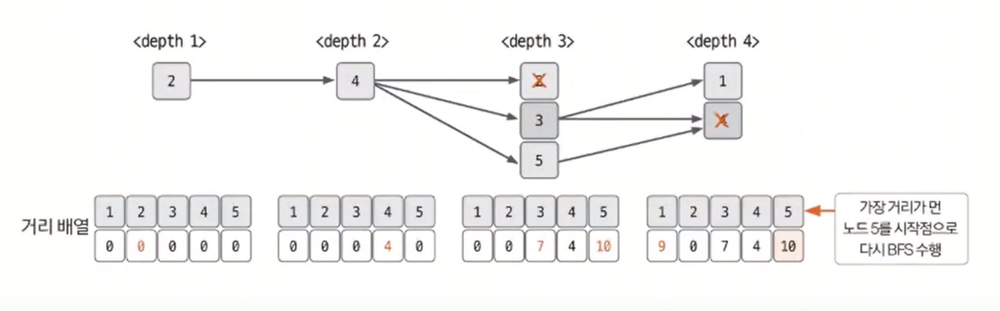
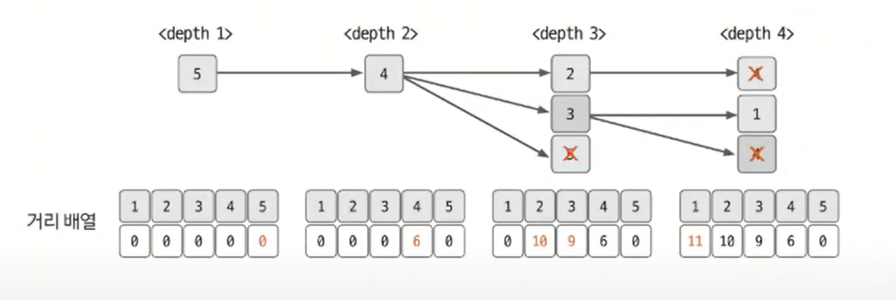

# 너비 우선 탐색 예제 - 3

### [문제(백준(1167번 -트리의 지름))](https://www.acmicpc.net/problem/1167)

### 문제 분석
- 가장 긴 경로를 찾는 방법과 관련된 아이디어가 필요한 문제다.
- **가장 긴 경로 찾기 아이디어**
  - **임의의 노드에서 가장 긴 경로로 연결된 노드는 트리의 지름에 해당하는 두 노드 중 하나다.**

### 손으로 풀어보기
1. **그래프를 인접 리스트로 저장한다. 이때 `(노드, 가중치)`를 표현해야 하기 때문에 클래스(튜플)로 선언한다.**
2. **임의의 노드에서 BFS를 수행하고 탐색할 때 각 노드의 거리를 배열에 저장한다.**



3. **2번 과정에서 얻은 리스트에서 임의의 노드와 가장 먼 노드를 찾는다. 그런 다음 그 노드부터 BFS를 다시 수행한다. 마찬가지로 탐색할 때 각 노드의 거리를 리스트에 저장한다.**



4. **3번 과정에서 거리 배열에 저장한 값 중 가장 큰 값이 이 트리의 지름이 된다.**

### 슈도코드
```text
v(정점의 개수)
A(그래프 데이터 저장 인접 리스트)

for v 반복:
    A 인접 리스트에 그래프 데이터 저장
    
visit 초기화
distance 초기화

BFS:
    큐 자료구조에 시작 노드 삽입
    visit 방문 처리
    
    while 큐가 비어 있을 때까지:
        큐에서 노드 데이터 가져오기
        for 현재 노드의 연결 노드:
            if 미방문 노드:
                큐에 데이터 삽입
                visit 방문 처리
                큐에 삽입 된 노드 거리 = 현재 노드의 거리 + 에지의 가중치로 변경
                
BFS(임의의 시작점) 실행
distance 리스트에서 가장 큰 값을 지닌 노드를 새로운 시작점으로 지정

visit 초기화
distance 초기화
BFS(새로운 시작점) 실행

distance 리스트에서 가장 큰 수 출력
```

### 코드 구현 - 파이썬
```python
from collections import deque

v = int(input())
A = [[] for _ in range(v + 1)]

for _ in range(v):
    data = list(map(int, input().split()))
    index = 0
    s = data[index]  # 기준 노드
    index += 1
    while True:
        e = data[index]  # 기준 노드와 연결된 노드
        if e == -1:
            break
        d = data[index + 1]  # 거리
        A[s].append((e, d))  # [노드, 거리] 튜플
        index += 2

distance = [0] * (v + 1)
visit = [False] * (v + 1)


def BFS(node):
    queue = deque()
    queue.append(node)
    visit[node] = True

    while queue:
        now_node = queue.popleft()
        for i in A[now_node]:
            if not visit[i[0]]:
                visit[i[0]] = True
                queue.append(i[0])

                distance[i[0]] = distance[now_node] + i[1]


BFS(1)
Max = 1

for i in range(2, v + 1):
    if distance[Max] < distance[i]:
        Max = i

distance = [0] * (v + 1)
visit = [False] * (v + 1)

BFS(Max)
distance.sort()
print(distance[v])
```

### 코드 구현 - 자바
```java
import java.io.BufferedReader;
import java.io.IOException;
import java.io.InputStreamReader;
import java.util.*;

public class Main {
    static class Node {
        int adjNode, distance;

        public Node(int adjNode, int distance) {
            this.adjNode = adjNode;
            this.distance = distance;
        }
    }
    
    static ArrayList<Node>[] A;
    static boolean[] visit;
    static int[] distance;

    public static void main(String[] args) throws IOException {
        BufferedReader br = new BufferedReader(new InputStreamReader(System.in));

        int v = Integer.parseInt(br.readLine());
        A = new ArrayList[v + 1];
        for (int i = 1; i <= v; i++) {
            A[i] = new ArrayList<>();
        }

        for (int i = 0; i < v; i++) {
            StringTokenizer st = new StringTokenizer(br.readLine());

            int node = Integer.parseInt(st.nextToken());

            while (true) {
                int adjNode = Integer.parseInt(st.nextToken());
                if (adjNode == -1) {
                    break;
                }
                int dist = Integer.parseInt(st.nextToken());

                A[node].add(new Node(adjNode, dist));
            }
        }

        visit = new boolean[v + 1];
        distance = new int[v + 1];
        BFS(1);

        int max = 1;

        for (int i = 2; i < distance.length; i++) {
            if (distance[max] < distance[i]) {
                max = i;
            }
        }

        visit = new boolean[v + 1];
        distance = new int[v + 1];

        BFS(max);
        
        Arrays.sort(distance);
        System.out.println(distance[v]);
        
/*
        max = 1;
        for (int i = 2; i < distance.length; i++) {
            if (distance[max] < distance[i]) {
                max = i;
            }
        }

        System.out.println(distance[max]);
*/
    }

    private static void BFS(int node) {
        Queue<Integer> queue = new LinkedList<>();
        queue.add(node);
        visit[node] = true;

        while (!queue.isEmpty()) {
            int now_node = queue.poll();
            for (Node next : A[now_node]) {
                if (!visit[next.adjNode]) {
                    visit[next.adjNode] = true;
                    queue.add(next.adjNode);

                    distance[next.adjNode] = distance[now_node] + next.distance;
                }
            }
        }
    }
}
```