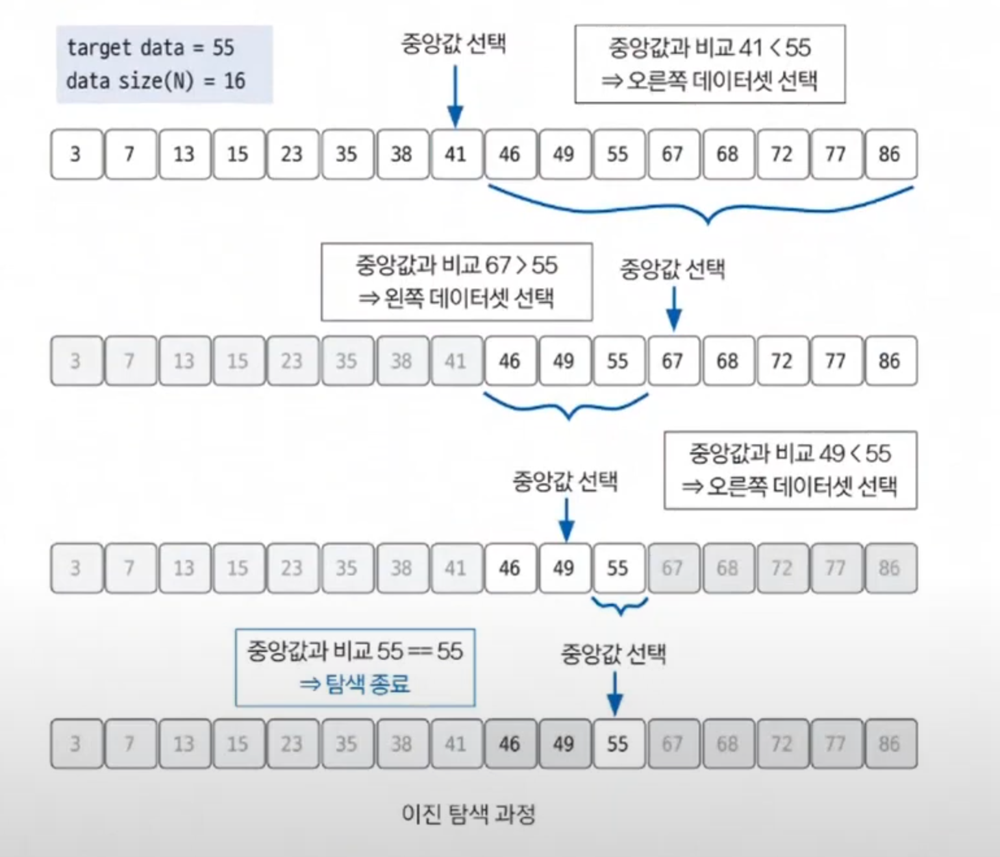

# 이진 탐색

- **Binary Search** : 데이터가 정렬돼 있는 상태에서 원하는 값을 찾아내는 알고리즘이다.
- 대상 데이터의 중앙값과 찾고자 하는 값을 비교해 데이터의 크기를 절반씩 줄이면서 대상을 찾는다.
- `기능` : 타겟 데이터 탐색
- `특징` : 중앙값 비교를 통합 대상 축소 방식
- `시간 복잡도` : `O(logN)`

## 핵심 이론
- 오름차순으로 정렬된 데이터에서 다음 4가지 방법을 반복한다.(내림차순이라면 조건을 반대로 하여)
  1. 현재 데이터셋의 중앙값을 선택한다.
  2. `중앙값 > 타겟 데이터` : 중앙값 기준으로 왼쪽 데이터셋을 선택한다.
  3. `중앙값 < 타겟 데이터` : 중앙값 기준으로 오른쪽 데이터셋을 선택한다.
  4. 과정 `1 ~ 3`을 반복하다가 `중앙값 == 타겟 데이터` 일때 탐색을 종료한다.

- **이렇게 이진 탐색을 사용하면 `N`개의 데이터에서 `log(N)`번의 연산으로 원하는 데이터의 위치를 찾을 수 있다.**
- **다만 이진 탐색은 데이터가 정렬되어 있어야 한다는 전제 조건이 있다.**

### [예제 문제(백준 - 수 찾기)](https://github.com/genesis12345678/TIL/blob/main/algorithm/search/binary/Example_1.md#%EC%9D%B4%EC%A7%84-%ED%83%90%EC%83%89-%EC%98%88%EC%A0%9C---1)

### [예제 문제(백준 - 기타 레슨)](https://github.com/genesis12345678/TIL/blob/main/algorithm/search/binary/Example_2.md#%EC%9D%B4%EC%A7%84-%ED%83%90%EC%83%89-%EC%98%88%EC%A0%9C---2)

### [예제 문제(백준 - K번째 수)](https://github.com/genesis12345678/TIL/blob/main/algorithm/search/binary/Example_3.md#%EC%9D%B4%EC%A7%84-%ED%83%90%EC%83%89-%EC%98%88%EC%A0%9C---3)