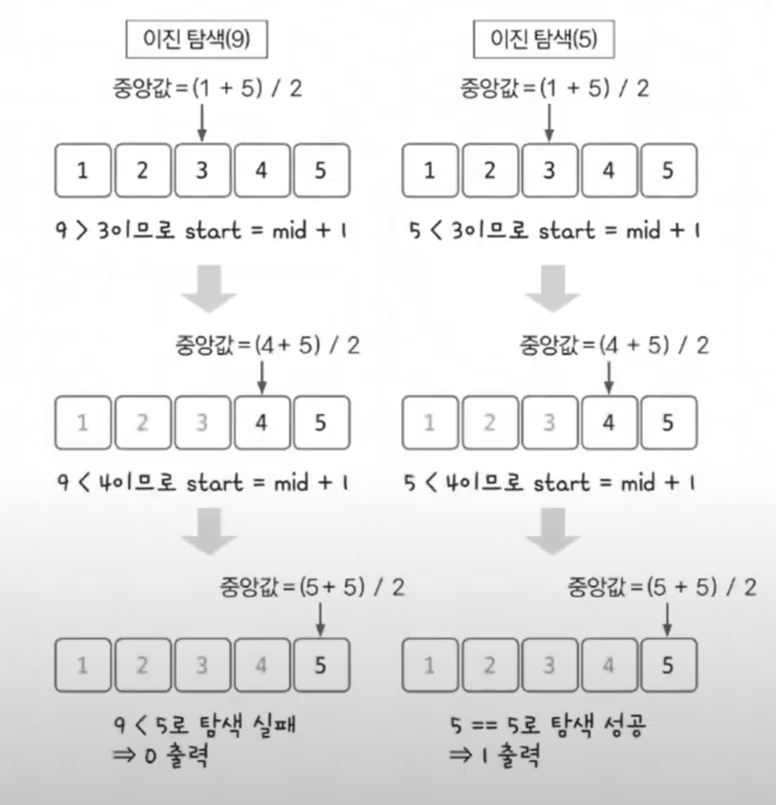

# 이진 탐색 예제 - 1

### [문제(백준(1920번 - 수 찾기))](https://www.acmicpc.net/problem/1920)

### 문제 분석
- `N`의 최대 범위가 100,000이므로 단순 반복문으로는 해결할 수 없다.(`n^2` 소요)
- 이진 탐색을 적용하면 데이터 정렬까지 고려했을 때 `O(nlogn)` 시간 복잡도로 해결할 수 있다.
- 내장 함수 `sort()`는 `O(nlogn)`의 시간 복잡도를 가지므로 정렬을 수행해도 제한 시간을 초과하지 않는다.

### 손으로 풀어보기
1. **탐색 데이터를 1차원 리스트에 저장한 다음 정렬한다.**
2. **정수가 존재하는지 이진 탐색을 사용해 확인한다.**



### 슈도코드
```text
n(수의 개수) m(탐색할 수의 개수)
A(수 데이터 리스트 저장)
A 리스트 정렬
target_list(탐색할 수 데이터 리스트 저장)

for m 반복:
    target(찾아야 하는 수)
    
    start(시작 인덱스)
    end(종료 인덱스)
    while 시작 인덱스 <= 종료 인덱스:
        midIdx(중간 인덱스)
        midVal(중앙값)
        if 중앙값 > target:
            종료 인덱스 = 중간 인덱스 - 1
        elif 중앙값 < target:
            시작 인덱스 = 중간 인덱스 + 1
        else:   
            찾았음, 반복문 종료
    
    if 찾았음:
        1 출력
    else:   
        0 출력
```

### 코드 구현 - 파이썬
```python
n = int(input())
A = list(map(int, input().split()))
A.sort()

m = int(input())
target_list = list(map(int, input().split()))

for i in range(m):
    find = False
    target = target_list[i]

    start = 0
    end = n - 1

    while start <= end:
        midIdx = int((start + end) / 2)
        midVal = A[midIdx]

        if midVal > target:
            end = midIdx - 1
        elif midVal < target:
            start = midIdx + 1
        else:
            find = True
            break

    if find:
        print(1)
    else:
        print(0)
```

### 코드 구현 - 자바
```java
import java.io.BufferedReader;
import java.io.IOException;
import java.io.InputStreamReader;
import java.util.Arrays;
import java.util.StringTokenizer;

public class Main {
    public static void main(String[] args) throws IOException {
        BufferedReader br = new BufferedReader(new InputStreamReader(System.in));

        int n = Integer.parseInt(br.readLine());
        int[] arr = new int[n];

        StringTokenizer st = new StringTokenizer(br.readLine());
        for (int i = 0; i < n; i++) {
            arr[i] = Integer.parseInt(st.nextToken());
        }

        Arrays.sort(arr);

        int m = Integer.parseInt(br.readLine());
        int[] target_list = new int[m];

        st = new StringTokenizer(br.readLine());
        for (int i = 0; i < m; i++) {
            target_list[i] = Integer.parseInt(st.nextToken());
        }

        StringBuilder sb = new StringBuilder();
        for (int i = 0; i < m; i++) {
            boolean find = false;
            int target = target_list[i];

            int start = 0;
            int end = n - 1;

            while (start <= end) {
                int midIdx = (start + end) / 2;
                int midVal = arr[midIdx];

                if (midVal > target) {
                    end = midIdx - 1;
                } else if (midVal < target) {
                    start = midIdx + 1;
                } else {
                    find = true;
                    break;
                }
            }

            sb.append(find ? 1 : 0).append("\n");
        }

        System.out.println(sb);
    }
}
```