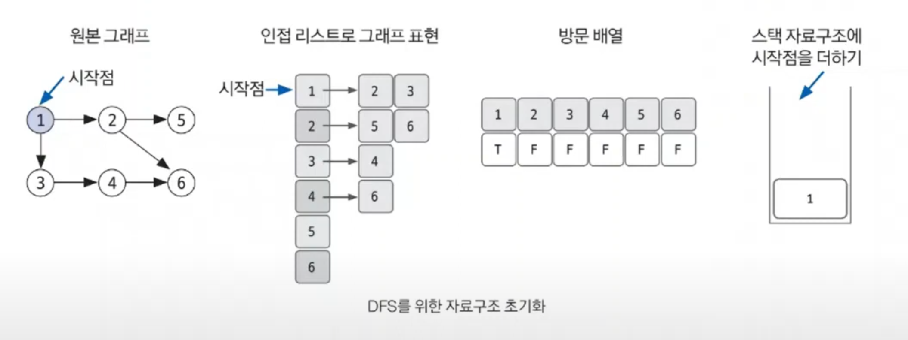
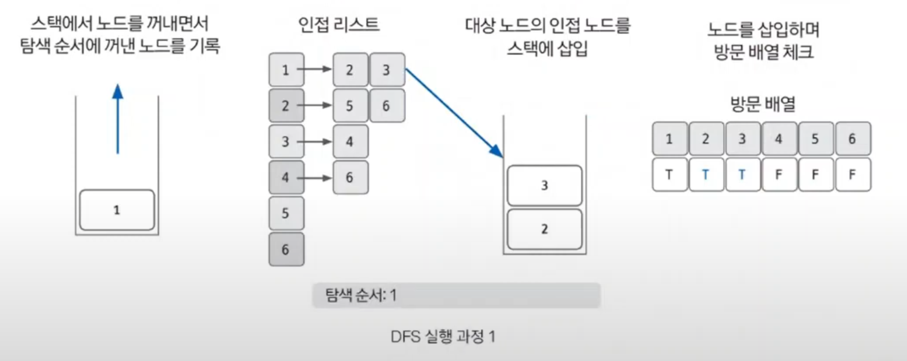
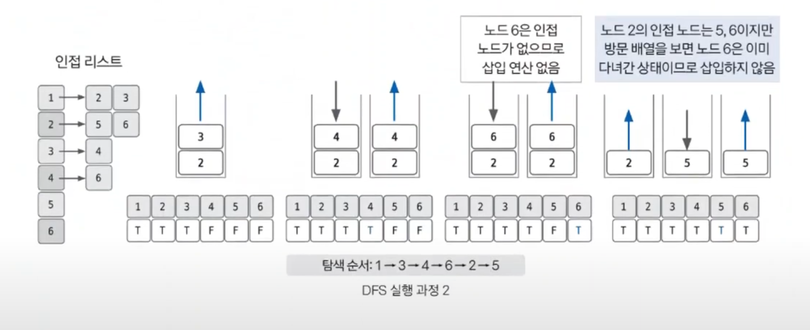

# 깊이 우선 탐색

- **DFS** : Depth-First Search, 그래프 완전 탐색 기법 중 하나
- 그래프의 시작 노드에서 출발하여 탐색할 한 쪽 분기를 정하여 최대 깊이까지 탐색을 마친 후 다른 쪽 분기로 이동하여 다시 탐색을 수행하는 알고리즘
- 재귀 함수 또는 스택 자료구조를 이용해 구현할 수 있다.
- 시간 복잡도는 `O(V + E)`이다. `V`: 노드 수, `E`: 에지 수
- 보통은 재귀 함수를 이용해 구현하는데, 스택 오버플로우에 유의해야 한다.

## 깊이 우선 탐색 핵심 이론
- `DFS`는 한 번 방문한 노드를 다시 방문하면 안 되므로 노드 방문 여부를 체크할 배열이 필요하며, 그래프는 인접 행렬이나 인접 리스트로 표현한다.(보통은 인접 리스트로 표현)
- `DFS`의 탐색 방식은 후입선출(`LIFO`) 특성을 갖고 있다.

1. **DFS를 시작할 노드를 정한 후 사용할 자료구조 초기화**

- DFS를 위해 필요한 초기 작업
  - 인접 리스트로 그래프 표현
  - 방문 배열 초기화
  - 시작 노드 스택에 삽입

2. **스택에서 노드를 꺼낸 후 꺼낸 노드의 인접 노드를 다시 스택에 삽입**

- `pop`을 수행하여 노드를 꺼낸다.
- 꺼낸 노드를 탐색 순서에 기입하고 인접 리스트의 인접 노드를 스택에 삽입하며 방문 배열을 체크한다.

3. **스택 자료구조에 값이 없을 떄까지 반복**

- **이미 다녀간 노드는 방문 리스트를 바탕으로 재삽입하지 않는 것이 핵심이다.**

### [예제 문제(백준 - 연결 요소의 개수)](https://github.com/genesis12345678/TIL/blob/main/algorithm/search/dfs/Example_1.md#%EA%B9%8A%EC%9D%B4-%EC%9A%B0%EC%84%A0-%ED%83%90%EC%83%89-%EC%98%88%EC%A0%9C---1)

### [예제 문제(백준 - 신기한 소수)](https://github.com/genesis12345678/TIL/blob/main/algorithm/search/dfs/Example_2.md#%EA%B9%8A%EC%9D%B4-%EC%9A%B0%EC%84%A0-%ED%83%90%EC%83%89-%EC%98%88%EC%A0%9C---2)

### [예제 문제(백준 - ABCDE)](https://github.com/genesis12345678/TIL/blob/main/algorithm/search/dfs/Example_3.md#%EA%B9%8A%EC%9D%B4-%EC%9A%B0%EC%84%A0-%ED%83%90%EC%83%89-%EC%98%88%EC%A0%9C---3)