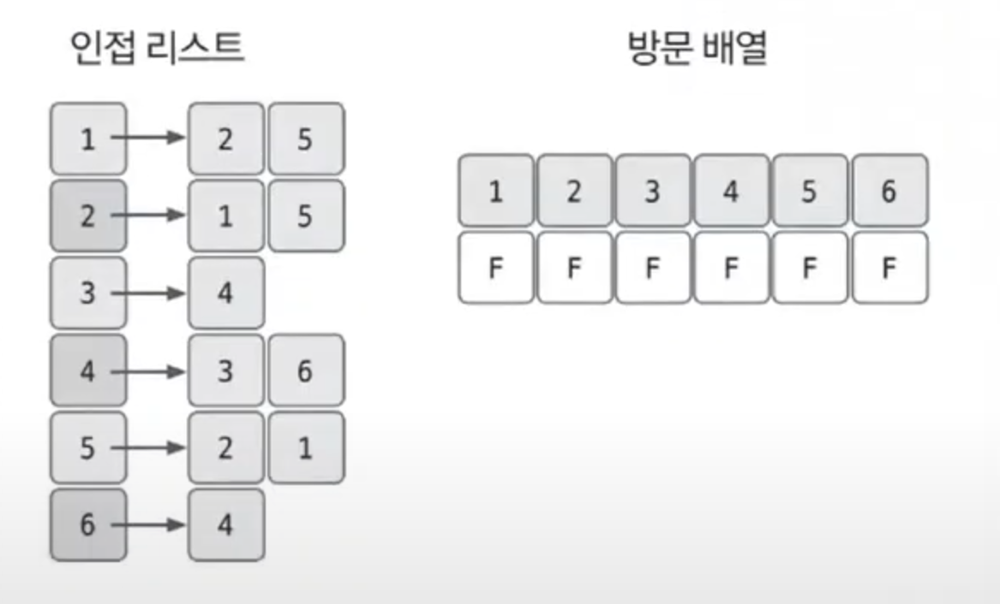
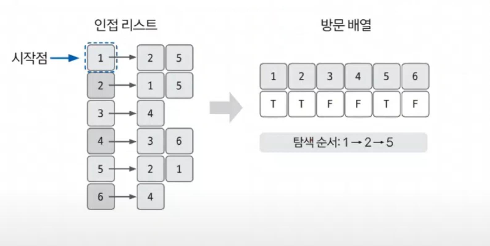

# 깊이 우선 탐색 예제 - 1

### [문제(백준(11724번 - 연결 요소의 개수))](https://www.acmicpc.net/problem/11724)

### 문제 분석

- 노드의 최대 개수가 1,000이므로 시간 복잡도 `N^2`이하의 알고리즘을 모두 사용할 수 있다.
- 연결 요소는 에지로 연결된 노드의 집합이며, 한 번의 DFS가 끝날 때까지 탐색한 모든 노드의 집합을 하나의 연결 요소로 판단할 수 있다.

### 손으로 풀어보기

1. **그래프를 인접 리스트로 저장하고 방문 리스트도 초기화한다. 방향이 없는 그래프이기 때문에 양쪽 방향으로 에지를 모두 저장한다.**



2. **임의의 시작점에서 DFS를 수행한다.**



3. **아직 방문하지 않은 노드가 있으면 시작점을 다시 정해 탐색을 진행한다. 모든 노드를 방문하면 전체 탐색을 종료한다.**

4. **DFS 수행 횟수가 정답이 된다.**


### 슈도코드
```text
n(노드 개수) m(에지 개수)
a(그래프 데이터 저장 인접 리스트)
visit(방문 기록 리스트)

dfs:
    visit 리스트에 현재 노드 방문 기록
    현재 노드의 연결 노드 중 방문하지 않은 노드로 dfs 실행(재귀 함수)

for m 반복:
    a 인접 리스트에 그래프 데이터 저장
    
for n 반복:
    if 방문하지 않은 노드가 있다면:
        연결 요소 개수 값 1 증가
        dfs 실행

연결 요소 개수 값 출력
```

### 코드 구현 - 파이썬
```python
import sys

sys.setrecursionlimit(10000)
input = sys.stdin.readline

n, m = map(int, input().split())
a = [[] for _ in range(n+1)]
visit = [False] * (n+1)


def dfs(node):
    visit[node] = True
    for i in a[node]:
        if not visit[i]:
            dfs(i)


for _ in range(m):
    u, v = map(int, input().split())
    a[u].append(v)  # 양방향 연결
    a[v].append(u)

count = 0

for i in range(1, n+1):
    if not visit[i]:
        count += 1
        dfs(i)

print(count)

```
- `sys.setrecursionlimit(10000)` : 재귀함수의 최대 깊이를 10,000으로 설정한다.
  - 파이썬에서 기본 설정이 1,000 정도이다.
  - DFS나 재귀관련 문제를 풀 때 해당 제한으로 예외가 발생하는 경우가 있다.


### 코드 구현 - 자바
```java
import java.io.BufferedReader;
import java.io.IOException;
import java.io.InputStreamReader;
import java.util.ArrayList;
import java.util.StringTokenizer;

public class Main {

    static boolean[] visit;
    static ArrayList<Integer>[] a;

    public static void main(String[] args) throws IOException {
        BufferedReader br = new BufferedReader(new InputStreamReader(System.in));

        StringTokenizer st = new StringTokenizer(br.readLine());

        int n = Integer.parseInt(st.nextToken());
        int m = Integer.parseInt(st.nextToken());

        visit = new boolean[n + 1];
        a = new ArrayList[n + 1];

        for (int i = 1; i <= n; i++) {
            a[i] = new ArrayList<Integer>();
        }

        for (int i = 0; i < m; i++) {
            st = new StringTokenizer(br.readLine());
            int u = Integer.parseInt(st.nextToken());
            int v = Integer.parseInt(st.nextToken());
            
            a[u].add(v);
            a[v].add(u);
        }

        int count = 0;

        for (int i = 1; i <= n; i++) {
            if (!visit[i]) {
                count++;
                dfs(i);
            }
        }
        System.out.println(count);
    }

    private static void dfs(int node) {
        visit[node] = true;

        for (int n : a[node]) {
            if (!visit[n]) {
                dfs(n);
            }
        }
    }
}
```