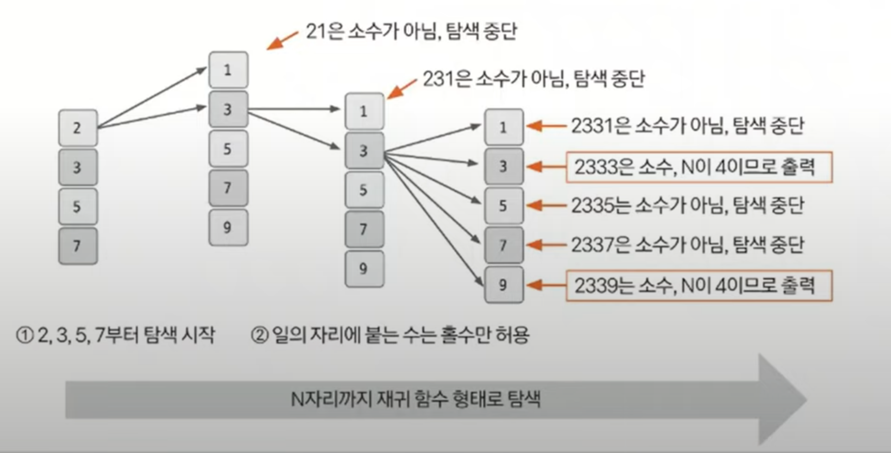

# 깊이 우선 탐색 예제 - 2

### [문제(백준(2023번 - 신기한 소수))](https://www.acmicpc.net/problem/2023)

### 문제 분석
- DFS를 재귀 함수로 자릿수 개념을 붙여 구현해본다.

### 손으로 풀어보기
- 우선 자릿수가 한 개인 소수는 2, 3, 5, 7이므로 이 수부터 탐색을 시작한다.
- 이어서 자릿수가 두 개인 `현재 수 * 10 + a`를 계산하여 이 수가 소수인지 판단하고, 소수라면 재귀 함수로 자릿수를 하나 늘린다.
- 이때, `a`가 짝수인 경우는 항상 2를 약수로 가지므로 가지치기로 `a`가 짝수인 경우를 제외한다.
- 이런 방식으로 자릿수를 `N`까지 확장했을 때 그 값이 소수라면 해당 값을 출력한다.




### 슈도코드
```text
n(자릿수)

# 소수 구하기 함수
for i 2~현재수/2+1 반복:
    if 현재수 % i == 0:
        return false
    return true

# dfs 구현
dfs(숫자):
    if 자릿수 == n:
        현재 수 출력
    else
        for i 1~9 반복:
            if i를 뒤에 붙인 새로운 수가 홀수이면서 소수일 때  # 소수 구하기 함수 사용
                dfs(숫자 * 10 + 뒤에 붙는 수) 실행
                
dfs 실행(2, 3, 5, 7로 시작)
```

### 코드 구현 - 파이썬
```python
import sys

sys.setrecursionlimit(10000)
input = sys.stdin.readline

n = int(input())


def isPrime(num):
    for i in range(2, int(num / 2 + 1)):  # 절반까지 확인하면 된다, 에라토스테네스의 체로 최적화 가능
        if num % i == 0:
            return False
    return True


def dfs(num):
    if len(str(num)) == n:
        print(num)
    else:
        for i in range(1, 10):
            if i % 2 != 0:
                target = num * 10 + i
                if isPrime(target):
                    dfs(target)


dfs(2)
dfs(3)
dfs(5)
dfs(7)
```

### 코드 구현 - 자바
```java
import java.io.BufferedReader;
import java.io.IOException;
import java.io.InputStreamReader;

public class Main {

    static int n;
    static StringBuilder sb = new StringBuilder();

    public static void main(String[] args) throws IOException {
        BufferedReader br = new BufferedReader(new InputStreamReader(System.in));

        n = Integer.parseInt(br.readLine());

        dfs(2);
        dfs(3);
        dfs(5);
        dfs(7);

        System.out.println(sb);
    }

    private static void dfs(int num) {
        if (Integer.toString(num).length() == n) {
            sb.append(num).append("\n");
        } else {
            for (int i = 1; i < 10; i++) {
                if (i % 2 != 0) {
                    int target = num * 10 + i;
                    if (isPrime(target)) {
                        dfs(target);
                    }
                }
            }
        }
    }

    private static boolean isPrime(int target) {
        for (int i = 2; i <= target / 2; i++) {
            if (target % i == 0) {
                return false;
            }
        }
        return true;
    }
}
```