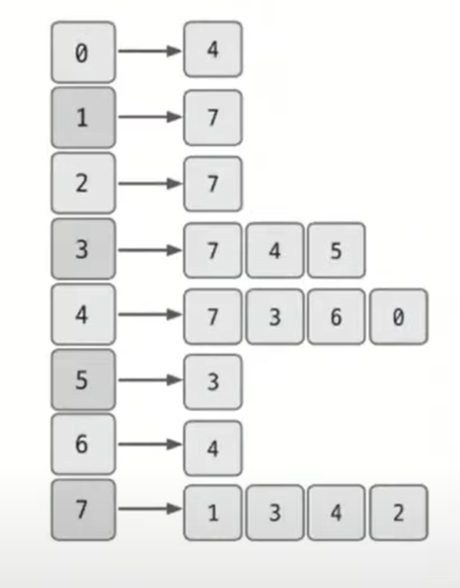
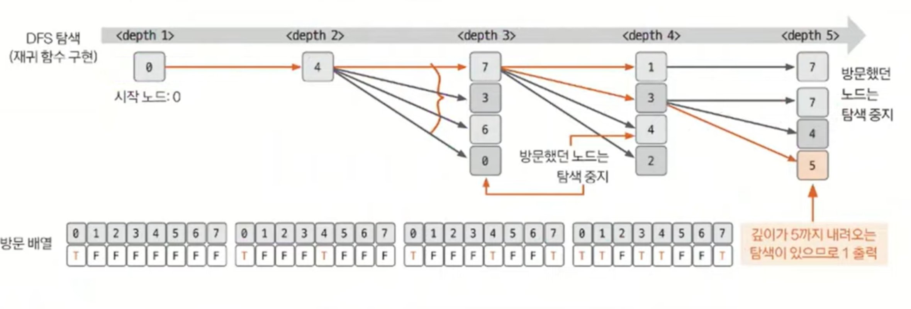

# 깊이 우선 탐색 예제 - 3

### [문제(백준(13023번 - ABCDE))](https://www.acmicpc.net/problem/13023)

### 문제 분석
- `N`의 최대 범위가 2,000이므로 알고리즘의 시간 복잡도를 고려할 때 좀 자유롭다.
- 주어진 모든 노드에 DFS를 수행하고 재귀의 깊이가 5 이상(5개의 노드가 재귀 형태로 연결)이면 1, 아니면 0을 출력한다.
- DFS의 시간 복잡도는 `O(V + E)`이므로 최대 4,000, 모든 노드를 진행 했을 때 `4,000 * 2,000`, 즉 `8,000,000` 이므로 DFS를 사용해도 제한 시간 내에 문제를 풀 수 있다.

### 손으로 풀어보기
1. **그래프 데이터를 인접 리스트로 저장한다.**



2. **모든 노드에서 DFS를 수행한다. 수행할 때 재귀 호출마다 깊이를 더한다. 깊이가 5가 되면 1을 출력하고 프로그램을 종료한다.**



3. **모든 노드를 돌아도 1이 출력되지 않았다면 0을 출력한다.**

### 슈도코드
```text
n(노드 개수), m(에지 개수)
a(그래프 데이터 저장 인접 리스트)
visit(방문 기록 리스트)
arrive(도착 확인 변수)

dfs(현재 노드, 깊이):
    if 깊이 == 5:
        arrive = true
        함수 종료
    방문 리스트에 현재 노드 방문 기록
    현재 노드의 연결 노드 중 방문하지 않은 노드 dfs 실행 (호출마다 깊이 +1)

for m 반복:
    a 인접 리스트에 그래프 데이터 저장

for n 반복:
    노드마다 dfs 실행
    if(arrive):
        반복문 종료  # 깊이가 5에 도달한 적이 있다면
        
if arrive: 
    1 출력
else:
    0 출력
```

### 코드 구현 - 파이썬
```python
import sys

sys.setrecursionlimit(10000)
input = sys.stdin.readline

n, m = map(int, input().split())
arrive = False
A = [[] for _ in range(n + 1)]
visit = [False] * (n + 1)


def dfs(node, depth):
    global arrive
    if depth == 5:
        arrive = True
        return
    visit[node] = True
    for i in A[node]:
        if not visit[i]:
            dfs(i, depth + 1)

    visit[node] = False


for i in range(m):
    a, b = map(int, input().split())
    A[a].append(b)
    A[b].append(a)

for i in range(n):
    dfs(i, 1)
    if arrive:
        break

if arrive:
    print(1)
else:
    print(0)
```

### 코드 구현 - 자바
```java
import java.io.BufferedReader;
import java.io.IOException;
import java.io.InputStreamReader;
import java.util.ArrayList;
import java.util.StringTokenizer;

public class Main {

    static ArrayList<Integer>[] A;
    static boolean[] visit;

    public static void main(String[] args) throws IOException {
        BufferedReader br = new BufferedReader(new InputStreamReader(System.in));
        StringTokenizer st = new StringTokenizer(br.readLine());

        int n = Integer.parseInt(st.nextToken());
        int m = Integer.parseInt(st.nextToken());

        A = new ArrayList[n];
        visit = new boolean[n];

        for (int i = 0; i < n; i++) {
            A[i] = new ArrayList<>();
        }

        for (int i = 0; i < m; i++) {
            st = new StringTokenizer(br.readLine());
            int a = Integer.parseInt(st.nextToken());
            int b = Integer.parseInt(st.nextToken());

            A[a].add(b);
            A[b].add(a);
        }

        for (int i = 0; i < n; i++) {
            dfs(i, 1);
        }

        System.out.println(0);

    }

    private static void dfs(int node, int depth) {
        if (depth == 5) {
            System.out.println(1);
            System.exit(0);
        }
        visit[node] = true;

        for (int next : A[node]) {
            if (!visit[next]) {
                dfs(next, depth + 1);
            }
        }

        visit[node] = false;
    }
}
```

