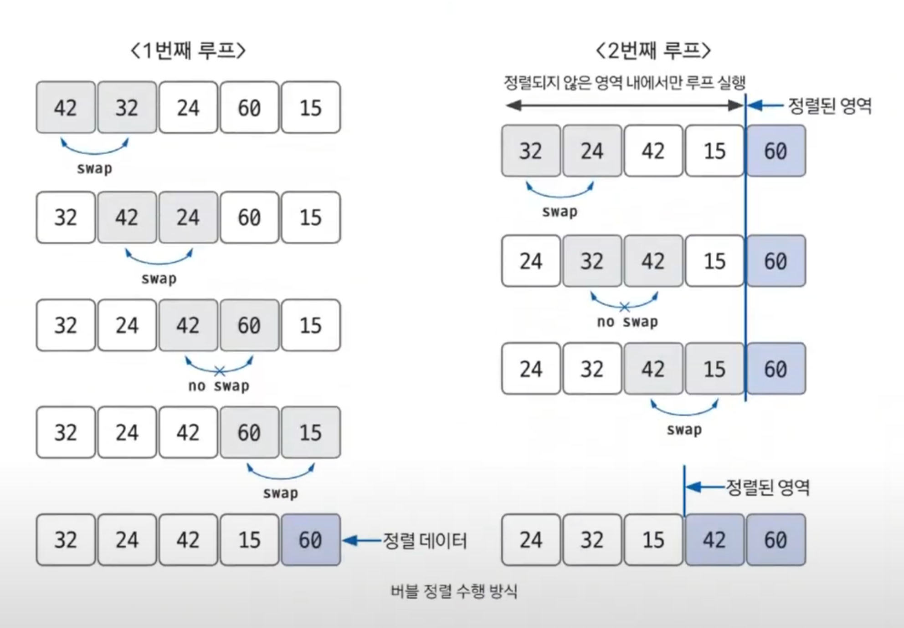

# 버블 정렬

- **버블 정렬**은 루프를 돌면서 두 인접한 데이터의 크기를 비교해 `swap` 연산으로 정렬하는 방법이다.
- 시간 복잡도는 `O(n^2)`으로 다른 정렬 알고리즘보다 속도가 느린 편이다.

**버블 정렬 과정**
1. 비교 연산이 필요한 루프 범위 설정
2. 인접한 데이터 값 비교
3. `swap` 조건에 부합하면 `swap` 연산 수행
4. 루프 범위가 끝날 때까지 2~3을 반복
5. 정렬 영역을 설정, 다음 루프를 실행할 때는 이 영역을 제외
6. 비교 대상이 없을 때까지 1~5를 반복

**만약 특정 루프의 전체 영역에서 `swap`이 한 번도 발생하지 않았다면 그 영역 뒤에 있는 데이터가 모두 정렬됐다는 뜻이므로 프로세스를 종료해도 된다.**

### [예제 문제(백준 - 수 정렬하기)](https://github.com/genesis12345678/TIL/blob/main/algorithm/sorting/bubbleSort/Example_1.md#%EB%B2%84%EB%B8%94-%EC%A0%95%EB%A0%AC-%EC%98%88%EC%A0%9C---1)

### [예제 문제(백준 - 버블 소트)](https://github.com/genesis12345678/TIL/blob/main/algorithm/sorting/bubbleSort/Example_2.md#%EB%B2%84%EB%B8%94-%EC%86%8C%ED%8A%B8-%EC%98%88%EC%A0%9C---2)