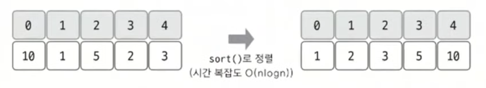

# 버블 소트 예제 - 2

### [문제(백준(1377번 - 버블 소트))](https://www.acmicpc.net/problem/1377)

### 문제 분석
- 버블 정렬의 `swap`이 한 번도 일어나지 않은 루프가 언제인지 알아내는 문제다.
- 버블 정렬의 이중 for문 에서 안쪽 for문 전체를 돌 때 `swap`이 일어나지 않으면 프로세스를 바로 종료해 시간 복잡도를 줄일 수 있다.
- 하지만 `N`의 최대 범위가 500,000이므로 버블 정렬로 문제를 풀면 시간 초과가 발생할 것이다.
- **안쪽 for문이 몇 번 수행됐는지 다른 아이디어가 필요하다.**

**안쪽 for문이 몇 번 수행됐는지 다른 아이디어**
- 안쪽 루프는 1에서 `n -j`까지, 즉 왼쪽에서 오른쪽으로 이동하면서 `swap`을 수행한다.
- 이것은 특정 데이터가 안쪽 루프에서 `swap`의 왼쪽으로 이동할 수 있는 최대 거리가 1이라는 뜻이다.
- 즉, 데이터의 정렬 전 index와 정렬 후 index를 비교해 왼쪽으로 가장 많이 이동한 값을 찾으면 문제를 해결할 수 있다.

### 손으로 풀어보기
1. **기본으로 제공하는 `sort()` 함수로 배열을 정렬한다.(`sort()`의 시간 복잡도 : `O(nlogn)`)**



2. **각 데이터마다 정렬 전 index에서 정렬 후 index 값을 빼고 최댓값을 찾는다. 그리고 `swap`이 일어나지 않는 반복문이 한 번 더 실행되는 것을 감안해 최댓값에 1을 더해준다.**


- 그림에서 결괏값은 안쪽 for문에서 `swap`이 일어난 횟수다.


### 슈도코드
```text
n(데이터 개수)
a(데이터 리스트)

for n 반복:
    a 리스트 저장
    
a 리스트 정렬

for n 반복:
    a[i]의 정렬 전 index - 정렬 후 index 계산의 최댓값을 찾아 저장

최댓값 + 1 출력
```

### 코드 구현 - 파이썬
```python
import sys

input = sys.stdin.readline

n = int(input())
a = []

for i in range(n):
    a.append((int(input()), i))  # [data, index] 튜플 저장  # 먼저 넣은 데이터를 기준으로 정렬을 시도한다.

max_val = 0
a.sort()

for i in range(n):
    # a[i][1] = 각 튜플의 index
    if a[i][1] - i > max_val:  # 정렬 전 index - 정렬 후 index 계산의 최댓값 저장
        max_val = a[i][1] - i

print(max_val + 1)
```

### 코드 구현 - 자바
```java
import java.io.BufferedReader;
import java.io.IOException;
import java.io.InputStreamReader;
import java.util.Arrays;
import java.util.Comparator;

public class Main {

    static class Data {
        int value, index;

        public Data(int value, int index) {
            this.value = value;
            this.index = index;
        }
    }

    public static void main(String[] args) throws IOException {
        BufferedReader br = new BufferedReader(new InputStreamReader(System.in));

        int n = Integer.parseInt(br.readLine());

        Data[] data = new Data[n];
        for (int i = 0; i < n; i++) {
            int value = Integer.parseInt(br.readLine());
            data[i] = new Data(value, i); //값과 index 저장
        }

/*
        Arrays.sort(data, (o1, o2) -> {
            return o1.value - o2.value;
        });
*/
        Arrays.sort(data, Comparator.comparingInt(o -> o.value)); //값 기준으로 정렬, 위 주석처리 한 코드와 같다.

        int max = Integer.MIN_VALUE;
        for (int i = 0; i < n; i++) {
            int num = data[i].index - i; //정렬 전 index - 정렬 후 index
            if (max < num) {
                max = num;
            }
        }
        System.out.println(max + 1);
    }
}
```