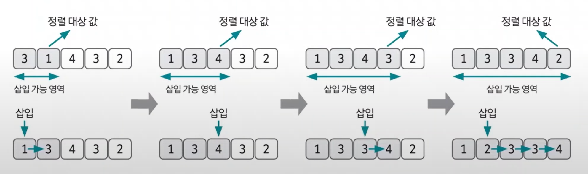
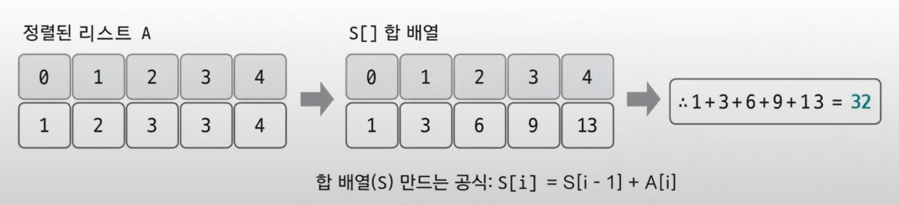

# 삽입 정렬 예제 - 1

### [문제(백준(11399번 - ATM))](https://www.acmicpc.net/problem/11399)

### 문제 분석

- 모든 사람이 가장 빠른 시간에 인출하는 방법을 그리디 방식으로 해결해 본다.
- 시간이 가장 적게 걸리는 사람이 먼저 인출할 수 있도록 순서를 정하는 것이 곧 그리디 방식이다.
- 이를 위해서는 인출 시간을 기준으로 값을 정렬해야 하는데 `N`의 최댓값이 1,000이고 시간 제한이 1초이므로 시간 복잡도가 `O(n^2)` 이하인 정렬
  알고리즘 중 아무거나 사용해도 된다.

### 손으로 풀어보기
1. **삽입 정렬을 이용해 인출 시간을 기준으로 데이터를 오름차순 정렬한다.**



2. **정렬된 데이터를 바탕으로 모든 사람이 돈을 인출하는 데 필요한 최솟값을 구한다. 인출에 필요한 시간은 `앞 사람들의 인출 시간 합 + 자신의 인출 시간`이므로 합 배열로 풀 수 있다.**



### 슈도코드
```text
n(사람 수)
a(자릿수별로 구분해 저장한 리스트)
s(합 배열)

for i 1~n 반복:
    for j i-1 ~ 0 뒤에서부터 반복:
        현재 범위에서 삽입 위치 찾기
    for j i~insert_point+1 뒤에서부터 반복:
        삽입을 위해 삽입 위치에서 i까지 데이터를 한 칸씩 뒤로 밀기
    삽입 위치에 현재 데이터 저장
    
for i 1~n 반복:
    a 리스트를 통합 합 배열 s 만들기
    
s 리스트의 각 데이터값을 모두 더해 결과 출력
```

### 코드 구현 - 파이썬
```python
n = int(input())
a = list(map(int, input().split()))
s = [0] * n

for i in range(1, n):
    insert_point = i
    insert_value = a[i]
    for j in range(i-1, -1, -1):  # i-1부터 0까지 -1씩 감소하면서 반복
        if a[j] < a[i]:
            insert_point = j + 1  # j위치 바로 다음에 위치해야 하므로 +1
            break
        if j == 0:  # j가 0까지 왔다는 것은 비교할 데이터가 가장 작은 값이라는 의미
            insert_point = 0
    for j in range(i, insert_point, -1):  # 삽입을 위해 현재 위치에서 insert_point 까지 한 칸씩 뒤로 밀기
        a[j] = a[j-1]
    a[insert_point] = insert_value  # 삽입 위치에 현재 데이터 저장

s[0] = a[0]
total = s[0]

for i in range(1, n):
    s[i] = s[i-1] + a[i]
    total += s[i]

print(total)
```

### 코드 구현 - 자바
```java
import java.io.BufferedReader;
import java.io.IOException;
import java.io.InputStreamReader;
import java.util.StringTokenizer;

public class Main {

    public static void main(String[] args) throws IOException {
        BufferedReader br = new BufferedReader(new InputStreamReader(System.in));
        int n = Integer.parseInt(br.readLine());

        StringTokenizer st = new StringTokenizer(br.readLine());
        int[] arr = new int[n];

        for (int i = 0; i < n; i++) {
            arr[i] = Integer.parseInt(st.nextToken());
        }

        for (int i = 1; i < n; i++) {
            int insert_point = i; //삽입 위치
            int insert_value = arr[i]; //삽입될 값

            for (int j = i - 1; j >= 0; j--) { //i-1부터 거꾸로 탐색
                if (arr[j] < arr[i]) { //더 작은 값을 만나면 해당 위치 바로 뒤에 위치해야 한다.
                    insert_point = j + 1; //바로 뒤에 위치해야 하기 때문에 +1 한 다음 삽입 위치 설정
                    break;
                }
                if (j == 0) { //0까지 탐색했다는 것은 가장 작은 값이므로 삽입 위치 0 설정
                    insert_point = 0;
                }
            }

            for (int j = i; j > insert_point ; j--) { //i부터 삽입 위치까지 거꾸로 탐색
                arr[j] = arr[j - 1]; //한 칸씩 뒤로 밀기
            }

            arr[insert_point] = insert_value; //삽입 위치에 삽입될 값 저장
        }

        int[] sum = new int[n];
        sum[0] = arr[0];
        int total = sum[0];

        for (int i = 1; i < n; i++) {
            sum[i] = sum[i - 1] + arr[i];
            total += sum[i];
        }

        System.out.println(total);
    }
}
```