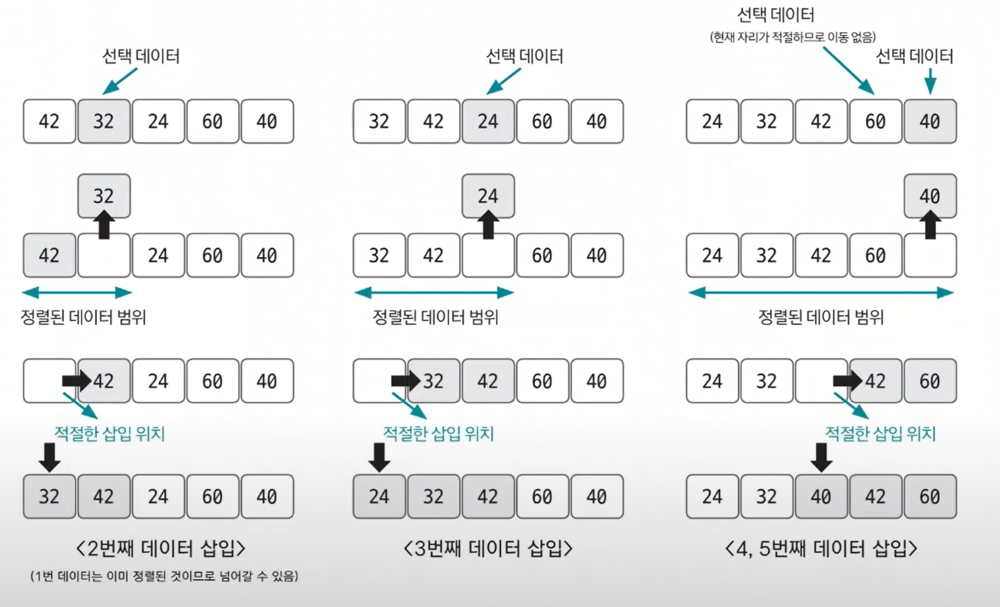

# 삽입 정렬

- 이미 정렬된 데이터 범위에 정렬되지 않은 데이터를 적절한 위치에 삽입시켜 정렬하는 방식
- 시간 복잡도는 `O(n^2)`으로 느린 편이지만 구현하기가 쉽다.

- 선택 데이터를 현재 정렬된 데이터 범위 내에서 적절한 위치에 삽입하는 것이 삽입 정렬의 핵심이다.
- **삽입 정렬 과정**
  1. 현재 index에 있는 데이터 값 선택
  2. 현재 선택한 데이터가 정렬된 데이터 범위에 삽입될 위치 탐색
  3. 삽입 위치부터 index에 있는 위치까지 shift 연산 수행
  4. 삽입 위치에 현재 선택한 데이터를 삽입하고 index++ 연산 수행
  5. 전체 데이터의 크기 만큼 index가 커질 때까지, 즉 선택할 데이터가 없을 때까지 반복한다.

**적절한 삽입 위치를 탐색하는 부분에서 이진 탐색(`binary search`) 등과 같은 탐색 알고리즘을 사용하면 시간 복잡도를 줄일 수 있다.**

### [예제 문제(백준 - ATM)](https://github.com/genesis12345678/TIL/blob/main/algorithm/sorting/insertionSort/Example_1.md#%EC%82%BD%EC%9E%85-%EC%A0%95%EB%A0%AC-%EC%98%88%EC%A0%9C---1)