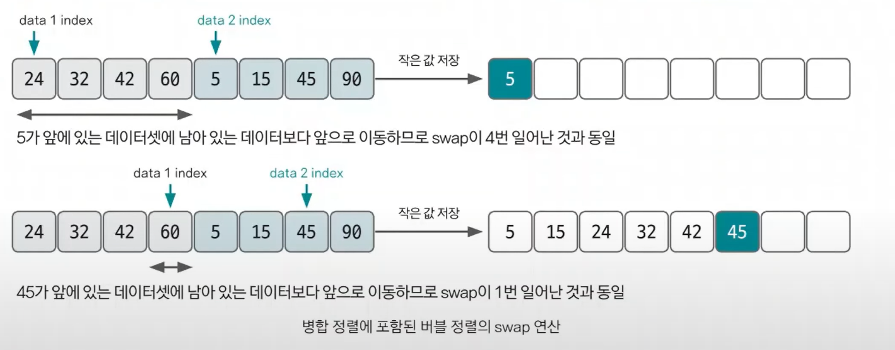
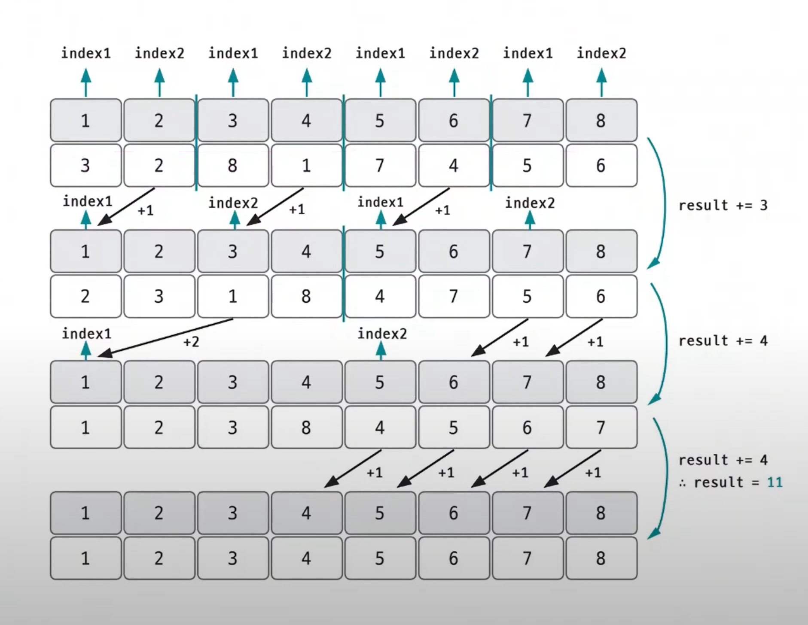

# 분할 정복 예제 - 2

### [문제(백준(1517번 - 버블 소트))](https://www.acmicpc.net/problem/1517)

### 문제 분석
- `N`의 최대 범위가 500,000이므로 `O(nlogn)`의 시간 복잡도로 정렬을 수행해야 한다.
- 제목은 버블 정렬이지만, 버블 정렬은 `n^2`의 시간 복잡도를 가지기 때문에 시간 초과가 발생한다. 
- 병합 정렬을 사용해서 두 그룹을 병합하는 과정에서 버블 정렬의 `swap`이 일어나는 과정을 알 수 있다.



### 손으로 풀어보기
**병합 정렬은 동일하게 진행하고, 정렬 과정에서 index가 이동한 거리를 결과에 저장한다.**



**뒤에 있는 데이터가 앞으로 올 때만 이동한 거리 만큼 result에 더해준다.**

### 슈도코드
```text
병합 정렬(start, end)
    start(시작점), end(종료점), mid(중간점)
    # 재귀 함수
    병합 정렬(start, mid)
    병합 정렬(mid + 1, end)
    for start ~ end:
        temp 리스트 저장
    
    # 두 그룹 병합
    index1(앞쪽 그룹 시작점)
    index2(뒤쪽 그룹 시작점)
    while index1 <= 중간점 and index2 <= 종료점:
        양쪽 그룹의 index가 가리키는 값을 비교한 후 더 작은 수를 선택해 리스트에 저장하고
        선택된 데이터의 index값을 오른쪽으로 한 칸 이동
        반복문이 끝난 후 남아있는 데이터 정리
        로직을 수행하면서 뒤쪽 데이터값이 더 작아 선택될 때
        swap이 일어난 것과 동일한 것이기 때문에
        현재 남은 앞쪽 그룹 데이터의 개수만큼 결과에 더해준다.

n(수의 개수)
a(리스트 선언)
temp(정렬할 때 잠시 사용할 리스트 선언)

for n:
    a 리스트 저장
    
병합 정렬 수행

결과 출력
```

### 코드 구현 - 파이썬
```python
import sys

input = sys.stdin.readline
result = 0

n = int(input())
a = list(map(int, input().split()))
a.insert(0, 0)  # 0번째에 값 0을 삽입
temp = [0] * (n + 1)


def merge_sort(start, end):
    global result

    if end - start < 1:
        return

    mid = int((start + end) / 2)
    merge_sort(start, mid)
    merge_sort(mid + 1, end)

    for i in range(start, end + 1):
        temp[i] = a[i]

    k = start
    index1 = start
    index2 = mid + 1

    while index1 <= mid and index2 <= end:
        if temp[index1] > temp[index2]:
            a[k] = temp[index2]
            result += index2 - k  # 뒤쪽 데이터가 이동할 때에만 결과를 더해준다.  # index2 - k: 앞에 남아 있는 데이터 개수
            k += 1
            index2 += 1
        else:
            a[k] = temp[index1]
            k += 1
            index1 += 1

    while index1 <= mid:
        a[k] = temp[index1]
        k += 1
        index1 += 1

    while index2 <= end:
        a[k] = temp[index2]
        k += 1
        index2 += 1


merge_sort(1, n)
print(result)
```

### 코드 구현 - 자바
```java
import java.io.BufferedReader;
import java.io.IOException;
import java.io.InputStreamReader;
import java.util.StringTokenizer;

public class Main {

    static long result = 0;
    static int[] arr;

    public static void main(String[] args) throws IOException {
        BufferedReader br = new BufferedReader(new InputStreamReader(System.in));

        int n = Integer.parseInt(br.readLine());

        arr = new int[n];
        int[] temp = new int[n];

        StringTokenizer st = new StringTokenizer(br.readLine());

        for (int i = 0; i < n; i++) {
            temp[i] = Integer.parseInt(st.nextToken());
        }

        mergeSort(temp, 0, n - 1);

        System.out.println(result);
    }

    private static void mergeSort(int[] temp, int start, int end) {
        if (start < end) { //배열 크기가 1 이상인지 확인
            int mid = (start + end) / 2; //분할을 위해 절반 나누기(분할된 오른쪽 부분의 index 계산 때문에 end / 2가 아닌 start + end / 2)

            mergeSort(temp, start, mid); //왼쪽 더 분할
            mergeSort(temp, mid + 1, end); //오른쪽 더 분할

            merge(temp, start, mid, end); //병합하기
        }
    }

    private static void merge(int[] temp, int start, int mid, int end) {
        int index1 = start;
        int index2 = mid + 1;
        int k = start;

        while (index1 <= mid && index2 <= end) {
            if (temp[index1] <= temp[index2]) { //앞쪽에서 정렬되는 경우
                arr[k++] = temp[index1++];
            } else {                            //뒤쪽에서 정렬되는 경우
                arr[k] = temp[index2];
                result += index2 - k; //index2에서 이동한 거리를 결과에 더해준다. k는 원본 배열에 다음 위치할 index다.
                k++;
                index2++;
            }
        }

        //index1이 끝까지 가지 않은 경우 나머지 처리
        while (index1 <= mid) {
            arr[k++] = temp[index1++];
        }
        
        //index2가 끝까지 가지 않은 경우 나머지 처리
        while (index2 <= end) {
            arr[k++] = temp[index2++];
        }

        //임시 배열에 정렬 된 결과 복사
        for (int l = start; l <= end; l++) {
            temp[l] = arr[l];
        }
    }
}
```