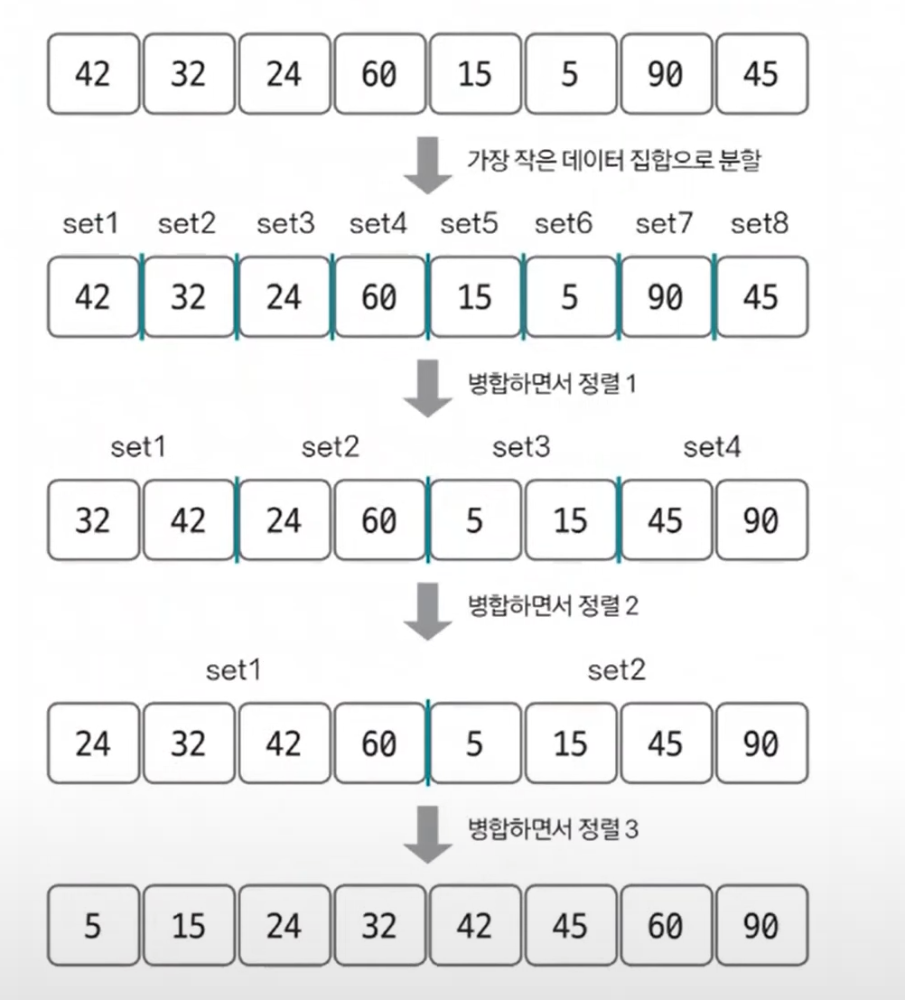
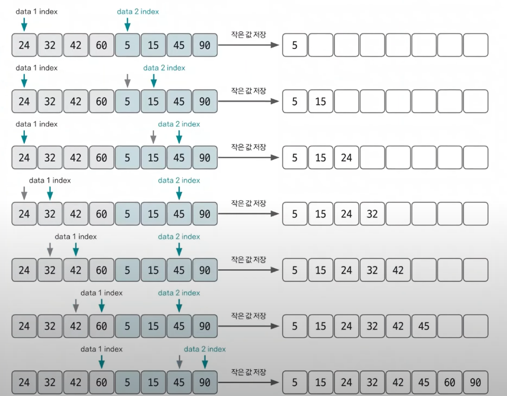

# 병합 정렬

- 병합 정렬은 분할 정복 방식을 사용해 데이터를 분할하고 분할한 집합을 정렬하며 합치는 알고리즘이다.
- 병합 정렬의 시간 복잡도는 `O(nlogn)`이다.

**병합 정렬 수행 방식**
1. 그림으로 예를 들면 최초에는 8개의 그룹으로 나눈다.
2. 이 상태에서 2개씩 그룹을 합치며 오름차순 정렬한다.
3. 이런 방식으로 병합 정렬 과정을 거치면 전체를 오름차순으로 정렬할 수 있다.

**병합 정렬은 코딩 테스트의 정렬 관련 문제에서 자주 등장한다. 특히 2개의 그룹을 병합하는 원리를 꼭 이해해야 한다.**

**2개의 그룹을 병합하는 과정**

- 투 포인터 개념을 사용하여 왼쪽, 오른쪽 그룹을 병합한다.
- 왼쪽 포인터와 오른쪽 포인터의 값을 비교하여 작은 값을 결과 배열에 추가하고 포인터를 오른쪽으로 1칸 이동시킨다.
- 단, 이동시킨 그룹에 포인터만 이동하고 반대편 그룹의 포인터는 변화가 없어야 한다.
- 만약 반대편 그룹의 더 이상 비교할 대상이 없다면(반대편 그룹의 포인터가 끝까지 이동했다면), 남은 그룹의 데이터들은 그대로 이어서 저장하면 된다.

### [예제 문제(백준 - 수 정렬하기 2)](https://github.com/genesis12345678/TIL/blob/main/algorithm/sorting/mergeSort/Example_1.md#%EB%B3%91%ED%95%A9-%EC%A0%95%EB%A0%AC-%EC%98%88%EC%A0%9C---1)

### [예제 문제(백준 - 버블 소트)](https://github.com/genesis12345678/TIL/blob/main/algorithm/sorting/mergeSort/Example_2.md#%EB%B6%84%ED%95%A0-%EC%A0%95%EB%B3%B5-%EC%98%88%EC%A0%9C---2)