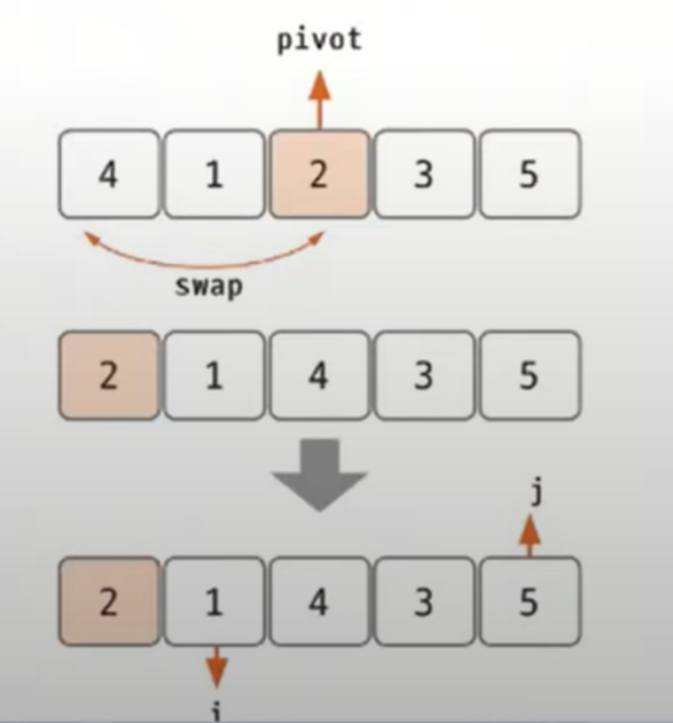
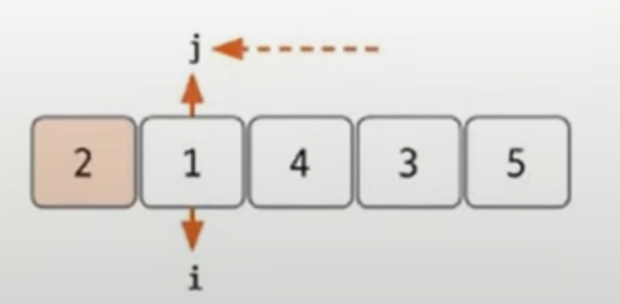
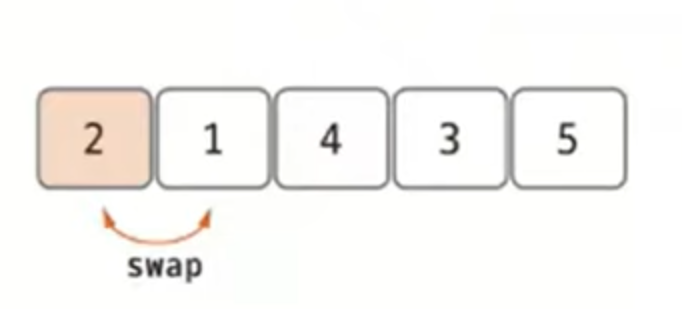
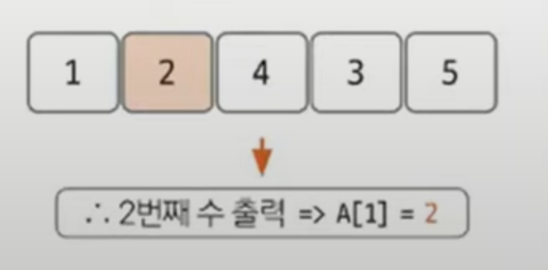

# 퀵 정렬 예제 - 1

### [문제(백준(11004번 - K번째 수))](https://www.acmicpc.net/problem/11004)

### 문제 분석
- 주어진 수를 오름차순 정렬하고 `k`번째 수를 출력한다.
- `N`이 최대 5,000,000 이기 때문에 `sort()` 내장 함수를 사용해도 되지만, 퀵 정렬을 구현해 본다.
  - 퀵 정렬은 `pivot`의 선택에 따라 최악의 시간 복잡도가 `n^2`이므로 이 문제에서는 병합 정렬(`nlogn`) 등을 사용하는 것이 더 안전하다.

> **`pivot`을 정하는 방법**
> - `pivot == k` : k번째 수를 찾은 것이므로 알고리즘을 종료한다.
> - `pivot > k` : `pivot`의 왼쪽 부분에 `k`가 있으므로 왼쪽(`start ~ pivot - 1`)만 정렬을 수행한다.
> - `pivot < k` : `pivot`의 오른쪽 부분에 `k`가 있으므로 오른쪽(`pivot + 1 ~ end`)만 정렬을 수행한다.


### 손으로 풀어보기

1. **중간 위치를 `pivot`으로 설정한 다음 맨 앞에 있는 값과 `swap`한다. `pivot`을 맨 앞으로 옮기는 이유는 `i`, `j`이동을 편하게 하기 위함이다. 
   이어서 `i`와 `j`를 `pivot`을 제외한 그룹에서 왼쪽, 오른쪽 끝으로 정한다.**



- `i`는 1번 index(start), `j`는 마지막 index(end)에 위치한다.

2. **우선 `j`를 이동한다. `j`가 `pivot`보다 크면 `j--` 연산을 반복한다. `j`를 이동한 후에는 `i`가 `pivot`보다 작으면서 `i`보다 `j`가 크면 `i++`
   연산을 반복한다.**



3. **`pivot`을 두 집합을 나눠 주는 위치, 즉 `i`와 `j`가 만난 위치와 `swap`한다.**



4. **`K`는 2이므로 이제 더 이상 정렬하지 않고 출력한다.**




### 슈도코드
```text
n(숫자의 개수) k(k번째 수)
a(숫자 데이터 저장 배열)

# 함수 구현
퀵 정렬 함수(시작, 종료, k)
    피벗 구하기 함수(시작, 종료):
    if 피벗 == k: 종료
    elif k < 피벗: 퀵 정렬 수행(시작, 피벗-1, k)
    else: 퀵 정렬 수행하기(피벗+1, 종료, k)
    
피벗 구하기 함수(시작, 종료):
    데이터가 2개인 경우는 바로 비교하여 정렬
    m(중앙값)
    중앙값을 시작 위치와 swap
    피벗을 시작 위치 값 a[s]로 저장
    i(시작점), j(종료점)
    
    while i <= j:
        피벗보다 큰 수가 나올 때까지 i 증가
        피벗보다 작은 수가 나올 때까지 j 감소
        찾은 i와 j데이터를 swap
        
    피벗 데이터를 나뉜 두 그룹의 경계 index에 저장
    경게 index 리턴
    
퀵 정렬 실행
k번째 데이터 출력
```

### 코드 구현 - 파이썬
```python
import sys

input = sys.stdin.readline
n, k = map(int, input().split())
a = list(map(int, input().split()))


def swap(i, j):
    global a
    temp = a[i]
    a[i] = a[j]
    a[j] = temp


def quickSort(start, end, k):
    global a
    if start < end:
        pivot = partition(start, end)  # 중간 위치 피벗 설정
        if pivot == k:   # k번째 수가 피벗이면 더는 구할 필요 없음
            return
        elif pivot > k:  # k가 피벗보다 작으면 왼쪽 그룹만 정렬
            quickSort(start, pivot - 1, k) 
        else:            # k가 피벗보다 크면 오른쪽 그룹만 정렬
            quickSort(pivot + 1, end, k)


def partition(start, end):
    global a

    if start + 1 == end:  # 데이터가 2개인 경우는 바로 비교하여 정렬
        if a[start] > a[end]:
            swap(start, end)
        return end

    m = (start + end) // 2  # 중간 index 구하기
    swap(start, m)  # start와 중간 swap
    pivot = a[start]  # pivot 값 지정
    i = start + 1  # start 지정
    j = end  # end 지정

    while i <= j:
        while pivot < a[j] and j > 0:  # 피벗보다 작은 값이 나올 때까지, 리스트 범위를 벗어나지 않을 때까지
            j -= 1  # end 왼쪽 이동
        while pivot > a[i] and i < len(a) - 1:  # 피벗보다
            i += 1

        if i <= j:  # i와 j의 위치가 다르면 swap하고 각각 안쪽으로 한 칸 이동
            swap(i, j)
            i += 1
            j -= 1

    #  i == j 피벗의 값을 양쪽으로 분리한 가운데에 오도록 설정하기
    a[start] = a[j]  # 현재 피벗의 값을 j 위치로 이동
    a[j] = pivot  # 피벗 값을 나뉜 두 그룹의 경계 index에 저장
    return j  # 반환하는 j의 순서는 정해졌다.


quickSort(0, n - 1, k - 1)
print(a[k - 1])

```

### 코드 구현 - 자바
```java
import java.io.BufferedReader;
import java.io.IOException;
import java.io.InputStreamReader;
import java.util.StringTokenizer;

public class Main {
    static int[] arr;
    static int k;

    public static void main(String[] args) throws IOException {
        BufferedReader br = new BufferedReader(new InputStreamReader(System.in));
        StringTokenizer st = new StringTokenizer(br.readLine());

        int n = Integer.parseInt(st.nextToken());
        k = Integer.parseInt(st.nextToken());

        arr = new int[n];

        st = new StringTokenizer(br.readLine());
        for (int i = 0; i < n; i++) {
            arr[i] = Integer.parseInt(st.nextToken());
        }

        quickSort(0, n - 1, k - 1);
        System.out.println(arr[k - 1]);
    }

    private static void quickSort(int start, int end, int k) {
        if (start < end) {
            int pivot = partition(start, end);

            if (pivot == k) {
                return;
            } else if (k < pivot) {
                quickSort(start, pivot - 1, k);
            } else {
                quickSort(pivot + 1, end, k);
            }
        }
    }

    private static int partition(int start, int end) {

        if (start + 1 == end) {
            if (arr[start] > arr[end]) {
                swap(start, end);
            }
            return end;
        }

        int mid = (start + end) / 2;
        swap(start, mid);
        int pivot = arr[start];

        int i = start + 1;
        int j = end;

        while (i <= j) {
            while (pivot < arr[j] && j > 0) {
                j--;
            }
            while (pivot > arr[i] && i < arr.length - 1) {
                i++;
            }

            if (i <= j) {
                swap(i, j);
                i++;
                j--;
            }
        }

        arr[start] = arr[j];
        arr[j] = pivot;

        return j;
    }

    private static void swap(int i, int j) {
        int temp = arr[i];
        arr[i] = arr[j];
        arr[j] = temp;
    }
}
```