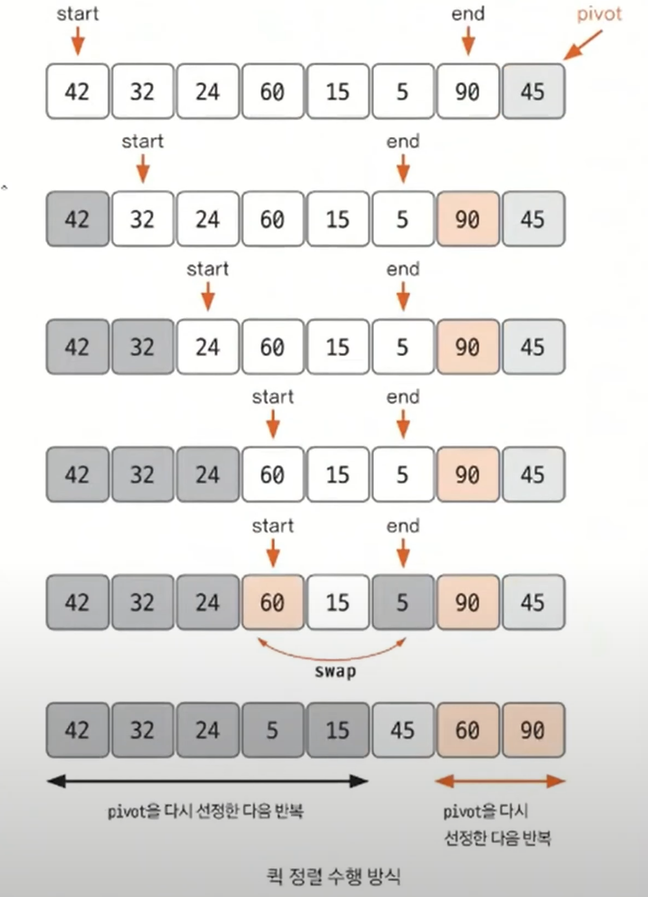

# 퀵 정렬

- 기준값(`pivot`)을 선정해 해당 값보다 작은 데이터와 큰 데이터로 분류하는 것을 반복해 정렬하는 알고리즘
- 기준값이 어떻게 선정되는지가 시간 복잡도에 많은 영향을 미친다.
- 평균적인 시간 복잡도는 `O(nlogn)`이며, 최악의 경우에는 `O(n^2)`이 된다.

- `pivot`을 중심으로 계속 데이터를 2개의 집합으로 나누면서 정렬하는 것이 퀵 정렬의 핵심이다.
- **퀵 정렬 과정**
1. 데이터를 분할하는 `pivot` 설정
2. `pivot`을 기준으로 다음 과정을 거쳐 데이터를 2개의 집합으로 분리한다.
   1. `start`가 가리키는 데이터가 `pivot`이 가리키는 데이터보다 작으면 `start`를 오른쪽으로 1칸 이동한다.
   2. `end`가 가리키는 데이터가 `pivot`이 가리키는 데이터보다 크면 `end`를 왼쪽으로 1칸 이동한다.
   3. `start` 가 가리키는 데이터가 `pivot`이 가리키는 데이터보다 크고, `end`가 가리키는 데이터가 `pivot`이 가리키는 데이터보다 작으면
        `start`, `end`가 가리키는 데이터를 `swap`하고 `start`는 오른쪽, `end`는 왼쪽으로 1칸씩 이동한다.
   4. `start`와 `end`가 만날 때가지 `2-1` ~ `2-3` 과정을 반복한다.
   5. `start`와 `end`가 만나면 만난 지점에서 가리키는 데이터와 `pivot`이 가리키는 데이터를 비교하여 `pivot`이 가리키는 데이터가 크면 만난 지점의 오른쪽에,
      작으면 만난 지점의 왼쪽에 `pivot`이 가리키는 데이터를 삽입한다.
3. 분리 집합에서 각각 다시 `pivot`을 설정한다.
4. 분리 집합이 1개 이하가 될 때까지 과정 `1 ~ 3`을 반복한다.

**퀵 정렬의 시간 복잡도는 비교적 준수해 코딩 테스트에서도 응용할 수 있다. 재귀 함수 형태로도 구현해 볼 수 있다.**

### [예제 문제(백준 - K번째 수)](https://github.com/genesis12345678/TIL/blob/main/algorithm/sorting/quickSort/Example_1.md#%ED%80%B5-%EC%A0%95%EB%A0%AC-%EC%98%88%EC%A0%9C---1)