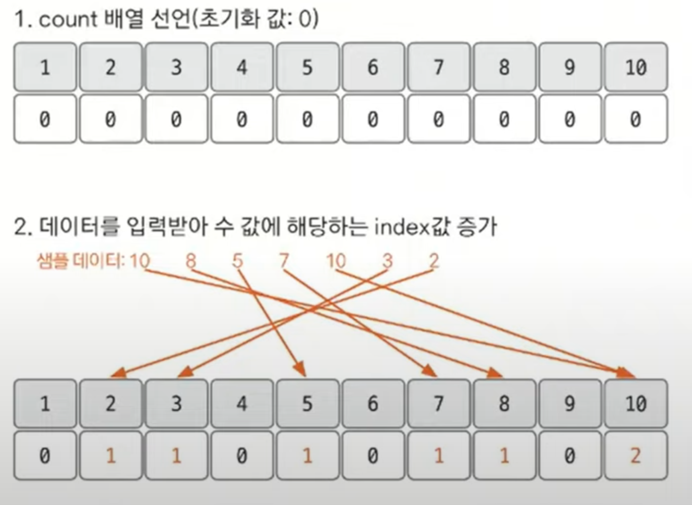
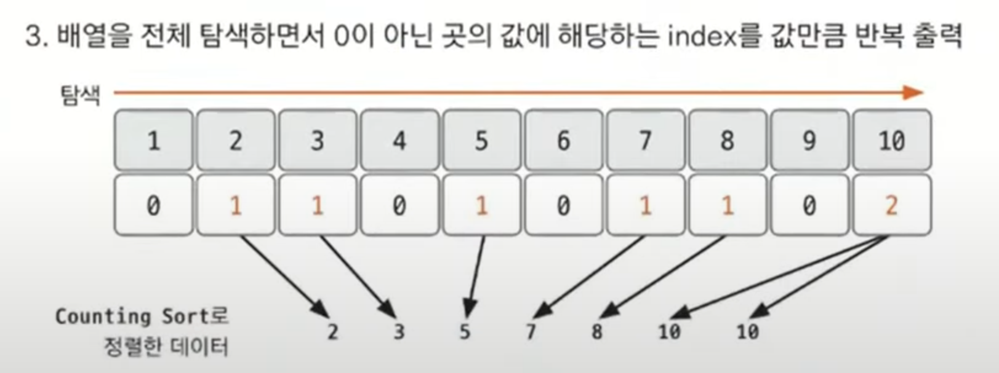

# 기수 정렬 예제 - 1

### [문제(백준(10989번 - 수 정렬하기 3))](https://www.acmicpc.net/problem/10989)

### 문제 분석
- `N`의 최대 개수가 10,000,000으로 매우 크기 때문에 `O(nlogn)`보다도 더 빠른 알고리즘이 필요하다.
- 숫자의 크기가 10,000 이하이기 때문에 기수 정렬과 함께 많이 사용하는 계수 정렬(`counting sort`)를 사용할 수 있다.
- 다만, 계수 정렬을 사용할 때에는 제약 조건이 있다.
  - 데이터가 양수여야 한다.
  - 데이터의 값이 매우 작아야 한다.

### 손으로 풀어보기

1. **숫자 크기가 10,000 이하 이므로 10,001 크기의 배열을 선언한다. 이후 입력하는 수를 받아 수의 값을 배열의 인덱스로 보고 해당 인덱스에 해당하는 값을 1 증가시켜 준다.**



2. **리스트를 처은부터 끝까지 탐색하면서 값이 0이 아닌 경우 해당 값이 있는 index를 값만큼 반복하여 출력해 준다.**



### 슈도코드
```text
n(정렬할 수 개수)
count(카운팅 정렬 리스트)

for n 반복:
    count 리스트에 현재 수에 해당하는 index 값 1 증가
    
for i 0 ~ 10000까지:
    if count[i] 값이 0이 아니면
        해당 값만큼 i 반복 출력
```

### 코드 구현 - 파이썬
```python
import sys

input = sys.stdin.readline
print = sys.stdout.write

n = int(input())
count = [0] * 10001

for i in range(n):
    count[int(input())] += 1

result = []

for i in range(10001):
    if count[i] != 0:
        for _ in range(count[i]):
            print(str(i) + "\n")
```

### 코드 구현 - 자바
```java
import java.io.BufferedReader;
import java.io.IOException;
import java.io.InputStreamReader;

public class Main {
    
    public static void main(String[] args) throws IOException {
        BufferedReader br = new BufferedReader(new InputStreamReader(System.in));

        int n = Integer.parseInt(br.readLine());
        int[] count = new int[10001];

        for (int i = 0; i < n; i++) {
            count[Integer.parseInt(br.readLine())]++;
        }

        StringBuilder sb = new StringBuilder();

        for (int i = 0; i < 10001; i++) {
            while (count[i] > 0) {
                sb.append(i).append("\n");
                count[i]--;
            }
        }
        System.out.println(sb);
    }
}
```