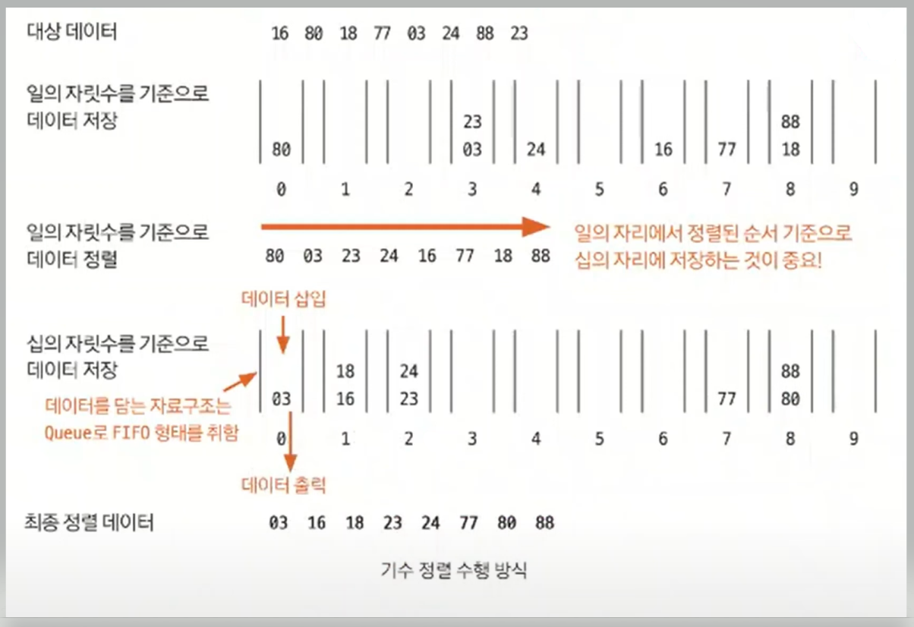

# 기수 정렬

- 기수 정렬은 값을 비교하지 않는 특이한 정렬이다. 
- 기수 정렬은 값을 놓고 비교할 자릿수를 정한 다음 해당 자릿수만 비교한다.
- 기수 정렬의 시간 복잡도는 `O(kn)`으로, `k`는 데이터의 자릿수를 말한다.

- **기수 정렬의 핵심은 10개의 큐를 이용하는 것이다.** 각 큐는 값의 자릿수를 대표한다.
- 마지막 자릿수를 기준으로 정렬할 때까지 과정을 반복한다.

### [예제 문제(백준 - 수 정렬하기 3)](https://github.com/genesis12345678/TIL/blob/main/algorithm/sorting/radixSort/Example_1.md#%EA%B8%B0%EC%88%98-%EC%A0%95%EB%A0%AC-%EC%98%88%EC%A0%9C---1)