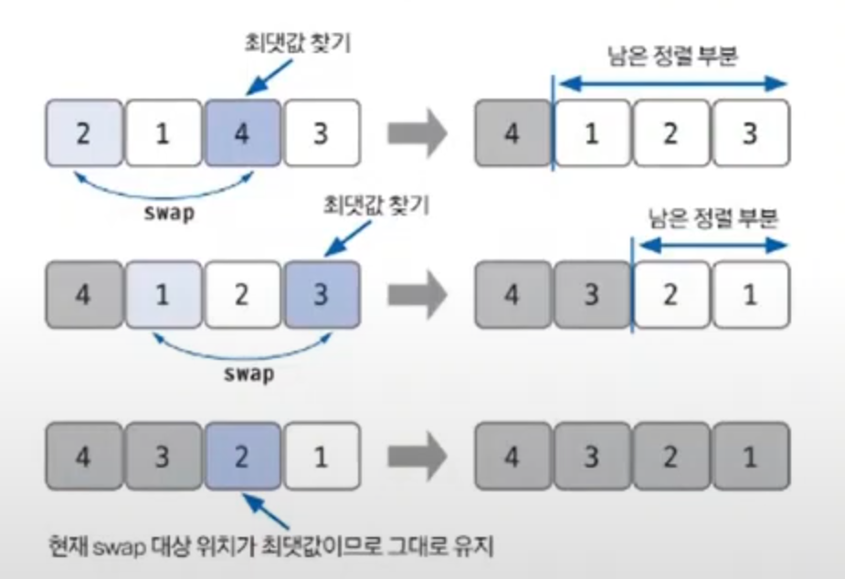

# 선택 정렬 예제 - 1

### [문제(백준(1427번 - 소트인사이드))](https://www.acmicpc.net/problem/1427)

### 문제 분석
- `N`이 최대 1,000,000,000인데 데이터 크기가 아니라 자릿수로 이해하면 되니까 최대 10자리로 범위가 매우 작다.
- 자연수를 받아 자릿수별로 정렬하는 문제이므로 먼저 숫자를 각 자릿수별로 나누는 작업이 필요하다.
- 파이썬에서는 `input` 데이터를 `list`로 변환하면 자동으로 각 자릿수로 나누어 리스트화 해주기 때문에 변경이 간편하다.
- `sort` 내장 함수를 사용해도 되지만, `N`의 길이가 크지 않으므로 선택 정렬을 사용해본다.

### 손으로 풀어보기
1. **`list` 변환을 사용하여 `input`데이터를 리스트에 저장한다.**
2. **리스트의 데이터를 선택 정렬 알고리즘을 이용해 내림차순 정렬한다. 내림차순 정렬이므로 최댓값을 찾아 기준이 되는 자리와 `swap`한다.**



### 슈도코드
```text
a(자릿수별로 구분해 저장한 리스트)
a 리스트 저장

for i a 리스트만큼 : 
    for j i+1 ~ a 리스트만큼 :
        현재 범위에서 max 찾기
    현재 i의 값과 max 중 max가 더 크면 swap 수행

a 리스트 출력
```

### 코드 구현 - 파이썬
```python
import sys

print = sys.stdout.write
a = list(input())

for i in range(len(a)):
    max = i
    for j in range(i+1, len(a)):
        if a[j] > a[max]:
            max = j

    if a[i] < a[max]:
        temp = a[i]
        a[i] = a[max]
        a[max] = temp

for i in range(len(a)):
    print(a[i])
```

### 코드 구현 - 자바
```java
import java.io.BufferedReader;
import java.io.IOException;
import java.io.InputStreamReader;

public class Main {

    public static void main(String[] args) throws IOException {
        BufferedReader br = new BufferedReader(new InputStreamReader(System.in));

        String input = br.readLine();
        int length = input.length();

        int[] arr = new int[length];

        for (int i = 0; i < length; i++) {
            arr[i] = Integer.parseInt(input.substring(i, i + 1));
        }

        for (int i = 0; i < length; i++) {
            int max = i;
            for (int j = i + 1; j < length; j++) {
                if (arr[j] > arr[max]) {
                    max = j;
                }
            }
            if (arr[i] < arr[max]) {
                int temp = arr[i];
                arr[i] = arr[max];
                arr[max] = temp;
            }
        }

        for (int n : arr) {
            System.out.print(n);
        }
    }
}
```