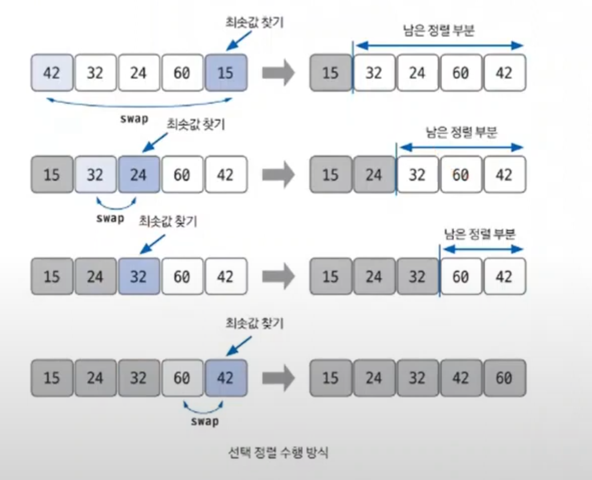

# 선택 정렬

- 대상 데이터에서 최대나 최소 데이터가 나열된 순으로 찾아가며 선택하는 방법
- 구현 방법이 복잡하고, 시간 복잡도도 `O(n^2)`으로 효율적이지 않아 코딩 테스트에서 많이 사용하지 않는다.

- 최솟값 또는 최댓값을 찾고, 남은 정렬 부분의 가장 앞에 있는 데이터와 `swap` 하는 것이 선택 정렬의 핵심
- **선택 정렬 과정**
  1. 남은 정렬 부분에서 최솟값 또는 최댓값을 찾는다.
  2. 남은 정렬 부분에서 가장 앞에 있는 데이터와 선택된 데이터를 `swap`한다.
  3. 가장 앞에 있는 데이터의 위치를 변경해(`index++`) 남은 정렬 부분의 범위를 축소한다.
  4. 전처 데이터 크기만큼 index가 커질 때까지, 즉 남은 정렬 부분이 없을 때까지 반복한다.

### [예제 문제(백준 - 소트인사이드)](https://github.com/genesis12345678/TIL/blob/main/algorithm/sorting/selectionSort/Example_1.md#%EC%84%A0%ED%83%9D-%EC%A0%95%EB%A0%AC-%EC%98%88%EC%A0%9C---1)