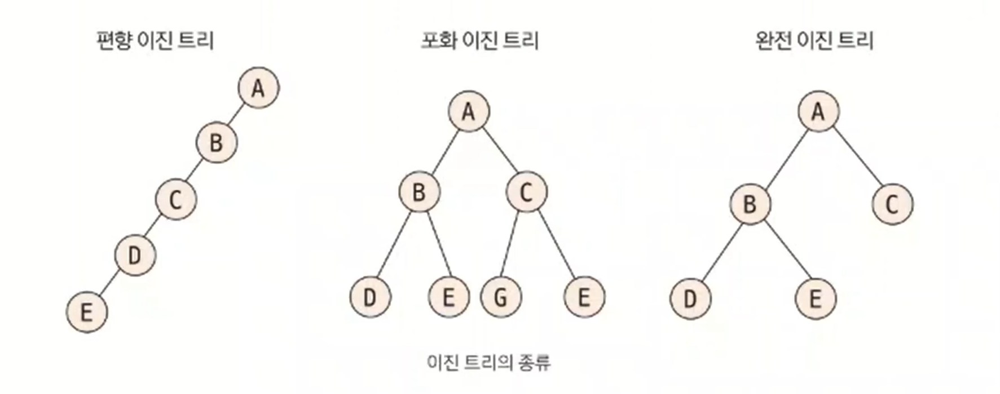
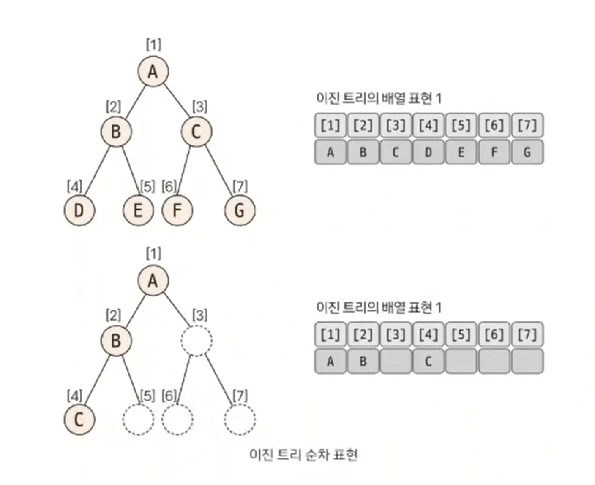

# 이진 트리

- 이진 트리(`binary tree`)는 각 노드의 자식 노드(차수)의 개수가 2 이하로 구성돼 있는 트리이며, 트리 영역에서 가장 많이 사용되는 형태이다.

## 이진 트리 핵심 이론

- **이진 트리의 종류**
  - 이진 트리에는 편향 이진 트리, 포화 이진 트리, 완전 이진 트리가 있다.
  - **편향 이진 트리**는 노드들이 한 쪽으로 편향돼 생성된 이진 트리이다.
  - **포화 이진 트리**는 트리의 높이가 모두 일정하며 리프 노드가 꽉 찬 이진 트리이다.
  - **완전 이진 트리**는 마지막 레벨을 제외하고 완전하게 노드들이 채워져 있고, 마지막 레벨은 왼쪽부터 채워진 트리이다.

- 데이터를 트리 자료구조에 저장할 때 편향 이진 트리의 형태로 저장하면 탐색 속도가 저하되고 공간이 많이 낭비되는 단점이 있다.
- 일반적으로 코딩 테스트에서 데이터를 트리에 담는다고 하면 완전 이진 트리 형태를 떠올리면 된다.

 

- **이진 트리의 순차 표현**
  - 가장 직관적이면서 편리한 트리 자료구조 형태는 배열(리스트)이다.

- 이진 트리는 1차원 배열(리스트)의 형태로 표현할 수 있다.
- 이렇게 1차원 배열의 형태로 표현하면 트리의 노드와 배열의 인덱스 간의 상관 관계가 생긴다.

| 이동 목표 노드  | 인덱스 연산                | 제약 조건(N = 노드 개수)   |
|-----------|-----------------------|--------------------|
| 루트 노드     | index = 1             |                    |
| 부모 노드     | index = index / 2     | 현재 노드가 루트 노드가 아님   |
| 왼쪽 자식 노드  | index = index * 2     | index * 2 <= N     |
| 오른쪽 자식 노드 | index = index * 2 + 1 | index * 2 + 1 <= N |

- 이러한 인덱스 연산 방식은 세그먼트 트리나 LCA 알고리즘에서 기본이 되는 연산이다.

### [예제 문제(백준 - 트리 순회)](https://github.com/genesis12345678/TIL/blob/main/algorithm/tree/binary/Example_1.md#%EC%9D%B4%EC%A7%84-%ED%8A%B8%EB%A6%AC-%EC%98%88%EC%A0%9C---1)
