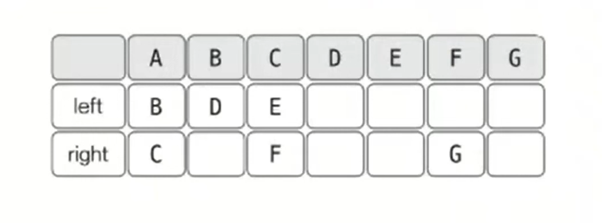
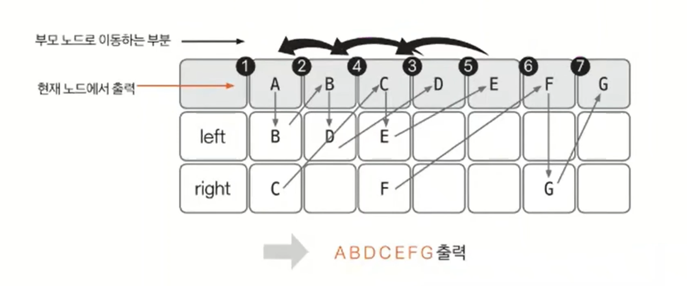

# 이진 트리 예제 - 1

### [문제(백준(1991번 - 트리 순회))](https://www.acmicpc.net/problem/1991)

### 문제 분석
- 특별한 아이디어를 떠올릴 필요 없이 문제가 요구하는 자료구조 형태만 충실히 구현하면 되는 문제다.
- 문제에서 주어진 입력값을 트리 형태의 자료구조로 적절하게 저장하고, 그 안에서 탐색을 수행하는 로직을 구현할 수 있다.
- 딕셔너리, 2차원 리스트로 구현하는 방식 등 다양한 방법으로 문제를 해결할 수 있다.

### 손으로 풀어보기
1. **2차원 배열(딕셔너리)에 트리 데이터를 저장한다.**



2. **전위 순회 함수를 구현해 실행한다.**

- **전위 순회 순서**
  - `현재 노드` -> `왼쪽 노드` -> `오른쪽 노드`



3. **중위 순회, 후위 순회 함수도 과정 2와 같은 방식으로 구현해 실행한다.**

- **중위 순회**
  - `왼쪽 노드` -> `현재 노드` -> `오른쪽 노드`
- **후위 순회**
  - `왼쪽 노드` -> `오른쪽 노드` -> `현재 노드`


### 슈도코드
```text
n(노드 개수) tree(tree 데이터 저장)

for n 반복:
    root, left, right 입력
    tree에 데이터 저장

preOrder(현재 노드):  # 전위 순회
    if 현재 노드 == '.':
        return
    현재 노드 출력
    왼쪽 노드 탐색
    오른쪽 노드 탐색

inOrder(현재 노드):  # 중위 순회
    if 현재 노드 == '.':
        return
    왼쪽 노드 탐색
    현재 노드 출력
    오른쪽 노드 탐색
    
postOrder(현재 노드):  # 후위 순회
    if 현재 노드 == '.':
        return
    왼쪽 노드 탐색
    오른쪽 노드 탐색
    현재 노드 출력
    
preOrder -> inOrder -> postOrder 순서로 실행 및 결과 출력
```

### 코드 구현 - 파이썬
```python
import sys

input = sys.stdin.readline

n = int(input())
tree = {}  # 딕셔너리

for _ in range(n):
    root, left, right = input().split()
    tree[root] = [left, right]  # {'root': ['left', 'child'], 'root': ['left', 'child'], ......}


def preOrder(now):
    if now == '.':
        return
    print(now, end='')
    preOrder(tree[now][0])
    preOrder(tree[now][1])


def inOrder(now):
    if now == '.':
        return
    inOrder(tree[now][0])
    print(now, end='')
    inOrder(tree[now][1])


def postOrder(now):
    if now == '.':
        return
    postOrder(tree[now][0])
    postOrder(tree[now][1])
    print(now, end='')


preOrder('A')
print()
inOrder('A')
print()
postOrder('A')
```

### 코드 구현 - 자바
```java
import java.io.BufferedReader;
import java.io.IOException;
import java.io.InputStreamReader;
import java.util.*;

public class Main {

    static int[][] tree = new int[26][2];
    static StringBuilder sb = new StringBuilder();
    public static void main(String[] args) throws IOException {
        BufferedReader br = new BufferedReader(new InputStreamReader(System.in));

        int n = Integer.parseInt(br.readLine());

        for (int i = 0; i < n; i++) {
            String[] input = br.readLine().split(" ");
            int root = input[0].charAt(0) - 'A';
            char left = input[1].charAt(0);
            char right = input[2].charAt(0);

            if (left == '.') {
                tree[root][0] = -1;
            } else {
                tree[root][0] = left - 'A';
            }

            if (right == '.') {
                tree[root][1] = -1;
            } else {
                tree[root][1] = right - 'A';
            }
        }

        preOrder(0);
        sb.append("\n");
        
        inOrder(0);
        sb.append("\n");
        
        postOrder(0);

        System.out.println(sb);
    }

    private static void postOrder(int now) { //후위 순회
        if (now == -1) {
            return;
        }
        postOrder(tree[now][0]);
        postOrder(tree[now][1]);
        sb.append((char)(now + 'A'));
    }

    private static void inOrder(int now) { //중위 순회
        if (now == -1) {
            return;
        }
        inOrder(tree[now][0]);
        sb.append((char)(now + 'A'));
        inOrder(tree[now][1]);
    }

    private static void preOrder(int now) { //전위 순회
        if (now == -1) {
            return;
        }
        sb.append((char)(now + 'A'));
        preOrder(tree[now][0]);
        preOrder(tree[now][1]);
    }
}
```