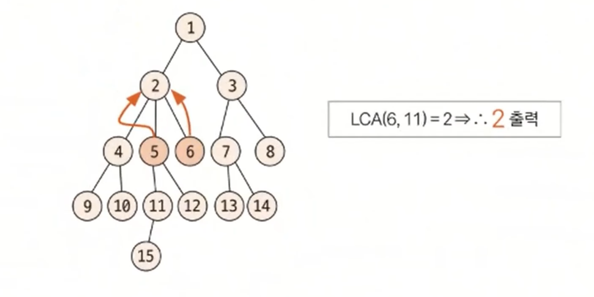

# 최소 공통 조상 예제 - 1

### [문제(백준(11437번 - LCA))](https://www.acmicpc.net/problem/11437)

### 문제 분석
- 질의 개수 10,000개, 노드 개수 50,000개로 비교적 데이터가 크지 않아 일반적인 방식의 LCA 알고리즘으로 구현하면 되는 문제다.

### 손으로 풀어보기
1. **인접 리스트로 트리 데이터를 구현한다.**
2. **탐색 알고리즘(DFS 또는 BFS)을 이용해 각 노드의 깊이와 부모 노드를 구한다.**(예: LCA(6, 11))
3. **깊이를 맞추기 위해 더 깊은 노드를 같은 깊이가 될 때까지 부모 노드로 이동한다. 노드 6의 깊이는 2, 노드 11의 깊이는 3으로 깊이가 1만큼 차이나므로 
    깊이가 3인 11번 노드를 부모 노드인 5번 노드로 이동한다.**
4. **부모 노드로 계속 올라가면서 최소 공통 조상을 찾는다. 한번 더 이동하면 부모 노드가 2로 같아지므로 노드 6과 노드 11의 최소 공통 조상은 2번 노드이다.**



### 슈도코드
```text
n(수의 개수)
tree(트리 데이터 저장)

for n-1 반복:
    tree 인접 리스트에 데이터 저장

depth(노드 깊이 리스트)
parent(노드 조상(부모 노드) 리스트)
visit(방문 저장 리스트)

BFS(node):
    큐에 출발 노드 삽입
    visit 방문 처리
    level(트리 깊이)
    nowSize(현재 깊이에서 트리 크기)
    count(카운트)
    
    while 큐가 빌 때까지:
        큐에서 노드 데이터 꺼내기
        for 현재 노드와 연결된 노드:
            if 미 방문 노드:
                큐에 데이터 삽입
                visit 방문 처리
                parent 리스트에 부모 노드 저장
                depth 리스트에 깊이 저장
        
        count 1 증가
        if nowSize == count: # 현재 깊이의 모든 노드를 방문
            count 초기화
            nowSize에 바로 아래 단계 트리 노드 개수 저장
            level 1 증가

BFS(1)

LCA(노드1, 노드2):
    1번 노드가 depth가 더 작으면 1번 노드와 2번 노드 swap
    두 노드의 depth를 동일하게 맞추기(a를 부모 노드로 변경을 높이가 맞을 때까지 반복)
    두 노드의 같은 조상이 나올 때까지 각 노드를 부모 노드로 변경하는 작업 반복
    
    최소 공통 조상 리턴

m(질의 개수)

for m 반복:
    a(1번 노드), b(2번 노드)
    print(LCA(a, b))
```

### 코드 구현 - 파이썬
```python
import sys
from collections import deque

input = sys.stdin.readline
print = sys.stdout.write

n = int(input())
tree = [[] for _ in range(n + 1)]

for _ in range(n - 1):
    s, e = map(int, input().split())
    tree[s].append(e)
    tree[e].append(s)

depth = [0] * (n + 1)
parent = [0] * (n + 1)
visit = [False] * (n + 1)


def BFS(node):
    qu = deque()
    qu.append(node)
    visit[node] = True
    level = 1
    nowSize = 1  # 현재 depth(level) 크기
    count = 0  # 현재 depth 에서 몇 개 노드를 처리했는지 알려주는 변수

    while qu:
        nowNode = qu.popleft()
        for next in tree[nowNode]:
            if not visit[next]:
                visit[next] = True
                qu.append(next)

                parent[next] = nowNode  # 부모 노드 저장
                depth[next] = level  # 노드 깊이 저장

        count += 1
        if count == nowSize:  # 다음 깊이로 가기 위한 처리
            count = 0
            nowSize = len(qu)
            level += 1


BFS(1)


def LCA(a, b):
    if depth[a] < depth[b]:  # 무조건 a의 depth를 더 깊게 하기 위해
        a, b = b, a  # a, b swap - 파이썬 문법

    while depth[a] != depth[b]:  # depth 맞추기
        a = parent[a]

    while a != b:  # 공통 조상 찾기
        a = parent[a]
        b = parent[b]

    return a  # a와 b가 같아졌으니 둘 중 아무거나 리턴


m = int(input())

result = []

for _ in range(m):
    a, b = map(int, input().split())
    result.append(str(LCA(a, b)))

print("\n".join(result))
```

### 코드 구현 - 자바
```java
import javax.swing.*;
import java.io.*;
import java.util.*;

public class Main {

    static boolean[] visit;
    static ArrayList<Integer>[] tree;
    static int[] depth;
    static int[] parent;

    public static void main(String[] args) throws IOException {
        BufferedReader br = new BufferedReader(new InputStreamReader(System.in));
        StringTokenizer st;
        int n = Integer.parseInt(br.readLine());

        visit = new boolean[n + 1];
        parent = new int[n + 1];
        depth = new int[n + 1];
        tree = new ArrayList[n + 1];
        for (int i = 1; i < n + 1; i++) {
            tree[i] = new ArrayList<>();
        }


        for (int i = 0; i < n - 1; i++) {
            st = new StringTokenizer(br.readLine());
            int s = Integer.parseInt(st.nextToken());
            int e = Integer.parseInt(st.nextToken());

            tree[s].add(e);
            tree[e].add(s);
        }

        BFS(1);
//        DFS(1, 0);

        StringBuilder sb = new StringBuilder();

        int m = Integer.parseInt(br.readLine());
        for (int i = 0; i < m; i++) {
            st = new StringTokenizer(br.readLine());
            int a = Integer.parseInt(st.nextToken());
            int b = Integer.parseInt(st.nextToken());

            sb.append(LCA(a, b)).append("\n");
        }

        System.out.print(sb);
    }

    private static int LCA(int a, int b) {
        if (depth[a] < depth[b]) {
            int temp = a;
            a = b;
            b = temp;
        }

        while (depth[a] != depth[b]) {
            a = parent[a];
        }

        while (a != b) {
            a = parent[a];
            b = parent[b];
        }

        return a;
    }

    private static void BFS(int node) {
        Queue<Integer> qu = new LinkedList<>();
        qu.offer(node);
        visit[node] = true;
        int level = 1;
        int nowSize = 1;
        int count = 0;

        while (!qu.isEmpty()) {
            int nowNode = qu.poll();
            for (int next : tree[nowNode]) {
                if (!visit[next]) {
                    visit[next] = true;
                    qu.offer(next);

                    parent[next] = nowNode;
                    depth[next] = level;
                }
            }
            count++;
            if (count == nowSize) {
                count = 0;
                nowSize = qu.size();
                level++;
            }
        }
    }

    private static void DFS(int node, int level) {
        visit[node] = true;
        depth[node] = level;

        for (int next : tree[node]) {
            if (!visit[next]) {
                parent[next] = node;
                DFS(next, level + 1);
            }
        }
    }
}
```