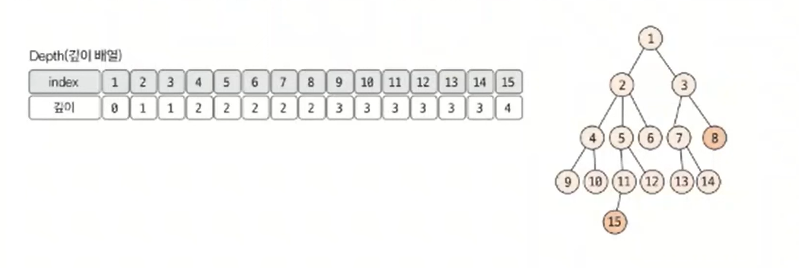
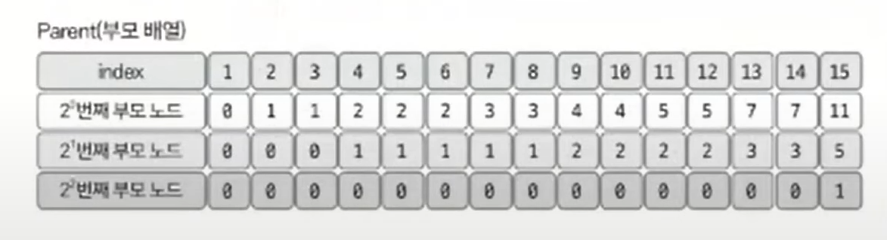

# 최소 공통 조상 예제 - 2

### [문제(백준(11438번 - LCA 2))](https://www.acmicpc.net/problem/11438)

### 문제 분석
- 노드의 개수와 질의의 개수가 매우 커졌다.
- 일반적인 최소 공통 조상 구하기 방식으로 해결하려고 하면 시간 초과가 발생한다.
- 제곱수 형태를 이용한 빠르게 최소 공통 조상 구하기 방식으로 문제를 해결해본다.

### 손으로 풀어보기
1. **인접 리스트로 트리 데이터를 구현한다.**
2. **탐색 알고리즘(BFS 또는 DFS)을 이용해 각 노드의 깊이와 바로 위 부모 노드를 구한다.**



3. **점화식을 이용해 Parent 배열(부모 노드 배열)을 구한다.**
   - **부모 노드 배열 점화식**
   - `P[K][N]` = `P[K - 1][P[K - 1][N]]`



4. **예를 들어 15와 8의 최소 공통 조상을 찾아보면, 깊이가 큰 노드는 Parent 배열을 이용해 `2^k`만큼 빠르게 이동시켜 깊이를 맞춘다. 깊이가 2만큼 차이나므로
    15번 노드를 15의 `2^1`번째 부모 노드인 5로 변경해 깊이를 맞춘다. 한 칸씩 오르는 것이 아닌 2의 제곱수로 빠르게 올라간다.**
5. **부모 노드로 올라가면서 최소 공통 조상을 찾는다. Parent 배열을 이용해 `2^k`만큼 넘어가면서 찾는 것이 핵심이다. `k`는 depth의 최댓값에서 1씩 감소한다.**


### 슈도코드
```text
n(수의 개수)
tree(트리 데이터 인접 리스트)

for n-1 반복:
    트리 데이터 입력

depth(노드 깊이 리스트)
parent(노드 조상(부모 노드)리스트)
visit(방문 저장 리스트)
kmax(최대 가능 높이)  # 최대 가능 높이 구하기

parent 선언 = [kmax + 1][n + 1]

BFS(node):
    큐에 출발 노드 삽입
    visit 방문 처리
    level(트리 깊이)
    nowSize(현재 깊이에서 트리 크기)
    count(카운트)
    
    while 큐가 빌 때까지:
        큐에서 노드 데이터 꺼내기
        for 현재 노드와 연결된 노드:
            if 미 방문 노드:
                큐에 데이터 삽입
                visit 방문 처리
                parent 리스트에 부모 노드 저장
                depth 리스트에 깊이 저장
        
        count 1 증가
        if nowSize == count: # 현재 깊이의 모든 노드를 방문
            count 초기화
            nowSize에 바로 아래 단계 트리 노드 개수 저장
            level 1 증가

BFS(1)    

for kmax 반복:    # 2^k 번째 부모 노드 계산 및 저장
    for n 반복:   # 노드 개수만큼
        점화식 parent 구성 : parent[k][n] = parent[k - 1][parent[k - 1][n]]
        
LCA(a, b):
    1번 노드의 depth가 더 작으면 1번 노드와 2번 노드 swap
    두 노드의 depth를 동일하게 맞추기   # parent 리스트를 이용해 2의 제곱수로 이동
    두 노드의 같은 조상이 나올 때까지 각 노드를 부모 노드로 변경     # parent 리스트를 이용해 2의 제곱수로 이동
    
    최소 공통 조상 리턴

m(질의 개수)

for m 반복:
    a(1번 노드) b(2번 노드)
    print(LCA(a, b))
```

### 코드 구현 - 파이썬
```python
import sys
from collections import deque

input = sys.stdin.readline

n = int(input())
tree = [[] for _ in range(n + 1)]

for _ in range(n - 1):
    s, e = map(int, input().split())
    tree[s].append(e)
    tree[e].append(s)

depth = [0] * (n + 1)
visit = [False] * (n + 1)
temp = 1
kmax = 0

while temp <= n:
    temp <<= 1  # shift 연산
    kmax += 1

parent = [[0 for _ in range(n + 1)] for _ in range(kmax + 1)]


def BFS(node):
    qu = deque()
    qu.append(node)
    visit[node] = True
    level = 1
    nowSize = 1
    count = 0

    while qu:
        nowNode = qu.popleft()
        for next in tree[nowNode]:
            if not visit[next]:
                visit[next] = True
                qu.append(next)

                parent[0][next] = nowNode
                depth[next] = level

        count += 1
        if count == nowSize:
            count = 0
            nowSize = len(qu)
            level += 1


BFS(1)

# 점화식으로 부모 노드 리스트 채우기
for k in range(1, kmax + 1):
    for n in range(1, n + 1):
        parent[k][n] = parent[k - 1][parent[k - 1][n]]


def LCA(a, b):
    if depth[a] > depth[b]:  # 더 깊은 depth가 b가 되도록
        a, b = b, a

    # 깊이 빠르게 맞추기
    for k in range(kmax, -1, -1):
        if pow(2, k) <= depth[b] - depth[a]:    # 두 노드의 depth 차이가 2^k보다 크면
            b = parent[k][b]                    # b의 depth를 2^k 만큼 한 번에 이동

    # 조상 빠르게 찾기
    for k in range(kmax, -1, -1):
        if a == b:
            break
        if parent[k][a] != parent[k][b]:        # 부모 노드가 다르면 2^k 만큼 한 번에 이동
            a = parent[k][a]
            b = parent[k][b]

    lca = a
    if a != b:      # a와 b가 다르면 한 칸만 부모 노드로 이동
        lca = parent[0][lca]

    return lca


m = int(input())

result = []
for _ in range(m):
    s, e = map(int, input().split())
    result.append(str(LCA(s, e)))

print("\n".join(result))
```

### 코드 구현 - 자바
```java
import java.io.*;
import java.util.*;

public class Main {

    static boolean[] visit;
    static ArrayList<Integer>[] tree;
    static int[] depth;
    static int[][] parent;
    static int kmax = 0;

    public static void main(String[] args) throws IOException {
        BufferedReader br = new BufferedReader(new InputStreamReader(System.in));
        StringTokenizer st;
        int N = Integer.parseInt(br.readLine());

        visit = new boolean[N + 1];
        depth = new int[N + 1];
        tree = new ArrayList[N + 1];
        for (int i = 1; i < N + 1; i++) {
            tree[i] = new ArrayList<>();
        }

        int temp = 1;

        while (temp <= N) {
            temp <<= 1; //shift 연산
            kmax++;
        }

        parent = new int[kmax + 1][N + 1];

        for (int i = 0; i < N - 1; i++) {
            st = new StringTokenizer(br.readLine());
            int s = Integer.parseInt(st.nextToken());
            int e = Integer.parseInt(st.nextToken());

            tree[s].add(e);
            tree[e].add(s);
        }

        BFS(1);
//        DFS(1, 0);

        for (int k = 1; k <= kmax; k++) {
            for (int n = 1; n <= N; n++) {
                parent[k][n] = parent[k - 1][parent[k - 1][n]];
            }
        }

        StringBuilder sb = new StringBuilder();

        int m = Integer.parseInt(br.readLine());
        for (int i = 0; i < m; i++) {
            st = new StringTokenizer(br.readLine());
            int a = Integer.parseInt(st.nextToken());
            int b = Integer.parseInt(st.nextToken());

            sb.append(LCA(a, b)).append("\n");
        }

        System.out.print(sb);
    }

    private static int LCA(int a, int b) {
        if (depth[a] > depth[b]) {
            int temp = a;
            a = b;
            b = temp;
        }

        for (int k = kmax; k >= 0; k--) {
            if (Math.pow(2, k) <= depth[b] - depth[a]) {
                b = parent[k][b];
            }
        }

        for (int k = kmax; k >= 0; k--) {
            if (a == b) {
                break;
            }
            if (parent[k][a] != parent[k][b]) {
                a = parent[k][a];
                b = parent[k][b];
            }
        }

        int lca = a;
        if (a != b) {
            lca = parent[0][lca];
        }

        return lca;
    }

    private static void BFS(int node) {
        Queue<Integer> qu = new LinkedList<>();
        qu.offer(node);
        visit[node] = true;
        int level = 1;
        int nowSize = 1;
        int count = 0;

        while (!qu.isEmpty()) {
            int nowNode = qu.poll();
            for (int next : tree[nowNode]) {
                if (!visit[next]) {
                    visit[next] = true;
                    qu.offer(next);

                    parent[0][next] = nowNode;
                    depth[next] = level;
                }
            }
            count++;
            if (count == nowSize) {
                count = 0;
                nowSize = qu.size();
                level++;
            }
        }
    }

    private static void DFS(int node, int level) {
        visit[node] = true;
        depth[node] = level;

        for (int next : tree[node]) {
            if (!visit[next]) {
                parent[0][next] = node;
                DFS(next, level + 1);
            }
        }
    }
}
```