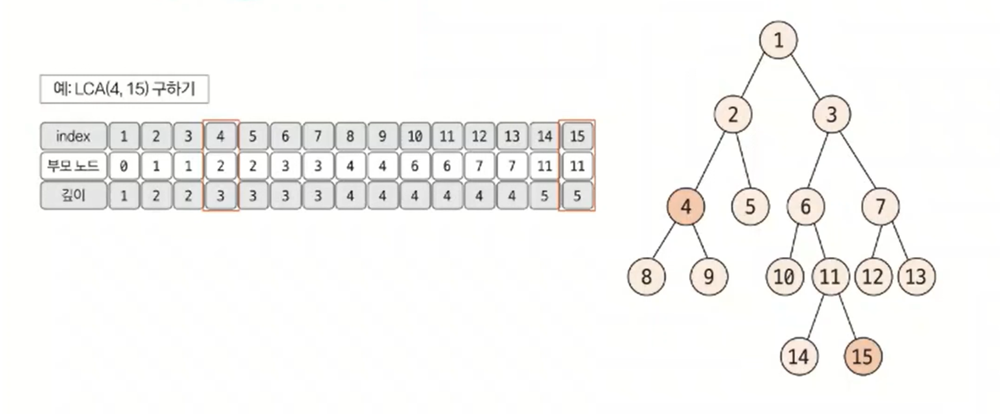
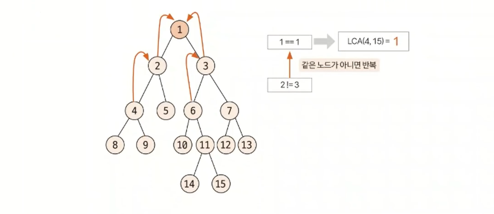
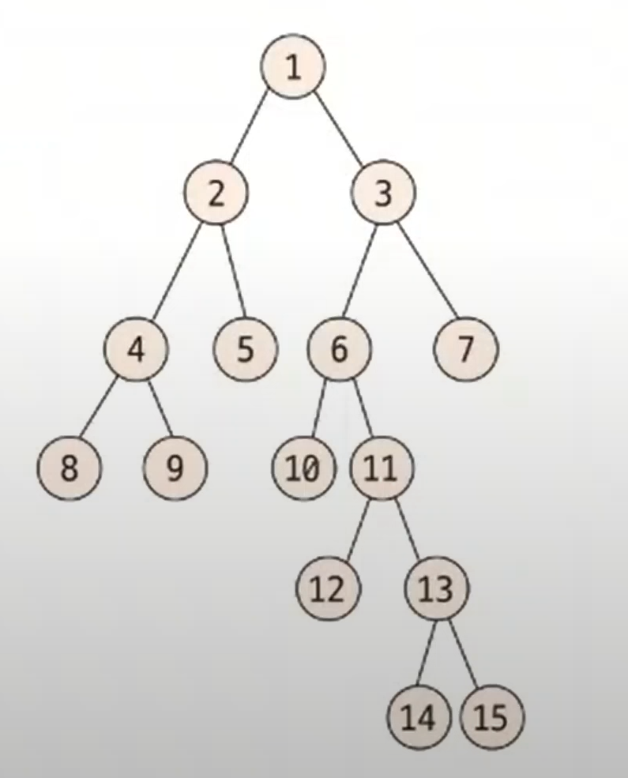
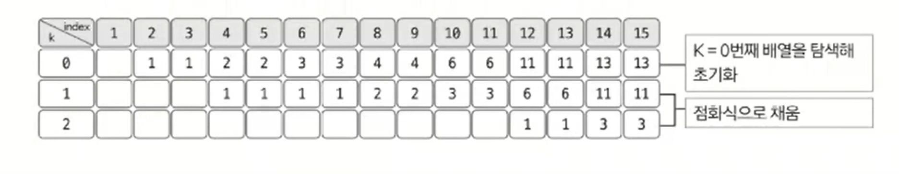
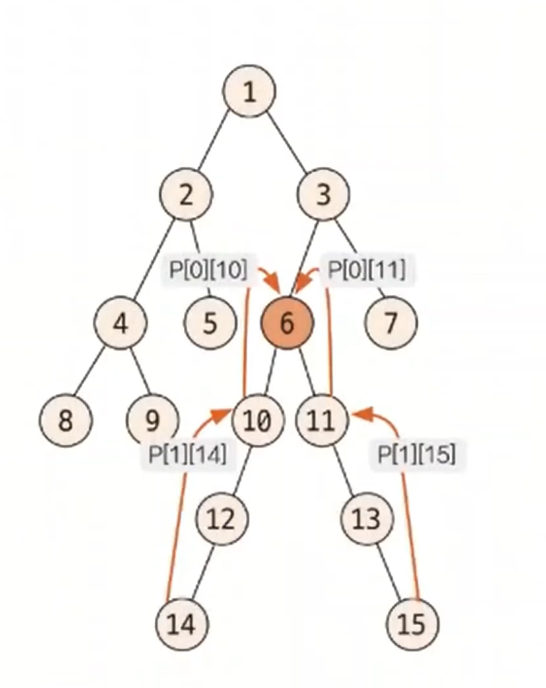

# 최소 공통 조상

- 트리 그래프에서 임의의 두 노드를 선택했을 때 두 노드가 각각 자신을 포함해 거슬러 올라가면서 부모 노드를 탐색할 때
    처음 공통으로 만나게 되는 부모 노드를 최소 공통 조상(`LCA: lowest common ancestor`)이라고 한다.

 

## 최소 공통 조상 핵심 이론

### 일반적인 최소 공통 조상 구하기

- 먼저 **트리의 높이가 크지 않을 때** 최소 공통 조상을 구하는 방법을 알아보자.
- 다음 트리에서 4번, 15번 노드의 최소 공통 조상을 구해본다.
- **먼저 루트 노드에서 탐색을 시작해 각 노드의 부모 노드와 깊이를 저장한다.**
  - 이때 탐색은 DFS나 BFS를 이용해 수행한다.

- 선택된 두 노드의 깊이가 다른 경우, 더 깊은 노드의 노드를 부모 노드로 1개씩 올려주면서 같은 깊이로 맞춘다.
- 이때 두 노드가 같으면 해당 노드가 최소 공통 조상이므로 탐색을 종료한다.

- 깊이가 같은 상태에서는 동시에 부모 노드로 올라가면서 두 노드가 같은 노드가 될 때까지 반복한다.
- 이때 처음 만나는 노드가 최소 공통 조상이 된다.

### 최소 공통 조상 빠르게 구하기

- 최소 공통 조상 빠르게 구하기의 핵심은 서로의 깊이를 맞춰 주거나 같아지는 노드를 찾을 때 기존에 한 단계식 올려주는 방식에서 `2^k`씩 올라가 비교하는 방식이다.
- 따라서 기존에 자신의 부모 노드만 저장해 놓던 방식에서 `2^k`번째 위치의 부모 노드까지 저장해 둬야 한다.

1. **부모 노드 저장 배열 만들기**
   - **부모 노드 배열 정의**
     - `P[K][N]` = `N`번 노드의 `2^k`번째 부모의 노드 번호
   - **부모 노드 배열 점화식**
     - `P[K][N]` = `P[K - 1][P[K -1][N]]`

- 점화식에서 `N`의 `2^k`번째 부모 노드는 `N`의 `2^k-1`번째 부모 노드의 `2^k-1`번째 부모 노드라는 의미이다.
- `K = 4`라고 했을 때, `N`의 16번째 부모 노드는 `N`의 8번째 부모 노드의 8번째 부모 노드라는 의미이다.
- 배열에서 `K`는 `트리의 깊이 > 2^k`를 만족하는 최댓값이다. 다음 트리에서 최대 깊이는 5이므로 `K = 2`가 되고, 이 트리의 모든 노드는 `2^3`번째 부모 노드를 지니고 있는 경우가 없다.

- 부모 노드 리스트의 점화식을 이용해 배열의 값을 채워보자.

- 초기화된 리스트를 바탕으로 K를 1씩 증가시키면서 나머지 배열을 채운다.
- 예) 14의 2^2번째, 즉 4번째 부모 노드(`P[2][14]`)
  - `P[2][14]` = `P[1][P[1][14]]`
    - => `P[1][14]` = `P[0][P[0][14]]` = `P[0][13]` = 11
    - => `P[2][14]` = `P[1][11]`
    - => `P[1][11]` = `P[0][P[0][11]]` = `P[0][6]` = 3
  - ∴ `P[2][14]` = 3

2. **선택된 두 노드의 깊이 맞추기**

- `P`배열을 이용해 기존에 한 단계씩 맞췄던 깊이를 `2^k` 단위로 넘어가면서 맞춘다.
- 예를 들어 노드 2와 노드 15의 깊이를 맞춰본다.
  - 노드 2의 깊이는 2, 노드 15의 깊이는 6으로 두 노드의 깊이 차이는 4이다.
  - 깊이를 맞추기 위해 더 깊이 있는 노드 15의 4번째 부모 노드를 `P` 배열을 이용해 찾는다.
  - `4 = 2^2` 이므로 `K = 2`이고, `P[2][15] = 3`이므로 노드 3으로 이동하면 2와 높이를 맞추게 된다.
- 만약 높이 차이가 20이라면, `2^k <= 20`을 만족하면서 `K`가 최대가 되는 만큼 이동하면서 높이 차이가 0이 될 때까지 반복한다.
- 즉, 높이 차이가 20일 경우에는 `k = 4`가 될 것이고, `2^4(16)` -> `2^2(4)` 와 같이 두 번 이동하면 된다.

3. **최소 공통 조상 찾기**

- 공통 조상을 찾는 작업 역시 한 단계씩이 아닌 `2^k` 단위로 점프하면서 맞춘다.
- `K`값을 1씩 감소하면서 `P` 배열을 이용해 최초로 두 노드의 부모가 달라지는 값을 찾는다.

- `P[2][14]` = 3 == `P[2][15]` = 3
- `P[1][14]` = 10 != `P[1][15]` = 11
- 최초로 달라지는 `K`에 대한 두 노드의 부모 노드를 찾아 이동한다.(노드 10, 노드 11로 이동)
- 이를 `K`가 0이 될 때까지 반복한다.
- 반복문이 종료된 후에는 이동한 2개의 노드가 같은 노드라면 해당 노드가, 다른 노드라면 바로 위의 부모 노드가 최소 공통 조상이 된다.
- 위 예제에서는 노드 10과 11이 다른 노드이기 때문에 바로 위 노드를 뜻하는 `P[0][11]` 또는 `P[0][10]`, 즉 노드 6이 최소 공통 조상이 된다.

### [예제 문제(백준 - LCA)](https://github.com/genesis12345678/TIL/blob/main/algorithm/tree/lca/Example_1.md#%EC%B5%9C%EC%86%8C-%EA%B3%B5%ED%86%B5-%EC%A1%B0%EC%83%81-%EC%98%88%EC%A0%9C---1)

### [예제 문제(백준 - LCA 2)](https://github.com/genesis12345678/TIL/blob/main/algorithm/tree/lca/Example_2.md#%EC%B5%9C%EC%86%8C-%EA%B3%B5%ED%86%B5-%EC%A1%B0%EC%83%81-%EC%98%88%EC%A0%9C---2)