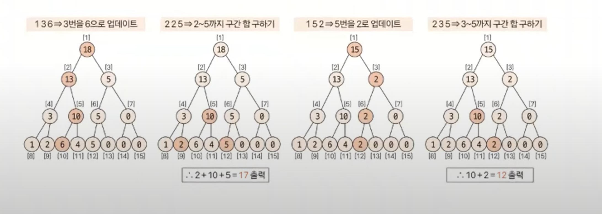

# 세그먼트 트리 예제 - 1

### [문제(백준(2042번 - 구간합 구하기))](https://www.acmicpc.net/problem/2042)

### 문제 분석
- 단순하게 구간 합을 구하는 문제라면 합 배열 자료구조를 이용해 쉽게 해결할 수 있을 것이다.
- 하지만 중간에 수의 변경이 빈번하게 일어나기 때문에 일반적인 합 배열로는 해결할 수 없다.(시간 초과 발생)
- 이 문제는 데이터의 변경에도 시간이 비교적 적게 걸리는 세그먼트 트리 자료구조를 이용해 해결해야 한다.

### 손으로 풀어보기
1. **1차원 리스트를 이용해 트리의 값을 초기화한다. 트리 리스트가 크기가 `N = 5`이므로 `2^k >= 5`를 만족하는 `k`값은 3이 되고,
    리스트의 크기는 `2^3 * 2 = 16`으로 지정하면 된다. 시작 인덱스는 `2^3 = 8`이 된다.**


2. **질의값 연산 함수와 데이터 업데이트 함수를 수행하고, 질의와 관련된 결괏값을 출력한다.**



### 슈도코드
```text
n(수의 개수) m(변경 횟수) k(구간 합 구할 횟수)
treeHeight(트리 높이)
length(리프 노드 개수)

트리 높이 구하기  # 리프 노드의 개수를 2씩 나누어 가면서 높이 계산
treeSize 구하기(Math.pow(2, 트리 높이 + 1)
leftNodeStartIndex 구하기(treeSize / 2) # 리프 노드 시작 인덱스
tree(인덱스 트리 저장 리스트)

tree 리스트의 리프 노드 영역에 데이터 입력

setTree(인덱스):
    while 인덱스가 루트가 아닐 때까지:
        부모 노드(인덱스 / 2)에 현재 index의 트리값 더하기
        인덱스 1 감소

setTree(treeSize - 1)

changeValue(시작 인덱스, 변경값):  # 값 변경 함수
    diff(현재 노드의 값과 변경값의 차이)
    while 시작 인덱스가 0보다 크면:
        시작 인덱스의 트리값에 diff값을 더함
        시작 인덱스 /= 2

getSum(시작 인덱스, 종료 인덱스):  # 구간 합 계산 함수
    while 시작 인덱스 <= 종료 인덱스:
        if 시작 인덱스 % 2 == 1:
            해당 노드의 값을 구간 합에 추가
            시작 인덱스 1 증가
        if 종료 인덱스 % 2 == 1:
            해당 노드의 값을 구간 합에 추가
            종료 인덱스 1 감소
        
        시작 인덱스 /= 2
        종료 인덱스 /= 2
    
    구간 합 결과 리턴

for m+k 반복:
    q(질의 유형), s(시작 인덱스), e(종료 인덱스 또는 변경값)
    if q == 1:
        changeValue(tree에서 시작 인덱스, e)
    else:
        print(getSum(tree에서 시작 인덱스, 트리에서 종료 인덱스))
```

### 코드 구현 - 파이썬
```python
import sys

input = sys.stdin.readline
n, m, k = map(int, input().split())

treeSize = 1

while pow(2, treeSize) < n:  # 2^k >= n 을 만족하는 k의 최솟값 구하기 (k = treeSize)
    treeSize += 1

tree = [0] * (pow(2, treeSize) * 2)  # 2^k * 2의 크기로 tree 리스트 생성

leftNodeStartIndex = pow(2, treeSize)  # 2^k이 리프 노드의 시작 인덱스

for i in range(leftNodeStartIndex, leftNodeStartIndex + n):  # 초기 리프 노드 값 세팅
    tree[i] = int(input())


# 리프 노드 값을 바탕으로 부모 노드 값 한 자리씩 채우는 함수
def setTree(i):
    while i != 0:
        tree[i // 2] += tree[i]
        i -= 1


setTree(len(tree) - 1)


# index의 값을 value로 변경
def changeValue(index, value):
    diff = value - tree[index]
    while index > 0:
        tree[index] += diff
        index //= 2  # /2로 부모 노드로 이동 하면서 값을 변경


# s ~ e 구간 합 구하는 함수
def getSum(s, e):
    partSum = 0

    while s <= e:
        if s % 2 == 1:  # start_index % 2 == 1이면 오른쪽 자식 이므로 단독 노드로 취급
            partSum += tree[s]
            s += 1
        if e % 2 == 0:  # end_index % 2 == 0이면 왼쪽 자식 이므로 단독 노드로 취급
            partSum += tree[e]
            e -= 1

        s //= 2  # 부모 노드 이동
        e //= 2  # 부모 노드 이동

    return partSum


result = []
for _ in range(m + k):
    q, s, e = map(int, input().split())
    if q == 1:
        changeValue(s + leftNodeStartIndex - 1, e)
    else:
        # 리프 노드의 인덱스로 맞추기 위해 '질의 인덱스 + 2^k - 1'로 변경 후 함수 실행
        s = s + leftNodeStartIndex - 1
        e = e + leftNodeStartIndex - 1

        result.append(str(getSum(s, e)))

print("\n".join(result))
```

### 코드 구현 - 자바
```java
import java.io.BufferedReader;
import java.io.IOException;
import java.io.InputStreamReader;
import java.util.*;

public class Main {

    static long[] tree;
    public static void main(String[] args) throws IOException {
        BufferedReader br = new BufferedReader(new InputStreamReader(System.in));
        StringTokenizer st = new StringTokenizer(br.readLine());

        int n = Integer.parseInt(st.nextToken());
        int m = Integer.parseInt(st.nextToken());
        int k = Integer.parseInt(st.nextToken());

        int treeSize = 1;
        while (Math.pow(2, treeSize) < n) {  
            treeSize++;
        }

        int leafNodeStartIndex = (int) Math.pow(2, treeSize);
        tree = new long[(int) (Math.pow(2, treeSize) * 2)];

        for (int i = leafNodeStartIndex; i < leafNodeStartIndex + n; i++) {
            tree[i] = Long.parseLong(br.readLine());
        }

        setTree(tree.length - 1);

        StringBuilder sb = new StringBuilder();
        for (int i = 0; i < m + k; i++) {
            st = new StringTokenizer(br.readLine());

            int q = Integer.parseInt(st.nextToken());
            int s = Integer.parseInt(st.nextToken());

            if (q == 1) {
                long e = Long.parseLong(st.nextToken());  //주의! 값 변경할 때는 tree 자료형에 맞게 long으로 받아야 함
                changeValue(s + leafNodeStartIndex - 1, e);
            } else {
                int e = Integer.parseInt(st.nextToken());

                s = s + leafNodeStartIndex - 1;
                e = e + leafNodeStartIndex - 1;

                sb.append(getSum(s, e)).append("\n");
            }
        }
        System.out.println(sb);
    }

    private static long getSum(int s, int e) {
        long partSum = 0;

        while (s <= e) {
            if (s % 2 == 1) {
                partSum += tree[s];
                s++;
            }
            if (e % 2 == 0) {
                partSum += tree[e];
                e--;
            }
            s /= 2;
            e /= 2;
        }

        return partSum;
    }

    private static void changeValue(int index, long value) {
        long diff = value - tree[index];
        while (index > 0) {
            tree[index] += diff;
            index /= 2;
        }
    }

    private static void setTree(int i) {
        while (i > 0) {
            tree[i / 2] += tree[i];
            i--;
        }
    }
}
```