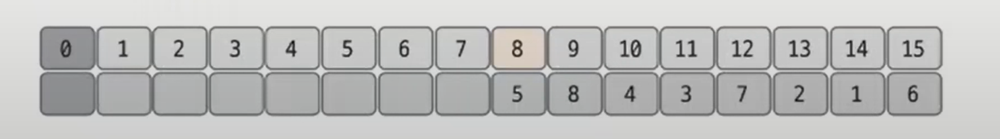
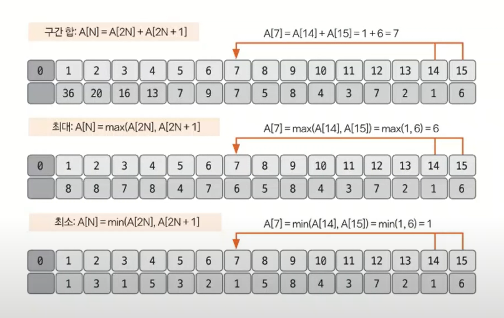
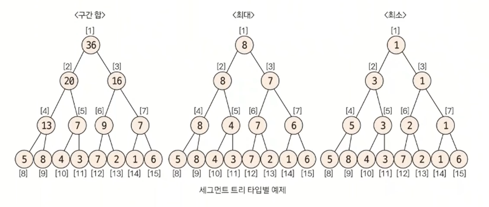
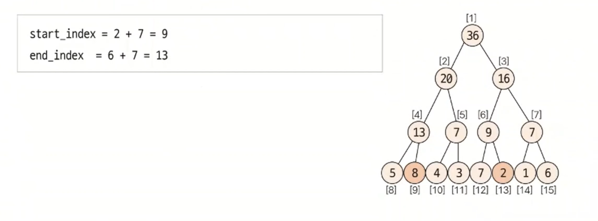
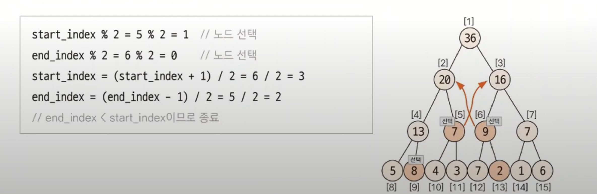
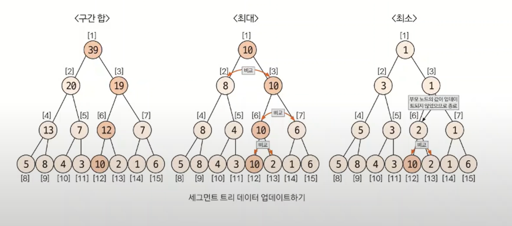

# 세그먼트 트리

- 주어진 데이터의 구간 합과 데이터 업데이트를 빠르게 수행하기 위해 고안해낸 자료구조 형태를 세그먼트 트리라고 한다.

## 세그먼트 트리 핵심 이론

- 세그먼트 트리의 종류는 구간 합, 최대(또는 최소) 구하기로 나눌 수 잇다.
- 구현 단계는 트리 초기화하기, 질의값 구하기(구간합 또는 최대-최소), 데이터 업데이트 하기로 나눌 수 있다.

### 1. **트리 초기화하기**

- 리프 노드의 개수가 데이터의 개수(`N`) 이상이 되도록 트리 리스트(배열)를 만든다.
- 트리 리스트의 크기를 구하는 방법은 `2^k >= N`을 만족하는 `k`의 최솟값을 구한 후 `2^k * 2`를 트리 리스트의 크기로 정의하면 된다.
- 예를 들어 `{5, 8, 4, 3, 7, 2, 1, 6}`의 샘플 데이터가 있다면 `N = 8`이므로 `2^3 >= 8`을 만족하게 되어 리스트의 크기를 `2^3 * 2 = 16`으로 정의한다.
- 리프 노드에 원본 데이터를 입력하는데, 리프 노드의 시작 위치를 트리 리스트의 인덱스로 구해야 한다.
- 구하는 방식은 `2^k`를 시작 인덱스로 하면 된다.(`k = 3`이면 start index = 8)

- 이후 리프 노드를 제외한 나머지 노드의 값을 채운다.(`2^k - 1` 부터 1번 쪽으로)
- 채워야 하는 인덱스를 `N`이라고 하면 자신의 자식 노드를 이용해 해당 값을 채울 수 있다.
- 자식 노드의 인덱스는 이진 트리 형식이기 때문에 `2N`, `2N + 1`이 된다.
- 각 케이스별(구간 합, 최대, 최소)로 적절하게 계산한다.

- 이렇게 구성한 트리 리스트를 실제 트리 모양으로 구조화하면 다음과 같이 표현할 수 있다.

- 이렇게 세그먼트 트리를 한 번 구성해 놓으면 그 이후 질의와 관련된 결괏값이나 데이터 업데이트 요구사항에 관해 좀 더 빠른 시간 복잡도 안에서 해결할 수 있게 된다.

### 2. **질의값 구하기**
- 주어진 질의 인덱스를 세그먼트 트리의 리프 노드에 해당하는 인덱스로 변경한다.
- 위 예제를 기준으로 한 인덱스값과 세그먼트 트리 리스트에서의 인덱스값이 다르기 때문에 인덱스를 변경해야 한다.

> **질의 인덱스를 세그먼트 트리 인덱스로 변경하는 방법**
> - `세그먼트 트리 index` = `주어진 질의 index + 2^k - 1`

질의에서의 시작 인덱스와 종료 인덱스에 관해 부모 노드로 이동하면서 주어진 질의에 해당하는 값을 다음과 같이 구한다.

> **질의값 구하는 과정**
> 1. `start_index % 2 == 1`일 때 해당 노드를 선택한다.
> 2. `end_index % 2 == 0`일 때 해당 노드를 선택한다.
> 3. `start_index` depth 변경 : `start_index = (start_index + 1) / 2`
> 4. `end_index` depth 변경 : `end_index = (end_index - 1) / 2`
> 5. 1~4를 반복하다가 `end_index < start_index`가 되면 종료
> 
> - 1~2 에서 해당 노드를 선택했다는 것은 해당 노드의 부모가 나타내는 범위가 질의 범위를 넘어가기 때문에 해당 노드를 질의값에 영향을 미치는 독립 노드로 
>   선택하고, 해당 노드의 부모 노드는 대상 범위에서 제외한다는 뜻이다.
> - 부모 노드를 대상 범위에서 제거하는 방법은 3~4에서 질의 범위에 해당하는 부모 노드로 이동하기 위해 인덱스 연산을 `index / 2`가 아닌
>   `(index + 1) / 2`, `(index - 1) / 2`로 수행하는 것이다.
> 
> 
> 
> - 질의에 해당하는 노드를 선택하는 방법은 구간 합, 최댓값 구하기, 최솟값 구하기 모두 동일하며 선택된 노드들에 관해 마지막에 연산 방식만 다르다.
> - **구간 합** : 선택된 노드들을 모두 더한다.
> - **최댓값 구하기** : 선택된 노드들 중 최댓값
> - **최솟값 구하기** : 선택된 노드들 중 최솟값

**2~6번째 구간 합을 구하는 과정 예제**

1. **먼저 리프 노드의 인덱스로 변경**
   - `질의 인덱스 + 2^k - 1`

2. **부모 노드로 이동**
   - `start_index % 2 == 1`일 때 해당 노드를 선택한다.
   - `end_index % 2 == 0`일 때 해당 노드를 선택한다.

3. **한번 더 부모 노드로 이동**

- `end_index < starT_index` 이므로 종료하고 값을 구한다. 2~6번 구간 합의 값은 선택된 노드들의 합인 `8 + 9 + 7 = 24`가 된다.

### 3. **데이터 업데이트하기**

업데이트 방식은 자신의 부모 노드로 이동하면서 업데이트한다는 것은 동일하고, 어떤 값으로 업데이트할 것인지에 관해서는 트리 타이별로 다르다.
부모 노드로 이동하는 방식은 세그먼트 트리가 이진 트리이므로 `index = index / 2`로 변경하면 된다.

- 구간 합에서는 원래 데이터와 변경 데이터의 차이만큼 부모 노드로 올라가면서 변경한다.
- 최댓값 찾기에서는 변경 데이터와 자신과 같은 부모를 지니고 있는 다른 자식 노드와 비교해 더 큰 값으로 업데이트한다. 업데이트가 일어나지 않으면 종료한다.
- 최솟값 찾기에서는 변경 데이터와 자신과 같은 부모를 지니고 있는 다른 자식 노드와 비교해 더 작은 값으로 업데이트한다. 업데이트가 일어나지 않으면 종료한다.

- 5번 데이터의 값을 7에서 10으로 업데이트하는 예시다.
- 5번 데이터의 인덱스를 리프 노드 인덱스로 변경하여(`5 + 8 - 1`) 부모 노드를 찾아 올라가면서 값을 업데이트한다.

### [예제 문제(백준 - 구간 합 구하기)](https://github.com/genesis12345678/TIL/blob/main/algorithm/tree/segment/Example_1.md#%EC%84%B8%EA%B7%B8%EB%A8%BC%ED%8A%B8-%ED%8A%B8%EB%A6%AC-%EC%98%88%EC%A0%9C---1)

### [예제 문제(백준 - 최솟값)](https://github.com/genesis12345678/TIL/blob/main/algorithm/tree/segment/Example_2.md#%EC%84%B8%EA%B7%B8%EB%A8%BC%ED%8A%B8-%ED%8A%B8%EB%A6%AC-%EC%98%88%EC%A0%9C---2)

### [예제 문제(백준 - 구간 곱 구하기)](https://github.com/genesis12345678/TIL/blob/main/algorithm/tree/segment/Example_3.md#%EC%84%B8%EA%B7%B8%EB%A8%BC%ED%8A%B8-%ED%8A%B8%EB%A6%AC-%EC%98%88%EC%A0%9C---3)