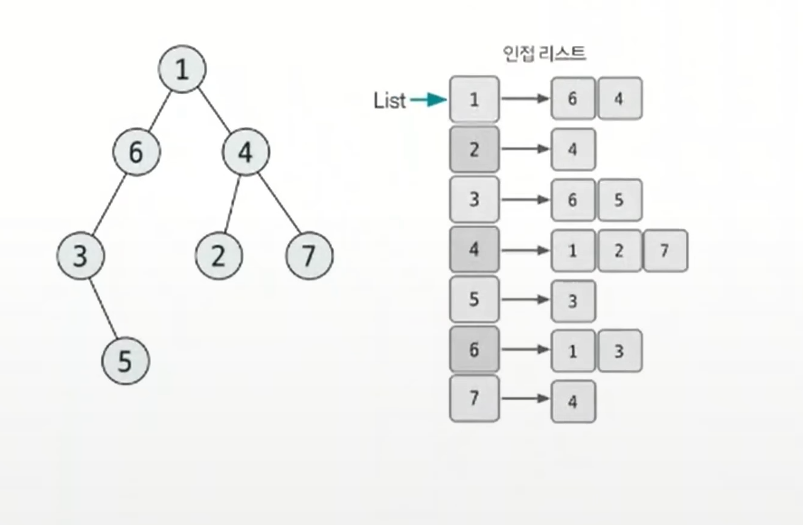
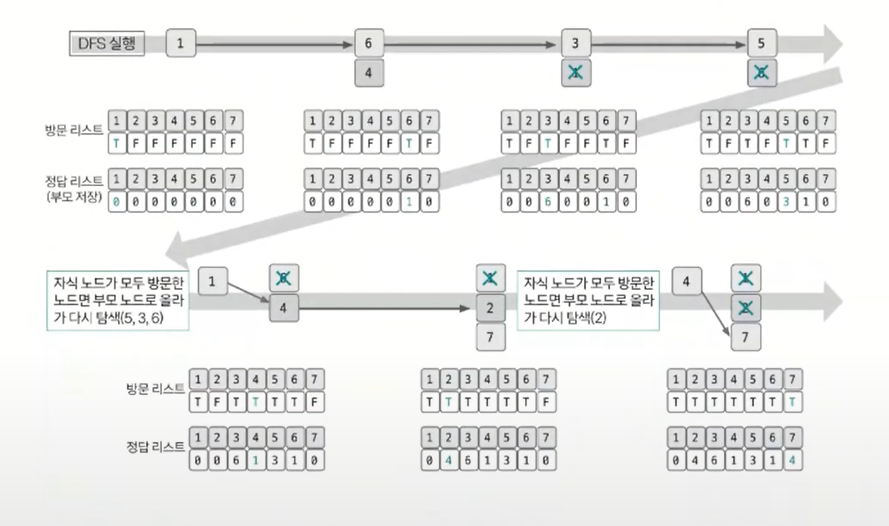

# 트리 예제 - 1

### [문제(백준(11725번 - 트리의 부모 찾기))](https://www.acmicpc.net/problem/11725)

### 문제 분석
- 데이터가 단순하게 연결돼 있는 두 노드를 알려주는 것이므로 데이터를 저장할 때 양방향 에지로 간주하고 저장한다.
- 인접 리스트 자료구조를 사용하면 간편하게 데이터를 저장할 수 있다.
- 트리의 루트가 1이라고 지정돼 있기 때문에 1번 노드부터 DFS로 탐색하면서 부모 노드를 찾아주면 문제를 해결할 수 있다.

### 손으로 풀어보기
1. **인접 리스트로 트리 데이터를 구현한다.**



2. **DFS 탐색을 수행한다. 수행할 때는 부모 노드의 값을 정답 리스트에 저장한다.**



3. **정답 리스트의 2번 인덱스부터 값을 차례대로 출력한다.**

### 슈도코드
```text
n(노드 개수)
visit(방문 기록 리스트)
tree(그래프 인접 리스트)
ans(정답 리스트)

for n-1 반복:
    인접 리스트 데이터 저장

DFS(부모 노드):
    visit 방문 처리
    for 부모 노드의 연결 노드:
        if 연결 노드가 미방문 노드:
            ans에 연결 노드의 부모를 부모 노드로 표시
            DFS(연결 노드)

DFS(1)

for 2~n 반복:
    ans 출력
```

### 코드 구현 - 파이썬
```python
import sys

sys.setrecursionlimit(10 ** 6)
input = sys.stdin.readline

n = int(input())
visit = [False] * (n + 1)
tree = [[] for _ in range(n + 1)]
ans = [0] * (n + 1)

for _ in range(n - 1):
    n1, n2 = map(int, input().split())
    tree[n1].append(n2)
    tree[n2].append(n1)


def DFS(parent):
    visit[parent] = True

    for next in tree[parent]:
        if not visit[next]:
            ans[next] = parent
            DFS(next)


DFS(1)

result = []
for i in range(2, n + 1):
    result.append(str(ans[i]))

print("\n".join(result))
```

### 코드 구현 - 자바
```java
import java.io.BufferedReader;
import java.io.IOException;
import java.io.InputStreamReader;
import java.util.ArrayList;
import java.util.StringTokenizer;

public class Main {

    static ArrayList<Integer>[] tree;
    static boolean[] visit;
    static int[] ans;
    
    public static void main(String[] args) throws IOException {
        BufferedReader br = new BufferedReader(new InputStreamReader(System.in));
        int n = Integer.parseInt(br.readLine());

        tree = new ArrayList[n + 1];
        visit = new boolean[n + 1];
        ans = new int[n + 1];

        for (int i = 0; i < n + 1; i++) {
            tree[i] = new ArrayList<>();
        }

        for (int i = 0; i < n - 1; i++) {
            StringTokenizer st = new StringTokenizer(br.readLine());
            int n1 = Integer.parseInt(st.nextToken());
            int n2 = Integer.parseInt(st.nextToken());

            tree[n1].add(n2);
            tree[n2].add(n1);
        }

        DFS(1);

        StringBuilder sb = new StringBuilder();
        for (int i = 2; i < n + 1; i++) {
            sb.append(ans[i]).append("\n");
        }

        System.out.println(sb);
    }

    private static void DFS(int parent) {
        visit[parent] = true;

        for (int next : tree[parent]) {
            if (!visit[next]) {
                ans[next] = parent;
                DFS(next);
            }
        }
    }
}
```